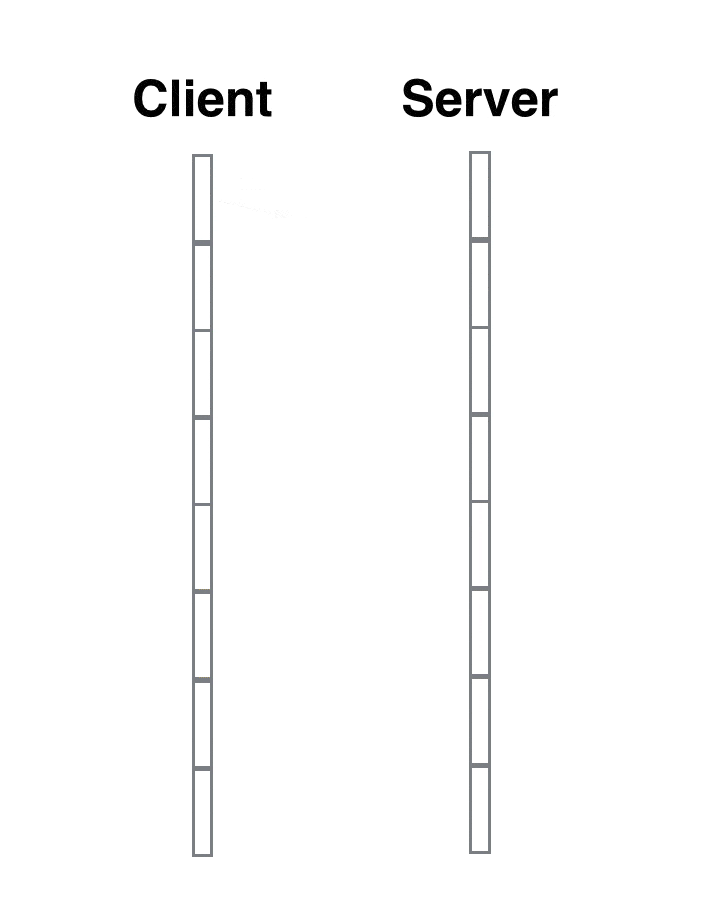
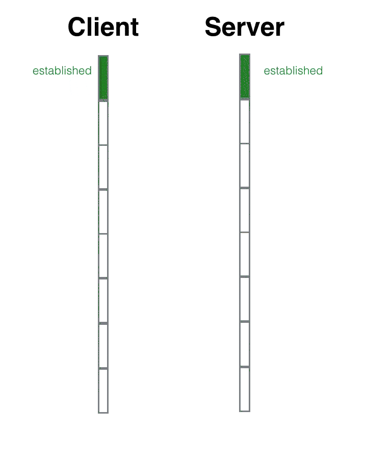
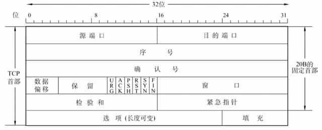
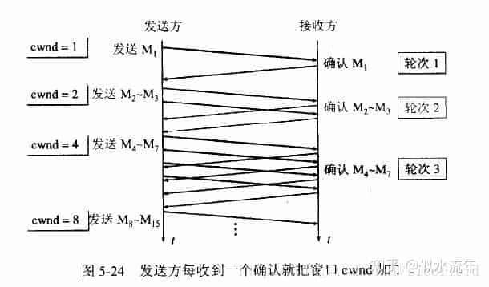
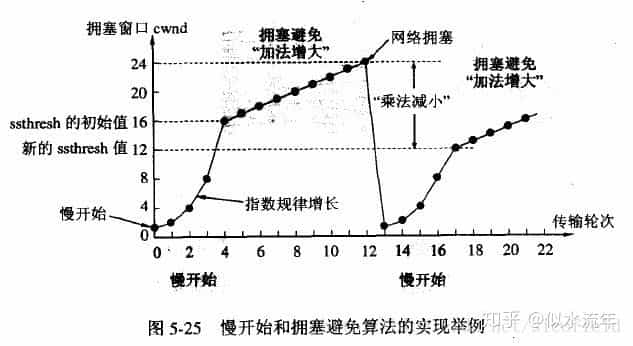
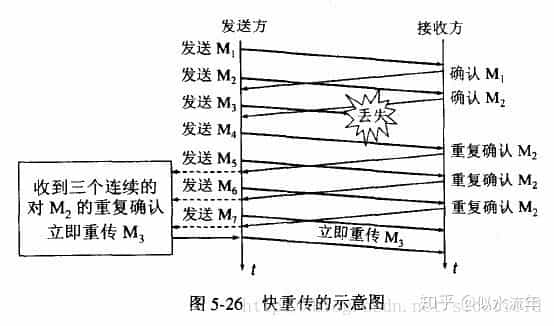
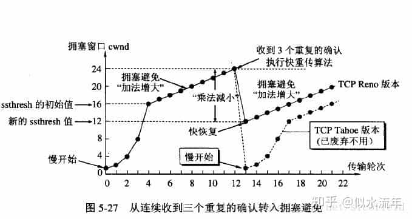
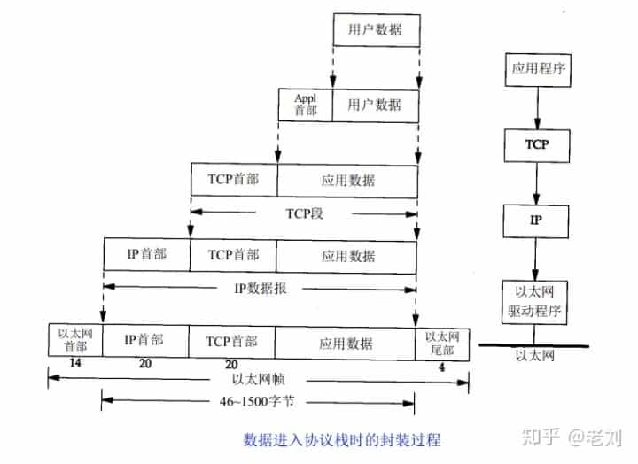
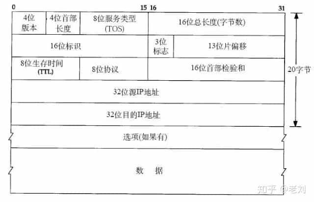

# Network Notes

## OSI Model

Reference

- https://en.wikipedia.org/wiki/OSI_model

> Open System Interconnection Model

|Layer  Type|Layer  Number|Layer  Name|Protocol  Data Unit (PDU)|Protocols|
|-|-|-|-|-|
|Host  layers|7|Application|Data|**HTTP**, HTTPS,  **FTP**, SMTP,  **DNS, DHCP**,  TELNET|
||6|Presentation|↑|TLS, ~~SSL~~, MIME|
||5|Session|↑|**Sockets**  ( session estabilishment  in TCP / RTP / PPTP )|
||4|Transport|Segment,  Datagram|**TCP, UDP**, TLS|
|Media  layers|3|Network|Packet|**IP**, IPsec,  ICMP, IGMP,  OSPF, RIP|
||2|Data Link|Frame|PPP|
||1|Physical|Bit,  Symbol|-|-|

- 7\. **应用层** Application Layer
    - High-level APIs,
    - including resource sharing, remote file access
    - e.g., **HTTP**
- 6\. **表现层** Presentation Layer
    - Translation of data between a networking service and an application;
    - including **character encoding, data compression & encryption/decryption**
- 5\. **会话层** Session Layer
    - Managing communication sessions,
    - i.e., continuous exchange of information in the form of multiple back-and-forth transmissions between two nodes
- 4\. **传输层** Transport Layer :
    - Reliable transmission of data segments between points on a network,
    - including **segmentation, acknowledgement & multiplexing**
    - e.g., **TCP / UDP**
- 3\. **网络层** Network Layer
    - Structuring and managing a multi-node network,
    - including **addressing, routing & traffic control**
    - e.g., IP
- 2\. **数据链路层** Data Link Layer :
    - **Reliable transmission of data frames between two nodes connected by a physical layer**
    - e.g., PPP ( Point-to-Point Protocol )
- 1\. **物理层** Physical Layer
    - **Transmission and reception of raw bit streams over a physical medium**

### _L1 Physical_

The physical layer is responsible for the transmission and reception of unstructured raw data between a device and a physical transmission medium.

- It converts the digital bits into electrical, radio, or optical signals.

### L2 Data Link

The data link layer **provides node-to-node data transfer** — a link between two directly connected nodes.

- It **detects and possibly corrects errors** that may occur in the physical layer.
- It **defines the protocol to establish and terminate a connection between two physically connected devices**.
- It also **defines the protocol for flow control** between them.

Sublayers

- MAC ( Medium Access Control )
- LLC (Logical Link Control )

……

The [Point-to-Point Protocol](https://en.wikipedia.org/wiki/Point-to-Point_Protocol) (PPP) is a data link layer protocol that can operate over several different physical layers, such as synchronous and asynchronous serial lines.

### L3 Network

The network layer provides the functional and procedural means of transferring packets from one node to another connected in "different networks".

- A network is a medium to which many nodes can be connected,
    - on which **every node has an address** and which permits nodes connected to it to **transfer messages to other nodes** connected to it
    - **by merely providing the content of a message and the address of the destination node** and **letting the network find the way to deliver** the message to the destination node,
    - possibly routing it through intermediate nodes.
- If the message is too large to be transmitted from one node to another on the data link layer between those nodes, the network may **implement message delivery by splitting the message into several fragments at one node, sending the fragments independently, and reassembling the fragments at another node**.
- It may, but **does not need to, report delivery errors**.

### L4 Transport

The transport layer provides the functional and procedural means of transferring variable-length data sequences from a source to a destination host, while maintaining the quality of service functions.

- The transport layer **controls the reliability of a given link through flow control, segmentation/desegmentation, & error control**.

……

- [Transmission Control Protocol](https://en.wikipedia.org/wiki/Transmission_Control_Protocol) (TCP) & [User Datagram Protocol](https://en.wikipedia.org/wiki/User_Datagram_Protocol) (UDP)
    - of the Internet Protocol Suite are commonly categorized as layer-4 protocols within OSI.
- [Transport Layer Security](https://en.wikipedia.org/wiki/Transport_Layer_Security) (TLS) provide security at this layer.

### _L5 Session_

The session layer controls the dialogues (connections) between computers.

- It **establishes, manages and terminates the connections between the local and remote application.**
- It provides for **full-duplex, half-duplex, or simplex operation, and establishes procedures for checkpointing, suspending, restarting, and terminating a session**.

### _L6 Presentation_

The presentation layer establishes context between application-layer entities,

- in which the application-layer entities may use different syntax and semantics if the presentation service provides a mapping between them.

### _L7 Application_

The application layer is the OSI layer closest to the end user, which means both the OSI application layer and the user interact directly with the software application.

## HTTP

References

- https://en.wikipedia.org/wiki/Hypertext_Transfer_Protocol
- https://en.wikipedia.org/wiki/List_of_HTTP_status_codes

### Status Codes

All HTTP response status codes are separated into **5 classes or categories**.

- **1xx informational response** _( 继续 )_
    - the request was received, continuing process
- **2xx successful** _( 成功 )_
    - the request was successfully received, understood, and accepted
- **3xx redirection** _( 重定向 )_
    - further action needs to be taken in order to complete the request
- **4xx client error**
    - the request contains bad syntax or cannot be fulfilled
- **5xx server error**
    - the server failed to fulfil an apparently valid request

_The first digit of the status code defines the class of response, while the last two digits do not have any classifying or categorization role._

#### 1xx Informational Response

- **100 Continues**
- 101 Switching Protocols
- 102 Processing
- _103 Early Hints_

#### 2xx Successful

- **200 OK**
- **201 Created**
- **202 Accepted**
- _203 Non-Authoritative Information_
- **204 No Content**
- _205 Reset Content_
- ……

#### 3xx Redirection

- _300 Multiple Choices_
- **301 Move Permanently**
- **302 Found** _( Previously "Move Temporarily" )_
- _303 See Other_
- **304 Not Modified**
- _305 Use Proxy_
- _306 Switch Proxy_
- _307 Temporary Redirect_
- _308 Permanent Redirect_

#### 4xx Client Error

- **400 Bad Request**
- **401 Unauthorized**
- 402 Payment Required
- **403 Forbidden**
- **404 Not Found**
- 405 Method Not Allowed
- _406 Not Acceptable_
- _407 Proxy Authentication Required_
- _408 Request Timeout_
- _409 Conflict_
- _410 Gone_
- _411 Length Required_
- _412 Precondition Failed_
- _413 Payload Too Large_
- _414 URI Too Long_
- _415 Unsupported Media Type_
- ……
- ~~_418 I'm a teapot_~~
- ……
- _426 Upgrade Required_
- ……
- _429 Too Many Requests_
- _431 Request Header Fields Too Large_
- _451 Unavailable For Legal Reasons_

#### 5xx Server Error

- **500 Internal Server Error**
- _501 Not Implemented_
- **502 Bad Gateway**
- **503 Service Unavailable**
- **504 Gateway Timeout**
- **505 HTTP Version Not Supported**
- ……
- _507 Insufficient Storage_
- _508 Loop Detected_
- _510 Not Extended_
- _511 Network Authentication Required_

## TCP

> Transmission Control Protocol

References

- Wikipedia : https://en.wikipedia.org/wiki/Transmission_Control_Protocol
- 跟着动画来学习TCP三次握手和四次挥手 - 掘金 : https://juejin.cn/post/6844903625513238541
- 为什么 TCP 建立连接需要三次握手 : https://draveness.me/whys-the-design-tcp-three-way-handshake
- TCP流量控制、拥塞控制 : https://zhuanlan.zhihu.com/p/37379780

### Three-Way Handshake

Client

- 1\. `sync_sent` _( syn package has been sent )_
    - syn = 90
- 3\. `established`
    - ack = 101

Server

- 2\. `sync_rcvd` _( syn package has been received )_
    - ack = 91
    - syn = 100
- 4\. `established`

#### Why three-way ?

Reference

- 为什么 TCP 建立连接需要三次握手 : https://draveness.me/whys-the-design-tcp-three-way-handshake/

为什么我们需要通过三次握手才可以初始化 Sockets、窗口大小、初始序列号并建立 TCP 连接 :

- **通过三次握手才能阻止重复历史连接的初始化**
- 通过三次握手才能对通信双方的初始序列号进行初始化
- 讨论其他次数握手建立连接的可能性

> The principle reason for the three-way handshake is to prevent old duplicate connection initiations from causing confusion.

Summary

- TCP 建立连接时通过三次握手可以有效地 **避免历史错误连接的建立**, 减少通信双方不必要的资源消耗,
- 三次握手能够 **帮助通信双方获取初始化序列号**,
    - 它们能够保证数据包传输的不重不丢, 还能保证它们的传输顺序, 不会因为网络传输的问题发生混乱,
- 到这里不使用『两次握手』和『四次握手』的原因已经非常清楚了 :
    - 两次握手  : 无法避免历史错误连接的初始化, 浪费接收方的资源;
    - 四次握手  : TCP 协议的设计可以让我们同时传递 ACK 和 SYN 两个控制信息, 减少了通信次数,
        - _所以不需要使用更多的通信次数传输相同的信息_

### Four-Way Handshake

Client

- 1\. `fin_wait_1`
    - fin = 500
- 3\. `fin_wait_2`
- 5\. `time_wait`
    - ack = 1001
- 7\. _wait for some time_
    - _default 4 min_
- 6\. `closed`

Server

- 2\. `close_wait`
    - ack = 501
- 4\. `last_ack`
    - fin = 1000
- 6\. `closed`

#### Why time_wait ?

- **在 `time_wait` 这段时间内, 该链接在对话期间于网际路由上产生的残留报文传过来时, 都会被立即丢弃掉.**
    - _( 因为路径过于崎岖, 数据报文走的时间太长, 可能重传的报文都收到了, 而原始报文还在路上 )_
    - **4 分钟的时间足以使得这些残留报文彻底消逝.**
    - **不然当新的端口被重复利用时, 这些残留报文可能会干扰新的链接.**
- 4 分钟就是 2 个 MSL, 每个 MSL 是 2 分钟.
    - **MSL 即 Maximium Segment Lifetime —— 最长报文寿命.**
    - 这个时间是由官方 RFC 协议规定的.
    - _至于为什么是 2 个 MSL 而不是 1 个 MSL, 暂时还没有一个足够合理的解释._

### Transport

_Keywords_

- 去重
- 重传
- TCP 窗口大小

#### Header

固定 Header 至少 20 bytes

#### Flow Control

Reference

- TCP流量控制、拥塞控制 : https://zhuanlan.zhihu.com/p/37379780

如果发送者发送数据过快, 接收者来不及接收, 那么就会有分组丢失. 流量控制 : **为了避免分组丢失, 控制发送者的发送速度, 使得接收者来得及接收**. _流量控制根本目的是防止分组丢失, 是构成TCP可靠性的一方面._

**如何实现流量控制 ?** 由 **滑动窗口协议 _( 连续ARQ协议 )_** 实现.

- 既保证了分组无差错、有序接收, 也实现了流量控制.
- 主要的方式就是接收方返回的 ACK 中会包含自己的接收窗口的大小, 并且利用大小来控制发送方的数据发送.

_流量控制引发的死锁 ? 怎么避免死锁的发生 ?_

- 当发送者收到了一个窗口为 0 的应答, 发送者便停止发送, 等待接收者的下一个应答.
- 但是如果这个窗口不为 0 的应答在传输过程丢失, 发送者一直等待下去, 而接收者以为发送者已经收到该应答, 等待接收新数据,
    - 这样双方就相互等待, 从而产生死锁!
- **为了避免流量控制引发的死锁, TCP 使用了持续计时器.**
    - 每当发送者收到一个 0 窗口的应答后就启动该计时器.
    - **时间一到便主动发送报文询问接收者的窗口大小.**
        - 若接收者仍然返回 0 窗口, 则重置该计时器继续等待;
        - 若窗口不为0, 则表示应答报文丢失了,
            - 此时重置发送窗口后开始发送, _这样就避免了死锁的产生._

Differ Flow Control from Congestion Control ?

- Congestion Control : 拥塞控制是作用于网络的,
    - 它是防止过多的数据注入到网络中, 避免出现网络负载过大的情况;
    - 常用的方法 :
        - 1\. 慢启动、拥塞避免
        - 2\. 快重传、快恢复
- Flow Control : 流量控制是作用于接收者的,
    - 它是控制发送者的发送速度从而使接收者来得及接收, 防止分组丢失的.

#### Congestion Control

拥堵控制算法

假定 :

- 1\. 数据是单方向传递, 另一个窗口只发送确认;
- 2\. 接收方的缓存足够大, 因此发送方的大小的大小由网络的拥塞程度来决定.

##### Slow Start

> 慢启动

发送方维持一个叫做 **拥塞窗口 cwnd ( congestion window )** 的状态变量.

- 拥塞窗口的大小取决于网络的拥塞程度, 并且动态地在变化.
- 发送方让自己的发送窗口等于拥塞窗口, 另外考虑到接受方的接收能力, 发送窗口可能小于拥塞窗口.

慢启动算法的思路就是, **不要一开始就发送大量的数据, 先探测一下网络的拥塞程度**, 也就是说 **由小到大逐渐增加拥塞窗口的大小**.

_用报文段的个数作为拥塞窗口的大小举例说明慢启动算法, **实际的拥塞窗口大小是以字节为单位的**._

一个传输轮次所经历的时间其实就是 **往返时间 RTT ( Round-Trip delay Time )** , 而且 **每经过一个传输轮次 ( transmission round ) , 拥塞窗口 cwnd 就加倍.**

为了防止 cwnd 增长过大引起网络拥塞, 还需设置一个 **慢启动门限 ssthresh ( Slow Start Threshold )** 状态变量. 其用法 :

- 当 cwnd < ssthresh 时, 使用 Slow Start 算法.
- 当 cwnd > ssthresh 时, 改用 Congestion Avoidance 算法.
- 当 cwnd = ssthresh 时, Slow Start 与 Congestion Avoidance 算法任意

注意 : "慢" 并不是指 cwnd 的增长速率慢, 而是指在 TCP 开始发送报文段时先设置 cwnd=1 , 然后逐渐增大; _这当然比按照大的 cwnd 一下子把许多报文段突然注入到网络中要 "慢得多" ._

_( icehe : 即 "慢" 表示初始传输速度慢, 而不是传输速度的增长速度慢. )_

##### Congestion Avoidance

拥塞避免算法让拥塞窗口缓慢增长, 即每经过一个往返时间 RTT 就把发送方的拥塞窗口 cwnd 加 1, 而不是加倍. **拥塞窗口按线性规律缓慢增长.**

- 无论是在慢启动阶段还是在拥塞避免阶段, **只要发送方判断网络出现拥塞 _( 其根据就是没有按时收到确认, 虽然没有收到确认可能是其他原因的分组丢失, 但是因为无法判定, 所以都当做拥塞来处理 )_ , 就把慢启动门限ssthresh 设置为出现拥塞时的发送窗口大小的一半 _( 但不能小于2 )_**.
- 然后 **把拥塞窗口 cwnd 重新设置为 1, 执行慢启动算法**.
    - 这样做的目的就是要迅速减少主机发送到网络中的分组数, 使得发生拥塞的路由器有足够时间把队列中积压的分组处理完毕.
    - _( icehe : 不能适应现代的复杂&先进网络环境 )_

拥塞控制的流程 _( 例如上图 )_ :

- 1\. 拥塞窗口 cwnd 初始化为 1 个报文段, 慢启动门限初始值为 16
- 2\. 执行慢启动算法, 指数规律增长到第 4 轮,
    - 即 cwnd = 16 = ssthresh, 改为执行拥塞避免算法, 拥塞窗口按线性规律增长
- 3\. 假定 cwnd = 24 时, 网络出现超时 ( 拥塞 ) , 则更新后的ssthresh = 12, cwnd 重新设置为 1, 并执行慢启动算法.
    - 当 cwnd = 12 = ssthresh 时, 改为执行拥塞避免算法

**加性增 ( Additive Increase )  & 乘性减 ( Multiplicative Decrease )**  :

- Multiplicative Decrease :
    - 指的是无论是在慢启动阶段还是在拥塞避免阶段, 只要发送方判断网络出现拥塞, 就把慢启动门限 ssthresh 设置为出现拥塞时的发送窗口大小的一半, 并执行慢启动算法,
    - 所以当网络频繁出现拥塞时, ssthresh 下降的很快, 以大大减少注入到网络中的分组数.
- Additive Increse :
    - 是指执行拥塞避免算法后, 使拥塞窗口缓慢增大, 以防止过早出现拥塞.
    - 常合起来成为 **AIMD 算法**.

_注意 : "拥塞避免" 并非完全能够避免了阻塞, 而是使网络比较不容易出现拥塞._

##### Fast Retransmit

> 快速重传

- 快速重传要求 **接收方在收到一个失序的报文段后就立即发出重复确认** 而不要等到自己发送数据时捎带确认.
    - _( 为的是使发送方及早知道有报文段没有到达对方, 可提高网络吞吐量约 20% )_
- 快重传算法规定, **发送方只要一连收到三个重复确认就应当立即重传对方尚未收到的报文段**, 而不必继续等待设置的重传计时器时间到期. 如下图 :

##### Fast Recovery

> 快速恢复

快重传配合使用的还有快恢复算法, 有以下两个要点 :

- 当发送方连续收到三个重复确认时, 就执行 "乘法减小" 算法, 把 ssthresh 门限减半 ( 为了预防网络发生拥塞 ) .
    - 但是 **接下去并不执行慢开始算法**
- 考虑到如果网络出现拥塞的话就不会收到好几个重复的确认, 所以发送方现在认为网络可能没有出现拥塞.
    - 所以此时不执行慢开始算法, **而是将 cwnd 设置为 ssthresh 减半后的值, 然后执行拥塞避免算法, 使cwnd缓慢增大.**
    - **TCP Reno 版本是目前使用最广泛的版本.**

注意 : **在采用快恢复算法时, 慢开始算法只是在TCP连接建立时和网络出现超时时才使用**.

## UDP

> User Datagram Protocol

Reference

- https://en.wikipedia.org/wiki/User_Datagram_Protocol

### TODO

## IP

Reference

- https://en.wikipedia.org/wiki/Transport_Layer_Security
- 关于 TCP/IP 必知必会的 10 个问题 : https://www.cxyxiaowu.com/11609.html

### ARP

> Address Resolution Protocol

ARP - Address Resolution Protocol ( 地址解析协议 ) **根据 IP 地址获取 MAC 地址的一种协议**.

本来主机是完全不知道这个 IP 对应的是哪个主机的哪个接口, 当主机要发送一个 IP 包的时候, 会首先查一下自己的 ARP 高速缓存 ( 就是一个 IP-MAC 地址对应表缓存 ) .

如果查询的 IP-MAC 值对不存在, 那么主机就向网络发送一个 ARP 协议广播包, 这个广播包里面就有待查询的 IP 地址, 而直接收到这份广播的包的所有主机都会查询自己的IP地址, 如果收到广播包的某一个主机发现自己符合条件, 那么就准备好一个包含自己的 MAC 地址的 ARP 包传送给发送 ARP 广播的主机.

而广播主机拿到 ARP 包后会更新自己的 ARP 缓存 ( 就是存放 IP-MAC 对应表的地方 ) . 发送广播的主机就会用新的ARP缓存数据准备好数据链路层的的数据包发送工作.

RARP 反向地址解析协议, 与之相反.

### ICMP

> Internet Control Message Protocol

Reference

- https://en.wikipedia.org/wiki/Internet_Control_Message_Protocol

TODO

### Others

Package Encapsulation

IP Header

### TODO

## Others

### SNMP

> Simple Network Management

Reference

- https://en.wikipedia.org/wiki/Simple_Network_Management_Protocol

TODO

_( icehe : 应用层的协议 )_
