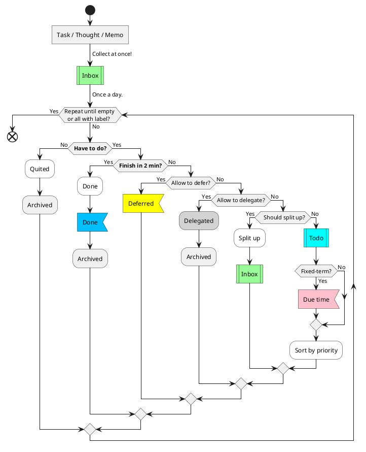
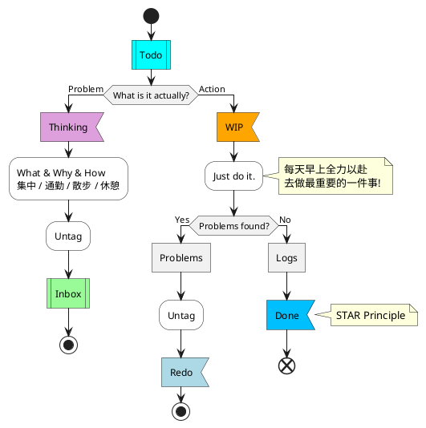
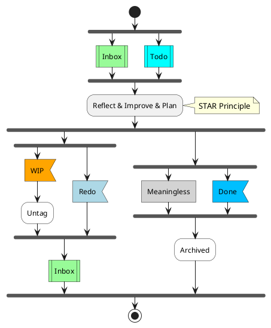

# Do Flow

> Concise Version

## Plan

```plantuml
@startuml
start
:Task / Thought / Memo]
-[#black]-> Collect at once!;
#paleGreen:Inbox|
-[#black]-> Once a day.;
while (Repeat until empty \n  or all with label?) is (No)
    if (**Have to do?**) then (No)
        #white:Quited;
        :Archived;
    else (Yes)
        if (**Finish in 2 min?**) then (Yes)
            #white:Done;
            #deepSkyBlue:Done<
            :Archived;
        else (No)
            if (Allow to defer?) then (Yes)
                #yellow:Deferred<
            else (No)
                if (Allow to delegate?) then (Yes)
                    #lightGray:Delegated;
                    :Archived;
                else (No)
                    if (  Should split up?) then (Yes)
                        #white:Split up;
                        #paleGreen:Inbox|
                    else (No)
                        #aqua:Todo|
                        if (Fixed-term?) then (Yes)
                            #pink:Due time<
                        else (No)
                        endif
                        #white:Sort by priority;
                    endif
                endif
            endif
        endif
    endif
endwhile (Yes)
end
@enduml
```

## Action

```plantuml
@startuml
start
#aqua:Todo|
if (What is it actually?) then (Problem)
    #plum:Thinking<
    #white:What & Why & How\n集中 / 通勤 / 散步 / 休憩;
    'note right : What & Why & How
    #white:Untag;
    #paleGreen:Inbox|
    stop
else (Action)
    #orange:WIP<
    #white:Just do it.;
    note right : 每天早上全力以赴\n去做最重要的一件事!
    if (Problems found?) then (Yes)
        :Problems]
        #white:Untag;
        #lightBlue:Redo<
        stop
    else (No)
        :Logs]
        #deepSkyBlue:Done<
        note right : STAR Principle
        end
    endif
endif
@enduml
```

## Reflect

```plantuml
@startuml
start
fork
    #paleGreen:Inbox|
fork again
    #aqua:Todo|
end fork
:Reflect & Improve & Plan;
note right : STAR Principle
fork
    fork
        #orange:WIP<
        #white:Untag;
    fork again
        #lightBlue:Redo<
    end fork
    #paleGreen:Inbox|
fork again
    fork
        #lightGray:Meaningless]
    fork again
        #deepSkyBlue:Done<
    end fork
    #white:Archived;
end fork
stop
@enduml
```

# References

> Image

