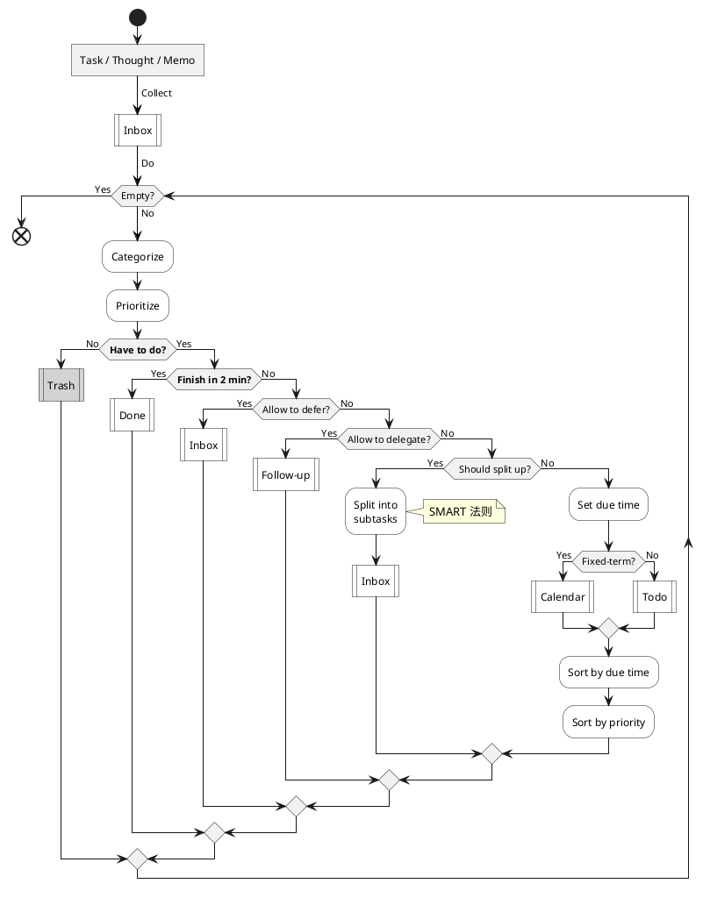
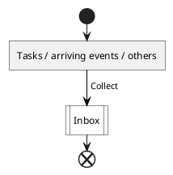
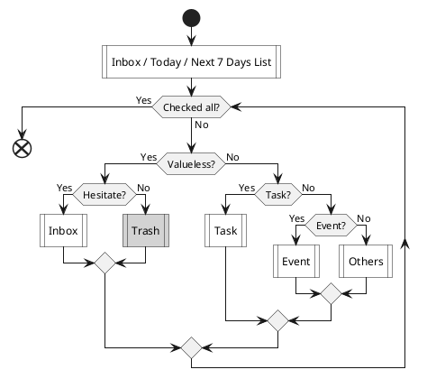
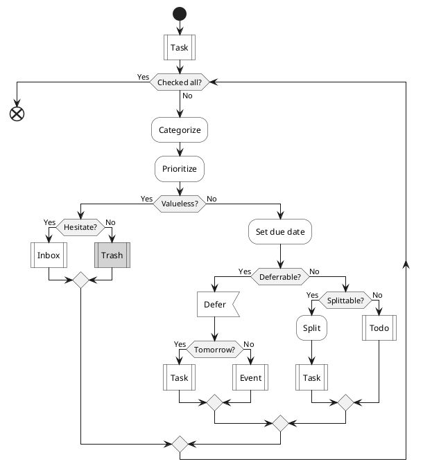
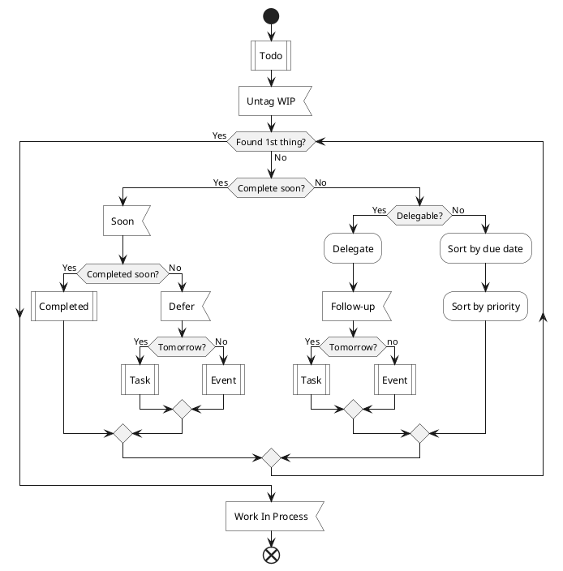
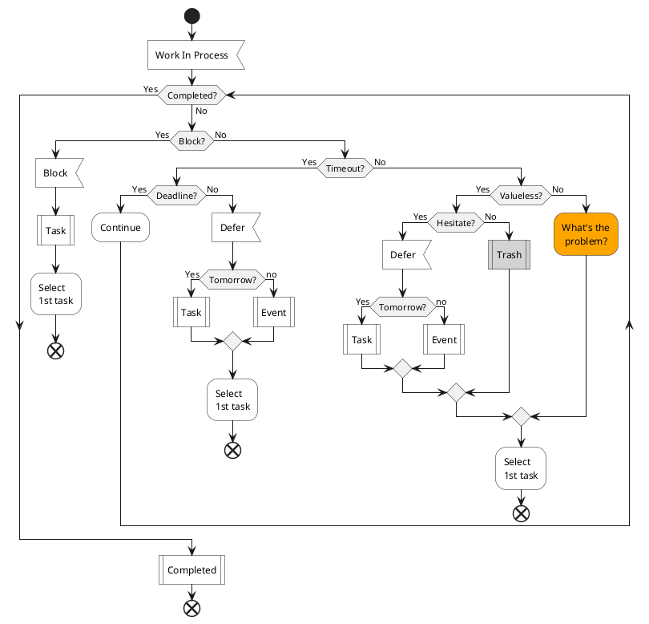
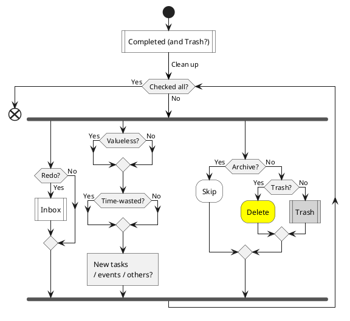
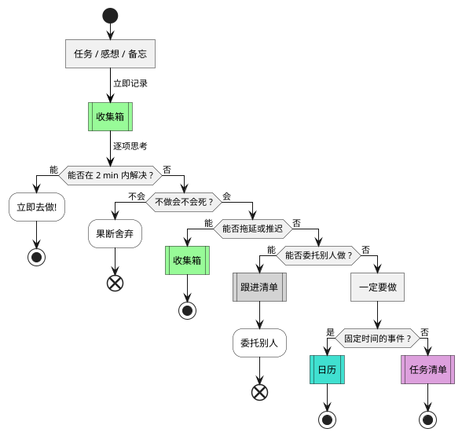
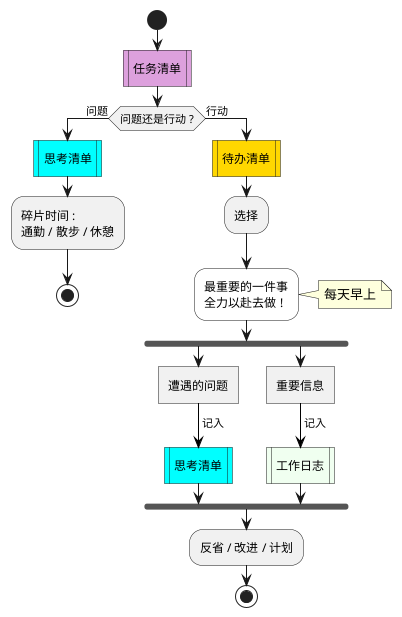

# GTD Flow

GTD Flow + PDCA Cycle + SMART Principle

---

## Simple Flow

## Daily Flow

每日流程

### Collect

0\. Collect tasks and anything else

_( anytime )_

- Arriving Events? Due events.

### Filter

1.1\. Plan - Filter tasks

_( night or morning )_

-   Why include Today and Next 7 Days List?

    Check arriving events ( which are not in Task & Todo List ).

-   Checked all? Or too many tasks.

    Too many tasks: Total duration over available time today.

-   Event: Events, future tasks ( without tomorrow ) .

-   Others: Thoughts, questions and something else.

### Prepare

1.2\. Plan - Prepare tasks

_( night or morning )_

-   Categorize:

    Work / Learn / Think / Read / Zheteng / Fun / Rest / Sport / Have-to / Waste / …

-   Priority

    - High: Important & urgent - _1st Thing 1st_
    - Medium: Important & not urgent - _Important_
    - Low: Not important & urgent - _Concerned_
    - No: Not important & not urgent - _Trash_

-   Deferrable? Not important.

-   Splittable? Not specific or duration > 2h.

    Ideal duration <= 2 hours

-   Split: Split into subtasks

### Select

2.1\. Do - Select 1st task

_( morning, noon, afternoon, evening )_

-   Checked all? Or too many todos.

    Too many todos: Total duration over available time today.

-   Complete soon? Estimated duration <= 5min.

-   Delegable? Able to assign to another person.

### Doing

2.2\. Do - Doing 1st task

_( morning, noon, afternoon, evening )_

- Block? Encounter a problem.
- Timeout? Over expected duration or till end of day.
- Finish soon? Extra duration < 1h or till end of day.

### Reflect

3\. Check - Reflect done tasks

_( night or morning )_

- Checked all? Or till end of day.
- Redo? Need to redo. _( Poor quality? )_
- Reflect?
    - _A. Add to Inbox, Thought & Question_
    - _B. Update its description or insert a new comment?_
    - _C. Write in reflect.md of IceHe's Library_
    - …

### Improve

4\. Act / Adjust - Improve daily flow

- Update regulations in rehabilitation.md

## References

### Original

### Rewritten

