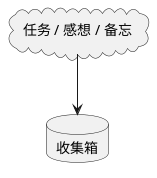
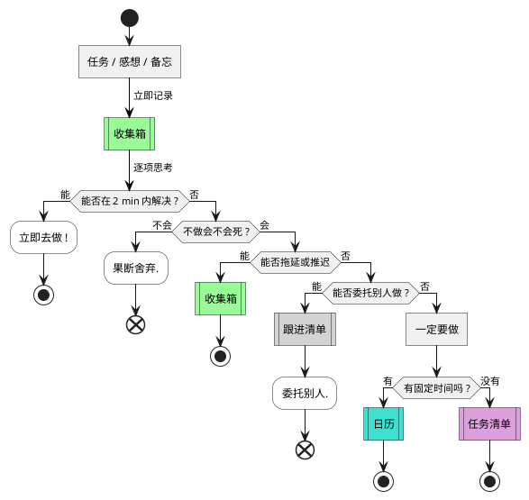
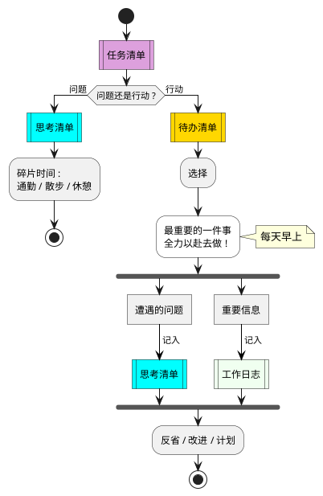

# Todo Flow

> 待办事项

```puml
@startuml

cloud todo as "任务 / 感想 / 备忘"
database inbox as "收集箱"

todo --> inbox

@enduml
```

## 决策流程

### 仿写中文

```puml
@startuml
start
:任务 / 感想 / 备忘]
-[#black]-> 立即记录;
#paleGreen:收集箱|
-[#black]-> 逐项思考;
if (能否在 2 min 内解决 ?) then (能)
    #white:立即去做 !;
    stop
else (否)
    if (不做会不会死 ?) then (不会)
        #white:果断舍弃.;
        end
    else (会)
        if (能否拖延或推迟) then (能)
            #paleGreen:收集箱|
            stop
        else (否)
            if (能否委托别人做 ?) then (能)
                #lightGray:跟进清单|
                #white:委托别人.;
                end
            else (否)
                :一定要做]
                if (有固定时间吗 ?) then (有)
                    #turquoise:日历|
                    stop
                else (没有)
                    #plum:任务清单|
                    stop
                endif
            endif
        endif
    endif
endif
@enduml
```

## 简化英文

```puml
@startuml
start
:任务 / 感想 / 备忘]
-[#black]-> 立即记录;
#paleGreen:收集箱|
-[#black]-> 逐项思考;
if (能否在 2 min 内解决 ?) then (能)
    #white:立即去做 !;
    stop
else (否)
    if (不做会不会死 ?) then (不会)
        #white:果断舍弃.;
        end
    else (会)
        if (能否拖延或推迟) then (能)
            #paleGreen:收集箱|
            stop
        else (否)
            if (能否委托别人做 ?) then (能)
                #lightGray:跟进清单|
                #white:委托别人.;
                end
            else (否)
                :一定要做]
                if (有固定时间吗 ?) then (有)
                    #turquoise:日历|
                    stop
                else (没有)
                    #plum:任务清单|
                    stop
                endif
            endif
        endif
    endif
endif
@enduml
```

## 执行流程

```puml
@startuml

start

#plum:任务清单|
if (问题还是行动 ?) then (问题)
    #aqua:思考清单|
    :碎片时间 : \n通勤 / 散步 / 休憩;
    stop
else (行动)
    #gold:待办清单|
    :选择;
    #white:最重要的一件事\n全力以赴去做 !;
    note right : 每天早上
    fork
        :遭遇的问题]
        -[#black]-> 记入;
        #aqua:思考清单|
    fork again
        :重要信息]
        -[#black]-> 记入;
        #honeyDew:工作日志|
    end fork
    :反省 / 改进 / 计划;
    stop
endif

@enduml
```

## 参考资料

