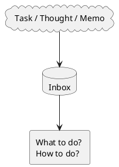
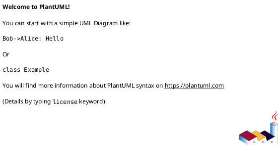
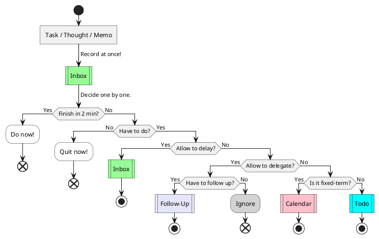
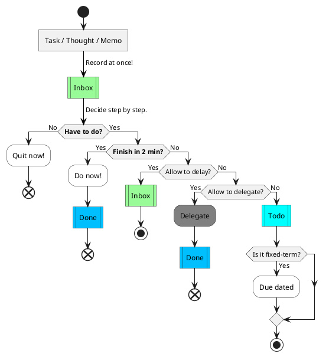
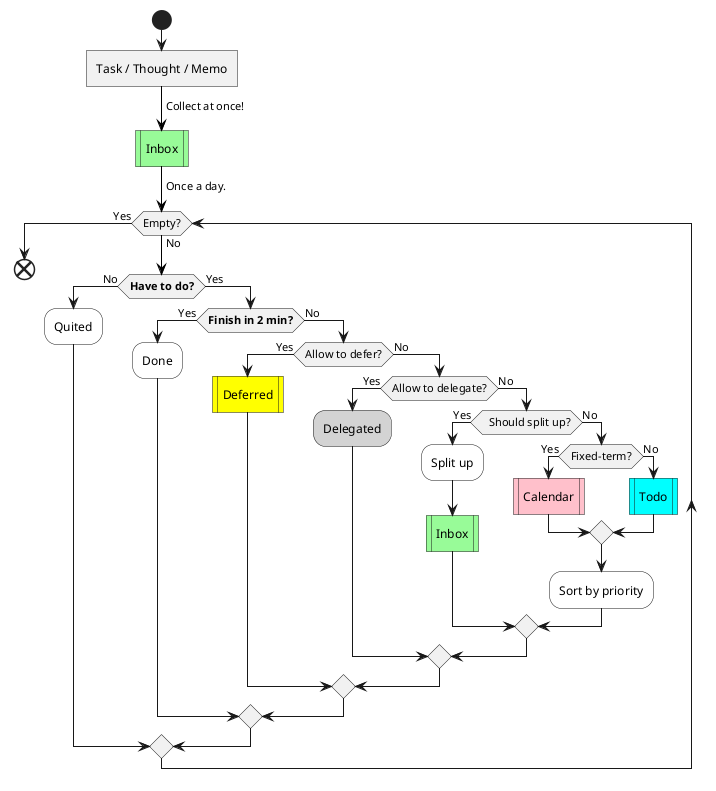
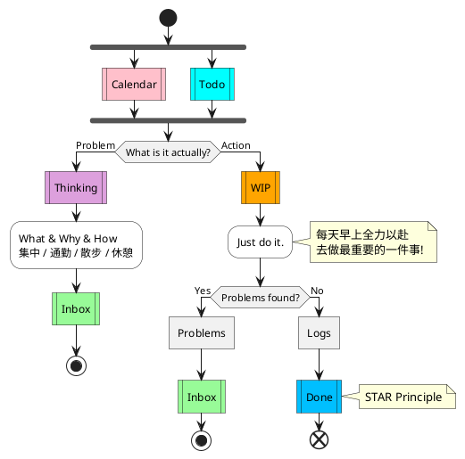
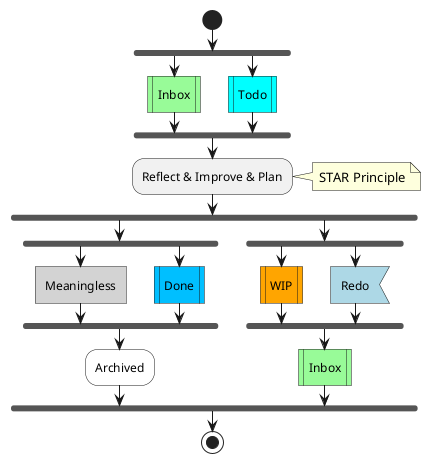
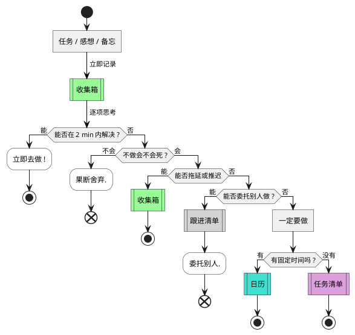
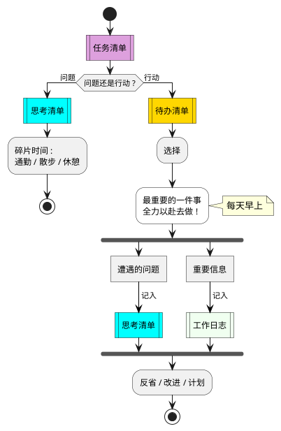

# Do Flow

## Intro

### Glossary

- Task : 任务 - 工作 & 学习
- Thought : 想法, 感悟
- Memo : 备忘, 信息, 笔记
- Inbox : 收集箱
- Delay : 拖延 / 推迟
- Defer : 推迟
- Delegate : 委托, 委派
- Todo : 待办事项
- Follow-up : 跟进

### Sample

> PlantUML

## Plan

### Ver 0

Policy

- 如无必要, 勿增实体. 例如, 可以推断出来的节点, 就别画蛇添足了.

### Ver 1

Policy

- 没有必要做的事情, 就算用一两分钟去做, 也是浪费!
    - Pull up section "Have to do?"
- 由于现在还处于比较低的地位, 很少有可以将自己事情委派给他人的机会和权力.
    - Simplify section "Allow to delegate?"
- 其它
    - 突出重点 : 部分 "条件分支" **加粗** 显示
    - 简化列表 : 不使用 "Calendar" List, 改用 "设置 Due Date" 的方式表示
    - 优化用词

### Ver 2

Policy

- 一两分钟就做完的杂事, 通常没啥意义, 没必要挪到到 Done 去.
    - 挪到 Done List 只该是 "有意义" 的任务成就!
        - 列出已完成的没意义的小事, 来提升自己的满足感? 太没出息.
        - 除非状态太差了, 需要自我激励; 否则尽量别这么做了……
    - 直接归档 ( Archived ) , 当然最好删除 ( Removed )
- 部分步骤从 Action 阶段前移到 Plan 阶段
    - Split up
    - Sort by
- 其它 : 优化描述

## Action

## Reflect

# References

## Original

> Image

## Rewritten

> Flow Chart - PlantUML

