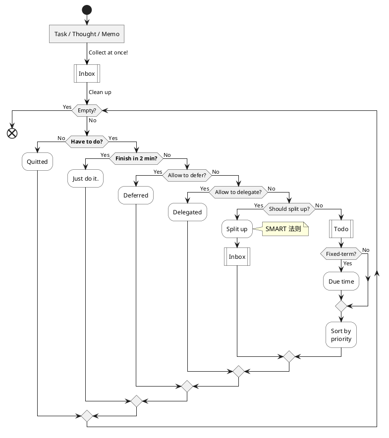
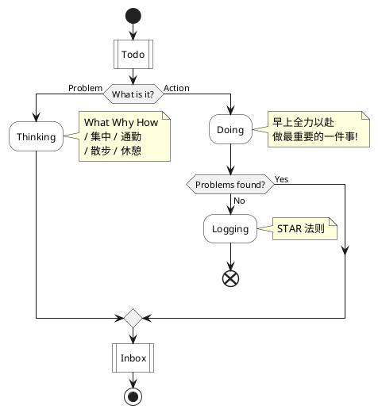
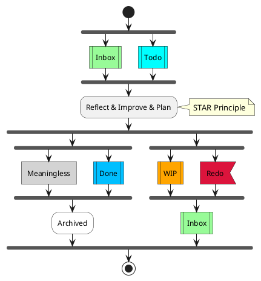
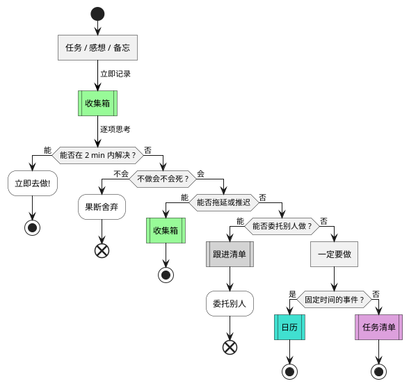
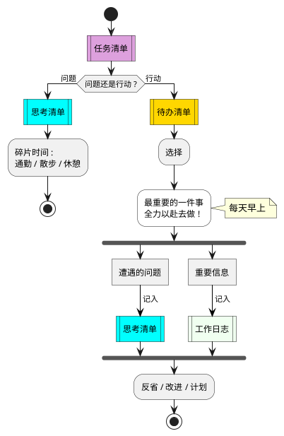

# Do Flow

Glossaries

- Task : 任务 - 工作 & 学习
- Thought : 想法, 感悟
- Memo : 备忘, 信息, 笔记
- Inbox : 收集箱
- Delay : 拖延 / 推迟
- Defer : 推迟
- Delegate : 委托, 委派
- Todo : 待办事项
- Follow-up : 跟进

## Plan

## Action

## Reflect

## References

### Original

### Flow Chart

