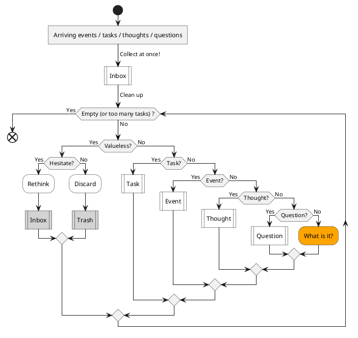
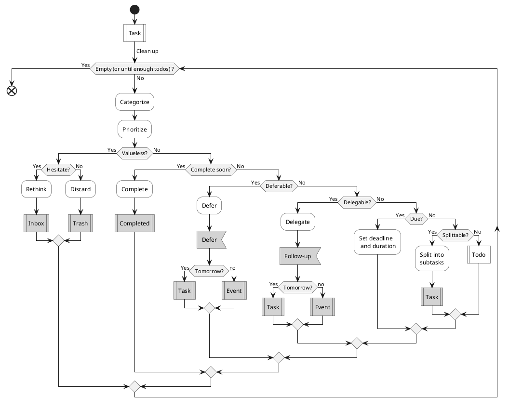
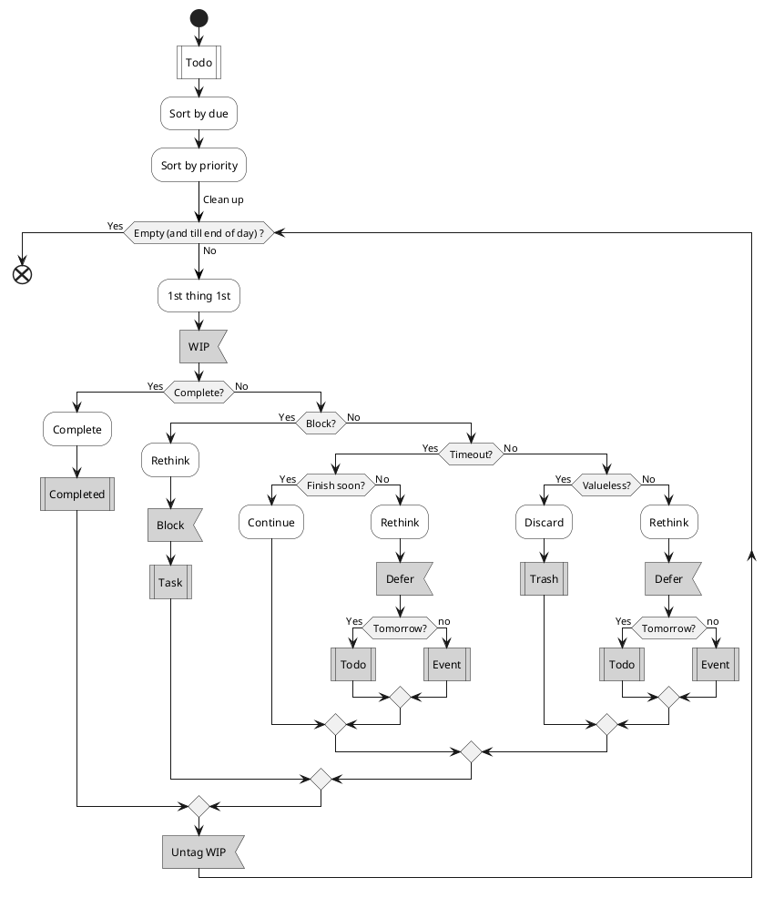
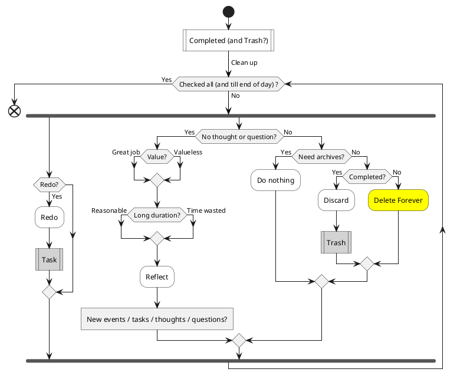
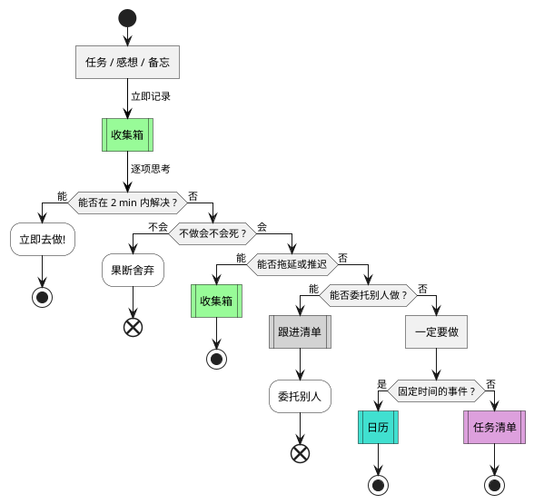
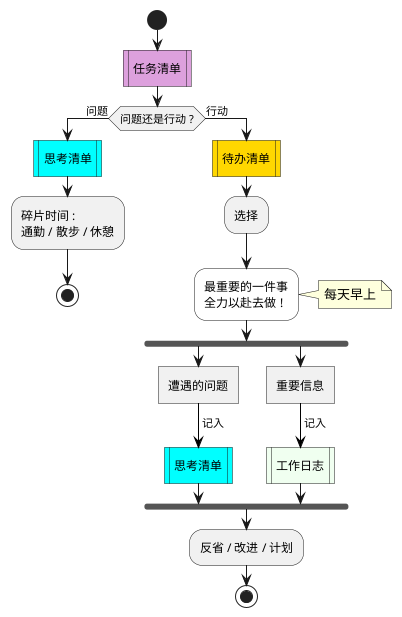

# Do Flow

Glossaries

- Inbox : 收集箱
- Task : 任务 - 工作 & 学习
- Thought : 想法, 感悟; 备忘, 笔记
- Question : 问题, 麻烦
- Event : 事件, 日历
- Defer : 推迟
- Delegate : 委托, 委派
- Follow-up : 跟进
- Todo : 待办事项
- Delay : 拖延 / 推迟

## Mine

Version 2020-12-19

**Daily Do Flow**

1.1\. Plan - Filter tasks ( morning )

- Arriving Events? Due events.
- Too many tasks? Over 10 tasks today.

1.2\. Plan - Preprocess tasks ( morning )

- Priority
    - High : Important & urgent
        - _1st Thing 1st_
    - Medium : Important & not urgent
        - _Important_
    - Low : Not important & urgent
        - _Concerned_
    - No : Not important & not urgent
        - _Trash_
- Enough todos? Usually 3 ~ 5 long todos today.
- Valueless? Maybe valueless. ( Doubt )
- Complete soon? Duration <= 2min
- Deferable? Not important and no deadline.
- Delegable? Able to assign to another person.
- Due? With a deadline.
- Splittable? Not specific or duration > 1day.
    - Ideal duration ≈ 2 hours ?

2\. Do tasks

- Block? Encounter a problem.
- Timeout? Over expected duration or till end of day.
- Finish soon? Extra duration < 1h or till end of day.
- Valueless? Maybe valueless. ( Doubt )

3\. Check done tasks ( evening )

- Valueless? Maybe valueless.
- Redo? Need to redo. (Poor quality?)
- Reflect?
    - _A. Add to Inbox, Thought & Question_
    - _B. Update its description or insert a new comment?_
    - _C. Write in reflect.md of IceHe's Library_
    - …

4\. Adjust

- Update rehabilitation.md
    - 细则 → GTD

## References

Original

