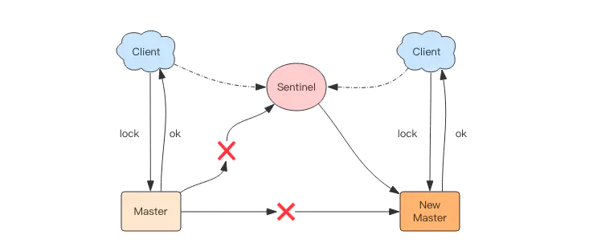
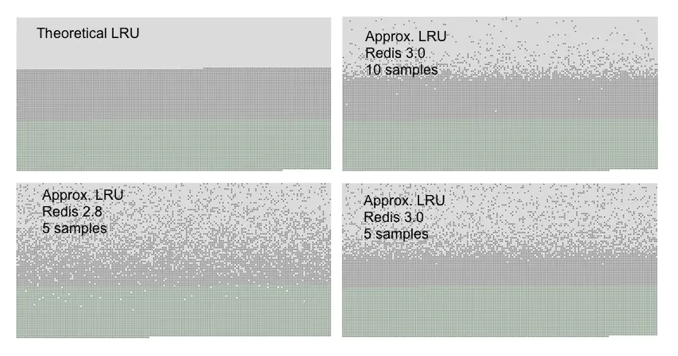
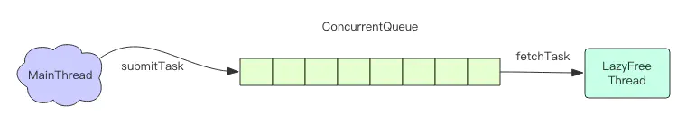
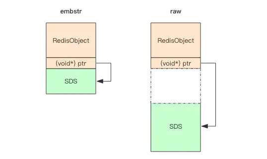
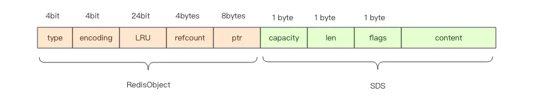
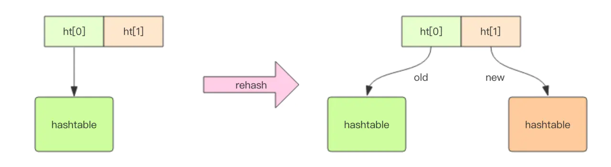
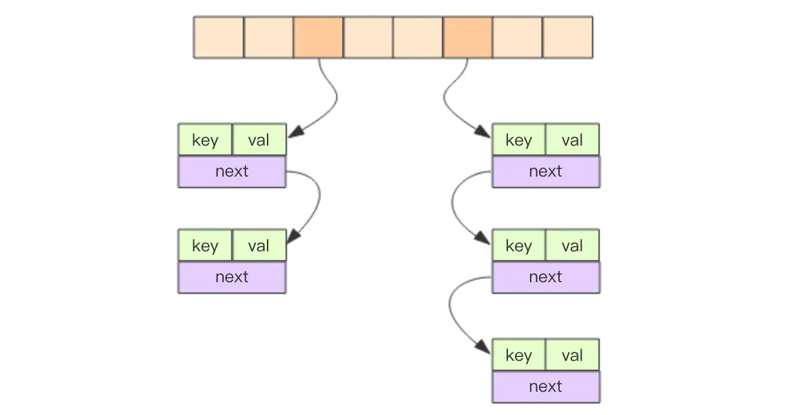
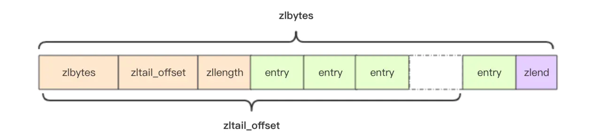
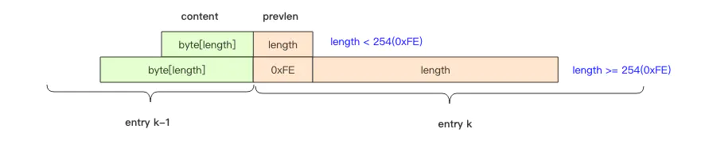
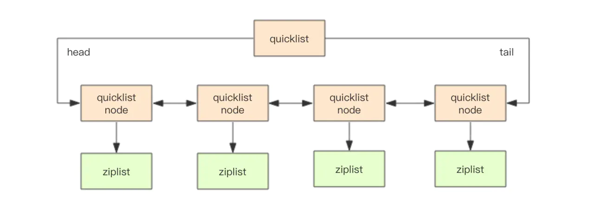

# Key Notes

Redis: **RE**mote **DI**ctionary **S**erver

---

## references

- [Redis 深度历险 : 核心原理与应用实践](https://juejin.im/book/5afc2e5f6fb9a07a9b362527)
- [Redis.io](https://redis.io)
    - [Introduce](https://redis.io/topics/introduction)
    - _[Clients](https://redis.io/clients)_
    - [Commands](https://redis.io/commands)
    - [Documentation](https://redis.io/documentation)
    - _[Download](https://redis.io/download)_
- [Redis.cn](http://redis.cn): 中文文档
- 容量评估
    - **[Redis 容量预估 - 极数云舟](http://www.redis.cn/redis_memory/)**
    - [Redis 容量评估模型 - 腾讯游戏学院](https://gameinstitute.qq.com/community/detail/114987)
- 源码解析
    - [Redis 源码分析 - huangz/note](http://note.huangz.me/storage/redis_code_analysis/index.html) 许多 Redis 书籍均由该作者翻译
    - 注释版源码
        - 2.6: https://github.com/huangz1990/annotated_redis_source
        - 3.0: https://github.com/huangz1990/redis-3.0-annotated
        - 1.0: http://pein0119.github.io/2014/08/18/-Redis-10%E4%BB%A3%E7%A0%81%E9%98%85%E8%AF%BB%EF%BC%88%E4%B8%80%EF%BC%89---%E5%BC%80%E7%AF%87

## data structure

- string
    - 结构: **sds - simple dynamic string**
        - 内存分配
            - **if len < 1M, 加倍扩容**
            - **if len >= 1M, 扩容 1M**
            - **max len = 512M**
- list
    - 结构:
        - **ziplist 压缩列表**
            - **用一块连续的内存存储**
        - **quicklist 快速链表**
            - **将多个 ziplist 用双向指针连起来**
            -   list 元素少时, 用 ziplist;
                list 元素多时, 用 quicklist.
            - _满足快速的插入删除, 以及较小的空间冗余 ( 普通链表的指针太多 )_
            - [structure.webp](_images/quicklist-simple-structure.webp)
- hash
    - 值只能是字符串
    - **progressive rehash**
        -   **ht[0] old;**
            **ht[1] new.**
        - [strategy.webp](_images/progressive-rehash-strategy.webp)
    - _usage: [strings vs hashes to represent JSON: efficiency?](https://stackoverflow.com/questions/16375188/redis-strings-vs-redis-hashes-to-represent-json-efficiency)_
        - _以 hash 形式保存完整信息的话, 可以只获取部分字段, 但结构消耗内存比 string 大._
        - _以 string 形式保存完整信息的话, 只能一次性全部读取, 比较浪费网络流量, 但比 hash 节省内存._
- set
    - 结构: hash
        - 所有的 value 都是 NULL
- zset
    - _like sorted-set + hash_
    - 结构: **skip-list**
        - [structure.webp](_images/skiplist-simple-structure-example.webp)

## usage

### distributed lock

- 思路:
    - **`setnx` ( set if not exists ) 加锁并设置超时时间, 用完了再调用 `del` 释放锁.**
    - **`setnx` 的 value 参数设置为一个随机数, 释放锁时先匹配随机数是否一致.**
- 实现:
    - 加锁
        ```python
        tag = random.nextint()  # 随机数
        if redis.set(key, tag, nx=True, ex=5):
            do_something()
            redis.delifequals(key, tag)  # 假想的 delifequals 指令
        ```
    - 解锁
        ```lua
        # delifequals
        if redis.call("get",KEYS[1]) == ARGV[1] then
            return redis.call("del",KEYS[1])
        else
            return 0
        end
        ```
- 困难:
    - **lock timeout 锁超时**
    - **reentrerability 可重入性**
- 现实经验:
    - _尽可能避免, 允许偶尔人工介入_

### asynchronous message queue

- 结构:
    - list
- 问题: 队列空了怎么办? 忙等: 浪费 CPU, 拉高 QPS
    - 优化A: 拉不到数据时, sleep 一段时间; 但是延迟增大
    - 优化B: **使用阻塞读, 例如 `blpop` `brpop`**
        - 阻塞读在队列没有数据的时候, 会立即进入休眠状态, 一旦数据到来, 则立刻醒过来.
        - 空闲连接自动断开: 注意捕获异常, 然后重试.
- 问题: 客户端在处理分布式锁请求时, 加锁失败怎么办? _3 种处理策略:_
    - A. **直接抛出异常, 通知用户稍后重试**
        - _比较适合由用户直接发起的请求,_
        - _用户看到错误对话框后, 会先阅读对话框的内容, 再点击重试, 这样就可以起到人工延时的效果._
        - _如果考虑到用户体验, 可以由前端的代码替代用户自己来进行延时重试控制._
    - B. **sleep 一会再重试**
        - 如果碰撞的比较频繁或者队列里消息比较多, sleep 可能并不合适.
        - 如果因为个别死锁的 key 导致加锁不成功, 线程会彻底堵死, 导致后续消息永远得不到及时处理.
    - C. **将请求转移至延时队列, 过一会再试**
        - 比较适合异步消息处理, 将当前冲突的请求扔到另一个队列延后处理以避开冲突.

### delayed queue

- 结构:
    - zset
- 用法:
    - _将消息序列化成 string 作为 zset 的 value, 到期处理时间作为 score;_
    - _然后用多个线程轮询 zset 获取到期的任务进行处理._

### bitmap

- 结构:
    - **普通的 string 作为 byte 数组**
- _特性:_
    - _自动拓展: 如果设置了某个偏移位置超出了现有内容范围, 就会自动将位数组进行零扩充._
- 场景:
    - 统计月活: 因为使用 set 浪费空间
        - 前提: userid 连续, 且活跃占比高, 否则还是浪费空间

### HyperLogLog

- 场景:
    - _统计 PV: 给每个网页一个独立的 Redis 计数器, 计数器的 key 后缀加上当天的日期_
    - 统计 UV: 需要去重, 同一个用户一天之内的多次访问请求只能计数一次
        - _要求每一个网页请求都需要带上用户的 ID, 无论是登陆用户还是未登陆用户都需要一个唯一 ID 来标识_
- 简单方案:
    - 做法: 为每一个页面一个独立的 set 集合来存储所有当天访问过此页面的用户 ID
    - 缺点: 如果页面访问量大、页面多, 则非常浪费内存
- 合理方案:
    - _妥协: 老板需要的数据一般不需要太精确, 105w 和 106w 差别不大_
    - 实现: **HyperLogLog 提供不精确的去重计数**, _标准误差为 0.81%_
    - _缺点: 数据结构的内存成本较高_
        - _结构需占 12k 内存, 所以不适合统计大量单个用户相关的数据_
    - 结构改进:
        - 在计数比较小时, HyperLogLog 的存储空间采用稀疏矩阵存储, 空间占用很小;
        - 仅仅在计数慢慢变大, 稀疏矩阵占用空间渐渐超过了阈值时才会一次性转变成稠密矩阵, 才会占用 12k 的空间.
- _PF 是 HyperLogLog 这个数据结构的发明人 Philippe Flajolet 的首字母缩写._

### bloom filter

- 场景:
    - _使用新闻客户端看新闻时, 它会不停地推荐新的内容, 每次推荐时要去重, 去掉那些已经看过的内容._
- 合理方案:
    - bloom filter 提供不精确的去重的存在判定, _在空间上还能节省 90% 以上_
- 特性:
    - **当 bloom filter 说某个值存在时, 这个值可能不存在; 当它说不存在时, 那就肯定不存在**.
        - _Redis 4.0 版本才开始有, 作为一个插件加载到 Redis Server 中_
        - _在上述场景下, 可以完全保证推荐给用户的内容都是无重复的_
- 原理:
    - **多个不同的无偏 hash 函数 + bitmap 存储**… _详情略_
        - 无偏: 能够把元素的 hash 值算得比较均匀
    - 注意: 不要让实际元素远大于初始化大小, 当实际元素开始超出初始化大小时, 应该对布隆过滤器进行重建
        - 这要求在其它的存储器中记录所有的历史元素!
    - [bloom-filter-data-structure.webp](_images/bloom-filter-data-structure-simple-example.webp)
- _其它场景:_
    - _爬虫系统: 对 URL 进行去重, 已经爬过的网页就可以不用爬了_
    - NoSQL 数据库领域: HBase、Cassandra、LevelDB、RocksDB 使用它来显著降低数据库的 IO 请求数量
    - _垃圾邮件过滤: 所以平时也会遇到某些正常的邮件被放进了垃圾邮件目录中, 就是误判所致, 概率很低_

### simple limiter

_简单限流器_

- _场景:_
    - _当系统的处理能力有限时, 阻止计划外的请求继续对系统施压._
    - _控制用户操作频率, 避免垃圾请求._
        - _比如在 UGC 社区, 用户的发帖、回复、点赞等行为都要严格受控,_
        - _一般要严格限定某行为在规定时间内允许的次数, 超过了次数那就是非法行为._
        - _对非法行为, 业务必须规定适当的惩处策略._
- _目标: 限定用户的某个行为在指定的时间里只能允许发生 N 次_
- 方案:
    - **用 zset 结构记录用户的行为历史,**
    - 每一个行为都作为 zset 中的一个 key 保存下来,
    - **score 值来保存时间窗口;**
    - 同一个用户同一种行为用一个 zset 记录;
    - 只需要保留这个时间窗口内的数据, 窗口之外的都可以删掉, 节省内存;
    - 通过统计滑动窗口内的行为数量与阈值 max_count 进行比较就可以得出当前的行为是否允许.
    - [zset-limiter.webp](_images/zset-limiter.webp)

### funnel limiter

_漏斗限流器_

- 思路:
    - _漏斗的剩余空间: 当前行为可以持续进行的数量_
    - _漏嘴的流水速率: 系统允许该行为的最大频率_
    - **每次灌水前都会被调用以触发漏水, 给漏斗腾出空间来.**
    - **能腾出多少空间取决于过去了多久以及流水的速率.**
- 实现:
    ```python
    # coding: utf8
    import time

    class Funnel(object):

        def __init__(self, capacity, leaking_rate):
            # 漏斗容量
            self.capacity = capacity
            # 漏嘴流水速率
            self.leaking_rate = leaking_rate
            # 漏斗剩余空间
            self.left_quota = capacity
            # 上一次漏水时间
            self.leaking_ts = time.time()

        def make_space(self):
            now_ts = time.time()
            # 距离上一次漏水过去了多久
            delta_ts = now_ts - self.leaking_ts
            # 又可以腾出不少空间了
            delta_quota = delta_ts * self.leaking_rate
            # 腾的空间太少, 那就等下次再继续
            if delta_quota < 1:
                return
            # 增加剩余空间
            self.left_quota += delta_quota
            # 记录漏水时间
            self.leaking_ts = now_ts
            # 剩余空间不得高于容量
            if self.left_quota > self.capacity:
                self.left_quota = self.capacity

        def watering(self, quota):
            self.make_space()
            # 判断剩余空间是否足够
            if self.left_quota >= quota:
                self.left_quota -= quota
                return True
            return False

    # 所有的漏斗
    funnels = {}

    # capacity  漏斗容量
    # leaking_rate 漏嘴流水速率 quota/s
    def is_action_allowed(
        user_id, action_key, capacity, leaking_rate):
        key = '%s:%s' % (user_id, action_key)
        funnel = funnels.get(key)
        if not funnel:
            funnel = Funnel(capacity, leaking_rate)
            funnels[key] = funnel
        return funnel.watering(1)

    for i in range(20):
        print is_action_allowed('laoqian', 'reply', 15, 0.5)
    ```
- 优点:
    - _Funnel 对象占据的空间大小不再和行为的频率成正比,_ 它的 **空间占用是一个常量**
- 简单结构:
    - 将 Funnel 对象的内容按字段存储到一个 hash 结构中
- 简单结构缺点:
    - 无法对整个 hash 结构的各字段的读写过程保证原子性.
    - 而一旦加锁, 就意味着会有加锁失败, 加锁失败就需要选择重试或者放弃.
    - 如果重试的话, 就会导致性能下降. 如果放弃的话, 就会影响用户体验.
    - 同时, 代码的复杂度也跟着升高很多.
- 合理结构方案:
    - Redis 4.0 提供了 **限流模块 redis-cell**, 使用 "漏斗算法" 并提供原子的限流指令

### GeoHash

- 场景: 寻找附近的人
    - 地图元素的位置数据使用二维的经纬度表示;
    - 当两个元素的距离不是很远时, 可以直接使用勾股定理就能算得元素之间的距离.
- 简单方案:
    - 元素的经纬度坐标使用关系数据库 (元素 id, 经度 x, 纬度 y) 存储,
        - 缺点: 通过遍历来计算所有的元素和目标元素的距离然后再进行排序, 计算量太大.
    - 通常通过矩形区域来限定元素的数量, 然后对区域内的元素进行全量距离计算再排序.
        - **`select id from positions where x0 - r < x < x0 + r and y0 - r < y < y0 + r;`**
    - **当用户对筛出来的结果不满意, 那就扩大半径继续筛选.**
        - 缺点: 如果查询请求非常多, 在高并发场合, 数据库的查询性能有限.
- 合理方案:
    - 业界比较通用的 **地理位置距离排序算法是 GeoHash 算法**
        - **将二维的经纬度数据映射到一维的整数, 所有的元素都将在挂载到一条线上,**
        - **距离靠近的二维坐标映射到一维后的点之间距离也会很接近.**
        - [geohash-animation.gif](_images/geohash-animation.gif)
            - _动图的例子中使用的是二刀法, 真实算法中还会有很多其它刀法, 最终编码出来的整数数字也都不一样._
    - 做法:
        - 经纬度使用 52 位的整数进行编码, 放进 zset
            - _zset 的 value 是元素的 key ( 例如 "三里屯SOHO" )_
            - _score 是 GeoHash 的 52 位整数值_
                - _score 虽然是浮点数, 但是对于 52 位的整数值, 它可以无损存储_
        - **score 范围查询就可以得到坐标附近的其它元素**
        - **可以根据 score 还原成坐标值就可以得到元素的原始坐标**

### scan

- 指令 `keys`
    - 功能: 列出所有满足特定正则字符串规则的 key
    - 缺点: 一次性吐出所有满足条件的 key, 使用遍历算法, 复杂度是 O(n)
        - _如果实例中有千万级以上的 key, 会导致 Redis 服务卡顿, 所有读写 Redis 的其它的指令都会被延后甚至会超时报错._
- 指令 `scan` 特点:
    - 也提供模式匹配功能; 复杂度也是 O(n), 但 **通过游标分步进行的, 不会阻塞线程**;
    - limit 参数制每次返回结果的最大条数, 但只是一个 hint, 返回的结果可多可少;
        - limit 不是限定返回结果的数量, 而是限定服务器单次遍历的字典槽位数量 ( 约等于 )
    - 服务器不需要为游标保存状态, 游标的唯一状态就是 scan 返回给客户端的游标整数;
    - 注意:
        - 返回的结果可能会有重复, 需要客户端去重复;
        - 遍历的过程中如果有数据修改, 改动后的数据能不能遍历到是不确定的;
        - 单次返回的结果是空的并不意味着遍历结束, 而要看返回的游标值是否为 0.
- `scan` 原理:
    - 在 Redis 中的所有 key 都存储在一个很大的 dictionary 中
        - 实现: 一维数组 + 二维链表结构 ( [dictionary-structure.webp](_images/dictionary-simple-structure.webp) )
        - 大小: 第一维数组的大小总是 2^n
        - 扩容: 一维数组大小加倍
    - `scan` 指令返回的游标 cursor: 第一维数组的位置索引, 也称为 **槽 ( slot )**
        - _如果不考虑字典的扩容缩容, 直接按数组下标挨个遍历即可._
    - `scan` 指令的参数 limit: 需要遍历的槽位数, 返回的结果可多可少
        - _因为不是所有的槽位上都会挂接链表, 有些槽位可能是空的; 还有些槽位上挂接的链表上的元素可能会有多个._
    - **每一次遍历都会将 limit 数量的槽位上挂接的所有链表元素进行模式匹配过滤后, 一次性返回** 给客户端.

#### traverse sequence

_遍历顺序_

- 做法:
    - 不是从第一维数组的第 0 位一直遍历到末尾, 而是采用 **高位进位加法** 来遍历.
- 原因:
    - **考虑到字典的扩容和缩容时避免槽位的遍历重复和遗漏**.
- 演示:
    - [high-carry-addition.gif](_images/high-carry-addition-example.gif)
- 原理:
    - rehash 就是将元素的 hash 值对数组长度进行取模运算.
        - 因为长度变了, 所以每个元素挂接的槽位可能也发生了变化.
    - 扩容 rehash 前后元素槽位的变化:
        - _假设当前的字典的数组长度由 8 位扩容到 16 位, 那么 3 号槽位 011 将会被 rehash 到 3 号槽位和 11 号槽位,_
            - _也就是说该槽位链表中大约有一半的元素还是 3 号槽位, 其它的元素会放到 11 号槽位,_
            - _11 这个数字的二进制是 1011, 就是对 3 的二进制 011 增加了一个高位 1._
            - [dictionary-rehash.webp](_images/dictionary-rehash-example.webp)
        - _抽象一点说, 假设开始槽位的二进制数是 xxx,_
            - _那么该槽位中的元素将被 rehash 到 0xxx 和 1xxx ( xxx+8 ) 中._
    - 对比扩容前后的遍历顺序:
        - **采用高位进位加法的遍历顺序, rehash 后的槽位在遍历顺序上是相邻的.**
        - [traverse-sequence-before-n-after-rehashing.webp](_images/traverse-sequence-before-n-after-rehashing.webp)
    - 考虑缩容:
        - **过去两个 slot 的数据挂载到同一个 slot, 有些元素会被重复遍历.**
    - 考虑 progressive rehash:
        - 操作处于 rehash 中的字典, 需要同时访问新旧两个数组结构.
            - 如果在旧数组 ht[0] 下面找不到元素, 还需要去新数组 ht[1] 下面去寻找.
        - _所以需要同时扫描新旧槽位, 然后将结果融合后返回给客户端._

#### bigkeys

- 场景:
    - 有时候会因为业务人员使用不当, 在 Redis 实例中会形成很大的对象,
        - 比如一个很大的 hash, 一个很大的 zset 这都是经常出现的.
        - 因为在集群环境下, 如果某个 key 太大, 会导致数据迁移卡顿.
        - 另外在内存分配上, 如果 key 太大, 当它需要扩容时, 会一次性申请更大的一块内存, 也会卡顿.
        - 如果这个大 key 被删除, 内存会一次性回收, 会再一次卡顿.
- 建议: 尽量避免大 key 的产生.
    - 如果观察到 Redis 的内存大起大落, 这极有可能是因为大 key 导致的;
    - 需要定位出具体是那个 key, 进一步定位出具体的业务来源, 然后再改进相关业务代码设计.
- 问题:
    - 如何定位大 key?
- 繁琐方案:
    - 为了避免对线上 Redis 带来卡顿, 这就要用到 scan 指令,
    - 对于扫描出来的每一个 key, 使用 type 指令获得 key 的类型,
    - 然后使用相应数据结构的 size 或者 len 方法来得到它的大小,
    - 对于每一种类型, 保留大小的前 N 名作为扫描结果展示出来.
    - 这样的过程需要编写脚本, 比较繁琐,_
- 官方方案:
    - **`redis-cli` 指令提供 `--bigkeys` 扫描功能.**
        - _`redis-cli -h 127.0.0.1 -p 7001 –-bigkeys`_
    - _担心这个指令会大幅抬升 Redis 的 ops 导致线上报警, 可以使用休眠参数._
        - _`redis-cli -h 127.0.0.1 -p 7001 –-bigkeys -i 0.1`_
        - _这样 ops 就不会剧烈抬升, 但是扫描的时间会变长._
- 拓展阅读: [美团近期修复的 scan 的一个 bug](https://mp.weixin.qq.com/s/ufoLJiXE0wU4Bc7ZbE9cDQ)

## principles

### general

- 容器性数据结构, 及其通用规则
    - list / hash / set / zset / ~~string~~
    - **create if not exists**: _如果容器不存在, 就创建一个再操作_
    - **drop if no elements**: _如果容器里元素没有了, 立即删除元素, 释放内存_
- expiration
    - 过期是以对象为单位的
        - hash 结构的过期是整个 hash 对象的过期, 而不是其中的某个子 key
        - 注意: 如果 string 有过期时间, 调用 set 方法修改, 会移除其过期时间

### thread io model

_线程 IO 模型_

- Redis 是个单线程程序, 但 **从 Redis 6.0 开始, 支持多线程 IO 处理模型**
    - _注意: 对于那些时间复杂度为 O(n) 级别的指令, 小心导致 Redis 卡顿._
- 问题:
    - 如何处理许多并发客户端的连接?
- 方案:
    - 多路复用: **`select` 系列的事件轮询 API, 支持非阻塞 IO.**
- 拓展阅读: [为什么 Redis 选择单线程模型 - draveness.me](https://draveness.me/whys-the-design-redis-single-thread)

#### non-blocking io

- 当调用套接字的读写方法, 默认是阻塞的,
    - read 方法要传递进去一个参数 n, 表示最多读取这么多字节后再返回,
        - 如果一个字节都没有, 那么线程就会卡在那里,
        - 直到新的数据到来或者连接关闭了, read方法才可以返回, 线程才能继续处理.
    - 而 write 方法一般来说不会阻塞,
        - 除非内核为套接字分配的写缓冲区已经满了, write方法就会阻塞,
        - 直到缓存区中有空闲空间挪出来了.
    - [io-model.webp](_images/io-model.webp)
- 非阻塞 IO 在套接字对象上提供了一个选项 `Non_Blocking`,
    - **当选项 `Non_Blocking` 打开时, 读写方法不会阻塞, 而是能读多少读多少, 能写多少写多少.**
        - 能读多少 取决于 : 内核为套接字分配的 **读缓冲区** 内部的数据字节数,
        - 能写多少 取决于 : 内核为套接字分配的 **写缓冲区** 的空闲空间字节数.
    - 读方法和写方法都会通过返回值来告知程序实际读写了多少字节.
        - 有了非阻塞 IO 意味着线程在读写 IO 时可以不必再阻塞了,
        - 读写可以瞬间完成然后线程可以继续干别的事了.

#### event polling

_( multiplexing 多路复用 )_

- 问题:
    - _非阻塞 IO 的问题: 线程要读数据, 结果读了一部分就返回了, 线程如何知道何时才应该继续读?_
    - _也就是当数据到来时, 线程如何得到通知._
    - _写也是一样, 如果缓冲区满了, 写不完, 剩下的数据何时才应该继续写, 线程也应该得到通知._
    - [event-loop.webp](_images/event-loop.webp)
- 初始方案:
    - 最简单的事件轮询 API 是操作系统提供给用户程序的 `select` 函数.
        - 输入: 读写描述符列表 **read_fds & write_fds**,`
        - 输出: 与之对应的可读可写事件.
        - 参数 :
            - timeout: 如果没有任何事件到来, 那么就最多等待 timeout 时间, 线程处于阻塞状态.
                - _一旦期间有任何事件到来, 就可以立即返回._
                - _时间过了之后还是没有任何事件到来, 也会立即返回._
        - 拿到事件后, 线程就可以继续挨个处理相应的事件.
            - 处理完了继续过来轮询, 于是线程就进入了一个死循环,
            - 把这个死循环称为 **事件循环**, 一个循环为一个周期.
    - _每个客户端套接字 socket 都有对应的读写文件描述符._
        ```python
        read_events, write_events = select(read_fds, write_fds, timeout)
        for event in read_events:
            handle_read(event.fd)
        for event in write_events:
            handle_write(event.fd)
        handle_others() # 处理其它事情, 如定时任务等
        ```
    - _因为通过 `select` 系统调用同时处理多个通道描述符的读写事件, 所以将这类系统调用称为多路复用 API._
- 进阶方案:
    - 现代 OS 的多路复用 API 改用 **`epoll`** | **`kqueue`**
        - _因为 `select` 系统调用的性能在描述符特别多时性能会非常差._
    - _事件轮询 API 就是 Java 语言里面的 NIO 技术._
        - _Java 的 NIO 并不是 Java 特有的技术, 其它计算机语言都有这个技术, 只不过换了一个词汇, 不叫 NIO 而已._
- 指令队列:
    - _Redis 将每个客户端套接字都关联一个指令队列._
    - _客户端的指令通过队列来排队进行顺序处理, 先到先服务._
- 响应队列:
    - _为每个客户端套接字关联一个响应队列._
    - _服务器通过响应队列来将指令的返回结果回复给客户端._
        - _如果队列为空, 那么意味着连接暂时处于空闲状态, 不需要去获取写事件,_
            - _也就是可以将当前的客户端描述符从 write_fds 里面移出来._
        - _等到队列有数据了, 再将描述符放进去._
            - _避免 `select` 系统调用立即返回写事件, 结果发现没什么数据可以写._
            - _出这种情况的线程会飙高 CPU._
- 定时任务:
    - _如果线程阻塞在 `select` 系统调用上, 定时任务将无法得到准时调度. Redis 如何解决?_
        - **定时任务会记录在一个称为最小堆的数据结构中.**
        - _在每个循环周期, Redis 都会将最小堆里面已经到点的任务立即进行处理._
        - _处理完毕后, 将最快要执行的任务还需要的时间记录下来, 这个时间就是 `select` 系统调用的 timeout 参数._
        - _因为 Redis 知道未来 timeout 时间内, 没有其它定时任务需要处理, 所以可以安心睡眠 timeout 的时间._
    - _Nginx 和 Node 的事件处理原理跟 Redis 也是类似的_

### communication protocol

- RESP: Redis Serialization Protocol - [Redis Protocol specification](https://redis.io/topics/protocol)
    - _直观, 优势在于实现异常简单, 解析性能极好._
    - _Redis 的作者认为数据库系统的瓶颈一般不在于网络流量, 而是数据库自身内部逻辑处理上._
    - _所以即使 Redis 使用了浪费流量的文本协议, 依然可以取得极高的访问性能._
    - _将所有数据都放在内存, 用一个单线程对外提供服务, 单个节点在跑满一个 CPU 核心的情况下可以达到了 10w/s 的超高 QPS._
- 传输结构
    - 单元结束时统一加上回车换行符号 `\r\n`
    - 5 种最小单元类型:
        1. 1 string: `+OK\r\n`
        1. N strings: `$3\r\nfoo\r\n` ( `$` 开头, 后跟 string len )
        1. int: `:1024\r\n`
        1. error : `-Error message\r\n`
        1. array: `*2\r\n:1\r\n$3\r\nfoo\r\n` ( `*` 开头, 后跟 array len )
            ```bash
            *2
            :1
            $3
            foo

            ```
    - 特殊类型:
        - NULL: `$-1\r\n`
        - empty string: `$0\r\n\r\n` ( 注意: 有两个 `\r\n` 是为了分隔空串 )
- _客户端向服务器发送的指令格式: 多行字符串数组_
    - _例如指令 `set author icehe` 会被序列化成:_
        _`*3\r\n$3\r\nset\r\n$6\r\nauthor\r\n$5\r\nicehe\r\n`_
        ```bash
        *3
        $3
        set
        $6
        author
        $5
        icehe
        ```
- _服务器向客户端回复的响应要支持多种数据结构: 略_

### persistency

- 持久化机制
    1. snapshot 快照:
        - 全量备份
        - 格式: 二进制序列化形式, 紧凑
    1. AOF 日志:
        - 增量备份
        - 格式: 指令文本
        - 问题: 在长期的运行过程中会变的无比庞大, 重启时需要加载 AOF 日志进行指令重放, 时间漫长
        - 解决: 需要定期进行 AOF 重写, 给 AOF 日志进行瘦身

#### snapshot

- 问题:
    - 为了不阻塞线上的业务, 就需要边持久化边响应客户端请求;
    - 持久化的同时, 内存数据结构还在改变, 怎么办?
- 解决:
    - 在持久化时会调用 glibc 的函数 `fork` 产生一个子进程
        ```python
        pid = os.fork()
        if pid > 0
            # 父进程继续处理客户端请求:
            handle_client_requests()
        if pid == 0:
            # 子进程处理快照写磁盘
            handle_snapshot_write()
        if pid < 0:
            # fork error
        ```
    - _父进程继续处理客户端请求: 对内存数据结构进行不间断的修改._
        - _这时就会使用操作系统的 COW 机制来进行数据段页面的分离._
    - 快照持久化完全交给子进程来处理, 不会修改现有的内存数据结构,
        - 子进程相应的页面是没有变化的, 还是进程产生时那一瞬间的数据.
    - _注意: 如果更新操作太多, 数据变化很大, 就要小心操作系统 OOM_

#### aof

- AOF 日志:
    - 存储的是 Redis 服务器的顺序指令序列, 只记录修改的指令记录
    - 先执行修改指令才将其日志存盘
        - _进行参数校验进行逻辑处理后, 如果没问题, 就立即将该指令文本存储到 AOF 日志中_
        - _不同于 LevelDB、HBase 等存储引擎, 它们都是先存储日志再做逻辑处理_

#### fsync

- 问题:
    - 对 AOF 日志文件进行写操作时, 实际上是将内容写到了内核为文件描述符分配的一个内存缓存中, 然后内核会异步将脏数据刷回到磁盘的.
    - 如果机器突然宕机, AOF 日志内容可能还没有来得及完全刷到磁盘中, 这个时候就会出现日志丢失. 怎么办?
- 方案:
    - Linux 的 glibc 提供了 **`fsync(int fd)` 函数可以将指定文件的内容强制从内核缓存刷到磁盘.**
    - 只要 Redis 进程实时调用 `fsync` 函数就可以保证 aof 日志不丢失.
- 缺点:
    - `fsync` 是一个磁盘 IO 操作, 非常慢!
    - _如果 Redis 执行一条指令就要 fsync 一次, 那么性能会大大下降._
- 妥协:
    - **在生产环境的服务器中, 通常每隔 1s 左右执行一次 `fsync` 操作.**
    - 在数据安全性和性能之间做了一个折中, 在保持高性能的同时, 尽可能使得数据少丢失.
- _其它策略:_
    - _A. 永不 fsync: 让操作系统来决定何时同步磁盘, 很不安全._
    - _B. 每个指令 fsync 一次: 非常慢, 在生产环境基本不会使用._

#### operation and maintenance

- 问题:
    - _快照是通过开启子进程的方式进行的: 遍历整个内存, 大块写磁盘会加重系统负载._
- 方案:
    - **通常 Redis 的主节点是不会进行持久化操作, 持久化操作主要在从节点进行.**
    - _从节点是备份节点, 没有来自客户端请求的压力, 它的操作系统资源往往比较充沛._
- 缺点:
    - 如果出现网络分区, 从节点长期连不上主节点, 就会出现数据不一致的问题,
    - 特别是在网络分区出现的情况下又不小心主节点宕机了, 那么数据就会丢失.
- 防护措施:
    - 在生产环境要做好实时监控工作, 保证网络畅通或者能快速修复.
    - 可以增加一个从节点以降低网络分区的概率, _只要有一个从节点数据同步正常, 数据也就不会轻易丢失._

#### 混合持久化

- 背景:
    - 考虑: 重启 Redis 时, 很少使用 rdb 来恢复内存状态, 因为会丢失大量数据.
    - 做法: 通常使用 AOF 日志重放
    - 缺点: 但重放 AOF 日志性能相对 rdb 来说要慢很多, 实例很大时启动需要花费很长的时间.
- 方案: **混合持久化** _since Redis 4.0_
    - 将 RDB 文件的内容和增量的 AOF 日志文件存在一起.
        - **AOF 日志不再是全量的日志, 而是自持久化开始到持久化结束的这段时间发生的增量 AOF 日志;**
        - _通常这部分 AOF 日志不能大, AOF 的速度必须能够尽快追上更新数据的速度_
    - 于是在 **Redis 重启的时候, 可以先加载 RDB 的内容, 然后再重放增量 AOF 日志.**
        - _可以完全替代之前的 AOF 全量文件重放, 重启效率因此大幅得到提升._
    - [recover-redis-by-rdb-n-aop.webp](_images/recover-redis-by-rdb-n-aop.webp)

### pipeline

- _误解:_
    - _Redis 管道 ( Pipeline ) 本身并不是由服务器直接提供的技术, **本质上是由客户端提供的**, 跟服务器没有什么直接的关系._
- 本质:
    - _服务器没有任何区别对待, 还是收到一条消息, 执行一条消息, 回复一条消息的正常的流程._
    - _客户端通过对管道中的指令列表改变读写顺序就可以大幅节省 IO 时间._
    - 简单来说, 就是 **将多次网络请求合并为一次网络请求, 节省多次网络往返的时延.**
    - [client-requests-server-responses.webp](_images/client-requests-server-responses.webp)
    - [client-requests-server-responses-in-pipeline.webp](_images/client-requests-server-responses-in-pipeline.webp)

### transaction

- 缺点!
    - Redis 的事务模型很不严格, 不能像使用关系数据库的事务一样来使用
- _DB 每个事务的操作:_
    - _`begin` 事务的开始_
    - _`commit` 事务的提交_
    - _`rollback` 事务的回滚_
- Redis 在形式上看起来差不多:
    - `watch` 在事务开始之前盯住 1 个或多个关键变量
        - 当 `exec` 执行时, 检查关键变量自 `watch` 以来是否被修改
            ( 包括当前事务所在的客户端 ) .
        - 如果关键变量被修改了, `exec` 指令返回 null 告知客户端事务执行失败
            ( 这时客户端一般会选择重试 ) .
    - `multi` 事务的开始
    - `exec` 事务的执行
    - `discard` 事务的丢弃: 在 `exec` 执行之前, 丢弃事务缓存队列中的所有指令.
- _示例:_
    ```bash
    > multi
    OK
    > incr books
    QUEUED
    > incr books
    QUEUED
    > exec
    (integer) 1
    (integer) 2
    ```
- [redis-transaction.webp](_images/redis-transaction.webp)

### pubsub

- 背景:
    - 可以用 Redis 的 list 或 zset 实现简单的消息队列,
    - 但是这样不支持消息的多播机制.
    - [redis-as-message-queue.webp](_images/redis-as-message-queue.webp)
- message multicast _消息多播_
    - 消息多播允许生产者生产一次消息, 中间件负责将消息复制到多个消息队列, 每个消息队列由相应的消费组进行消费.
    - 它是分布式系统常用的一种解耦方式, 用于将多个消费组的逻辑进行拆分.
    - 支持了消息多播, 多个消费组的逻辑就可以放到不同的子系统中.
    - 如果是普通的消息队列, 就得将多个不同的消费组逻辑串接起来放在一个子系统中, 进行连续消费.
- 官方方案:
    - _为了支持消息多播, 不能再依赖于那 5 种基本数据类型了._
    - 单独使用了模块 PubSub 支持消息多播,
    - _即 PublisherSubscriber, 发布者订阅者模型._
    - 问题:
        - PubSub 的消费者如果使用休眠的方式来轮询消息, 也会遭遇消息处理不及时的问题.
    - 解决:
        - 可以使用 `listen` 来阻塞监听消息来进行处理, _跟 `blpop` 原理相同._
        - _不需要再休眠了, 消息处理也及时了._
- 特性:
    - Pattern Subscribe _模式订阅_: `psubscribe codehole.*`
- 消息结构:
    - `data` 消息的内容, string
    - `channel` 当前订阅的主题名称
    - `type` 消息的类型 :
        - 如果是一个普通的消息, 那么类型就是 **message**,
        - 如果是控制消息, 比如订阅指令的反馈, 它的类型就是 **subscribe**,
        - 如果是模式订阅的反馈, 它的类型就是 **psubscribe**,
        - 还有取消订阅指令的反馈 **unsubscribe** 和 **punsubscribe**.
    - `pattern` 当前消息是使用哪种模式订阅到的,
        - 如果是通过 subscribe 指令订阅的, 那么这个字段就是空.
- _消息示例:_
    ```bash
    {'pattern': None, 'type': 'subscribe', 'channel': 'codehole', 'data': 1L}
    {'pattern': None, 'type': 'message', 'channel': 'codehole', 'data': 'python comes'}
    {'pattern': None, 'type': 'message', 'channel': 'codehole', 'data': 'java comes'}
    {'pattern': None, 'type': 'message', 'channel': 'codehole', 'data': 'golang comes'}
    ```
- 缺点:
    - PubSub 的生产者传递过来一个消息, Redis 会直接找到相应的消费者传递过去.
        - 如果一个消费者都没有, 那么消息直接丢弃.
        - 如果开始有三个消费者, 一个消费者突然挂掉了, 生产者会继续发送消息, 另外两个消费者可以持续收到消息.
        - 但是挂掉的消费者重新连上的时候, 这断连期间生产者发送的消息, 对于这个消费者来说就是彻底丢失了.
    - 如果 Redis 停机重启, PubSub 的消息是不会持久化的,
        - 毕竟 Redis 宕机就相当于一个消费者都没有, 所有的消息直接被丢弃.
    - 正是因为 PubSub 有这些缺点, 它几乎找不到合适的应用场景.
- 解决:
    - _所以 Redis 的作者单独开启了一个项目 Disque 专门用来做多播消息队列._
    - _该项目目前没有成熟, 一直长期处于 Beta 版本, 但是相应的客户端 sdk 已经非常丰富了, 就待 Redis 作者临门一脚发布一个 Release 版本._
- _许多高级特性都没有, 相比高吞吐 & 持久化 kafka, 还有强大易用的 RabbitMQ, 实用性太差了._

### small object compression

- 32bit vs 64bit
    - Redis 如果使用 32bit 进行编译, 内部所有数据结构所使用的指针空间占用会少一半, 如果对 Redis 使用内存不超过 4G, 可以考虑使用 32bit 进行编译, 可以节约大量内存.
    - 4G 的容量作为一些小型站点的缓存数据库是绰绰有余了, 如果不足还可以通过增加实例的方式来解决.
- 考虑:
    - 好比 HashMap 本来是二维结构, 但是如果内部元素比较少, 使用二维结构反而浪费空间,
    - 还不如使用一维数组进行存储, 需要查找时, 因为元素少进行遍历也很快, 甚至可以比 HashMap 本身的查找还要快.
- ziplist
    - 是一个紧凑的字节数组结构, 每个元素之间都是紧挨着的
    - 结构: [zlist-simple-structure-example.webp](_images/zlist-simple-structure-example.webp)
- _ziplist 示例:_
    - _如果它存储的是 hash 结构, 那么 key 和 value 会作为两个 entry 相邻存在一起._
        ```bash
        127.0.0.1:6379> hset hello a 1
        (integer) 1
        127.0.0.1:6379> hset hello b 2
        (integer) 1
        127.0.0.1:6379> hset hello c 3
        (integer) 1
        127.0.0.1:6379> object encoding hello
        "ziplist"
        ```
    - 如果它存储的是 zset, 那么 value 和 score 会作为两个 entry 相邻存在一起.
        ```bash
        127.0.0.1:6379> zadd world 1 a
        (integer) 1
        127.0.0.1:6379> zadd world 2 b
        (integer) 1
        127.0.0.1:6379> zadd world 3 c
        (integer) 1
        127.0.0.1:6379> object encoding world
        "ziplist"
        ```
- intset
    - 是一个紧凑的整数数组结构, 用于存放元素都是整数并且个数较少的 set 集合.
    - 如果整数可以用 uint16 表示, 那么 intset 的元素就是 16 位的数组,
        - 如果新加入的整数超过了 uint16 的表示范围, 那么就使用 uint32 表示,
        - 如果新加入的元素超过了 uint32 的表示范围, 那么就使用 uint64 表示,
    - 支持 set 集合动态从 uint16 升级到 uint32, 再升级到 uint64.
    - 结构: [intset-structure-simple-example.webp](_images/intset-structure-simple-example.webp)
- _intset 示例:_
    - 如果 set 里存储的是字符串, 那么 sadd 立即升级为 hashtable 结构.
        ```bash
        127.0.0.1:6379> sadd hello yes no
        (integer) 2
        127.0.0.1:6379> object encoding hello
        "hashtable"
        ```
- **存储界限**:
    - 当集合对象的元素不断增加, 或者某个 value 值过大, 这种小对象存储也会被升级为标准结构.
    - 规定在小对象存储结构的限制条件:
        ```bash
        # hash 的元素个数超过 512 就必须用标准结构存储
        hash-max-ziplist-entries 512
        # hash 的任意元素的 key/value 的长度超过 64 就必须用标准结构存储
        hash-max-ziplist-value 64

        # list 的元素个数超过 512 就必须用标准结构存储
        list-max-ziplist-entries 512
        # list 的任意元素的长度超过 64 就必须用标准结构存储
        list-max-ziplist-value 64

        # zset 的元素个数超过 128 就必须用标准结构存储
        zset-max-ziplist-entries 128
        # zset 的任意元素的长度超过 64 就必须用标准结构存储
        zset-max-ziplist-value 64

        # set 的整数元素个数超过 512 就必须用标准结构存储
        set-max-intset-entries 512
        ```

### memory collection mechanism

- 背景:
    - Redis 并不总是可以将空闲内存立即归还给操作系统.
- 做法:
    - OS 回收内存是以页为单位, 如果这个页上只要有一个 key 还在使用, 那么它就不能被回收.
    - 如果执行 `flushdb`, 然后再观察内存会发现内存确实被回收了.
        - 因为所有的 key 都干掉了, 大部分之前使用的页面都完全干净了, 会立即被操作系统回收.
    - Redis 虽然无法保证立即回收已经删除的 key 的内存, 但是它会重用那些尚未回收的空闲内存.

### memeory alloaction algorithm

- 背景:
    - Redis 为了保持自身结构的简单性, 在内存分配这里直接使用第三方库, 将内存分配的细节丢给了第三方内存分配库去实现.
- 现状:
    - 可以使用 jemalloc (facebook) 库来管理内存, 也可以切换到 tcmalloc(google).
        - _因为 jemalloc 相比 tcmalloc 的性能要稍好一些, 所以 Redis 默认使用了 jemalloc._
        ```bash
        127.0.0.1:6379> info memory
        # Memory
        used_memory:809608
        used_memory_human:790.63K
        used_memory_rss:8232960
        used_memory_peak:566296608
        used_memory_peak_human:540.06M
        used_memory_lua:36864
        mem_fragmentation_ratio:10.17
        mem_allocator:jemalloc-3.6.0
        ```
        - _macOS 安装的 Redis 使用了 libc 的 mem_allocator_

### master-salve synchronization

- 背景:
    - 很多企业都没有使用到 Redis 的集群, 但是至少都做了主从.
- 考虑:
    - 有了主从, 当 master 挂掉的时候, 运维让从库过来接管, 服务就可以继续,
    - 否则 master 需要经过数据恢复和重启的过程, 这就可能会拖很长的时间, 影响线上业务的持续服务.
- eventually consistent _最终一致_
    - Redis 的主从数据是异步同步的, 所以分布式的 Redis 系统并不满足「一致性」要求.
    - 当客户端在 Redis 的主节点修改了数据后, 立即返回,
    - 即使在主从网络断开的情况下, 主节点依旧可以正常对外提供修改服务, 所以 Redis 满足「可用性」. _( 这种情况到底算不算可用? 有争议 )_
    - Redis 保证「最终一致性」, 从节点会努力追赶主节点, 最终从节点的状态会和主节点的状态将保持一致.
    - 如果网络断开了, 主从节点的数据将会出现大量不一致, 一旦网络恢复, 从节点会采用多种策略努力追赶上落后的数据, 继续尽力保持和主节点一致.
- 特性
    - **主从同步** Master-Slave Synchronization
    - **从从同步** Slave-Slave Synchronization: 为了减轻主库的同步负担.

### incremental synchronization

- 背景:
    - Redis 同步的是指令流, 主节点会将那些对自己的状态产生修改性影响的指令记录在本地的内存 buffer 中, 然后异步将 buffer 中的指令同步到从节点
    - 从节点一边执行同步的指令流来达到和主节点一样的状态, 一边向主节点反馈自己同步到哪里了 ( 偏移量 ) .
- 问题:
    - 因为内存的 buffer 是有限的, 所以 Redis 主库不能将所有的指令都记录在内存 buffer 中.
    - Redis 的复制内存 buffer 是一个定长的环形数组, 如果数组内容满了, 就会从头开始覆盖前面的内容.
    - 如果因为网络状况不好, 从节点在短时间内无法和主节点进行同步, 那么当网络状况恢复时, Redis 的主节点中那些没有同步的指令在 buffer 中有可能已经被后续的指令覆盖掉了,
        - 从节点将无法直接通过指令流来进行同步, 这个时候就需要用到更加复杂的同步机制 —— 快照同步.

### snapshot synchronization

- 背景:
    - 快照同步是一个非常耗费资源的操作,
    - 首先需要在主库上进行一次 `bgsave` 将当前内存的数据全部快照到磁盘文件中, 然后再将快照文件的内容全部传送到从节点.
    - 从节点将快照文件接受完毕后, 立即执行一次全量加载, 加载之前先要将当前内存的数据清空.
    - 加载完毕后通知主节点继续进行增量同步.
    - [rdb-snapshot-synchronization.webp](_images/rdb-snapshot-synchronization.webp)
- 问题:
    - 在整个快照同步进行的过程中, 主节点的复制 buffer 还在不停的往前移动,
    - 如果快照同步的时间过长或者复制 buffer 太小, 都会导致同步期间的增量指令在复制 buffer 中被覆盖,
    - 这样就会导致快照同步完成后无法进行增量复制, 然后会再次发起快照同步, 如此极有可能会陷入快照同步的死循环.
    - 所以务必配置一个合适的复制 buffer 大小参数, 避免快照复制的死循环.
- add slave node
    - 当从节点刚刚加入到集群时, 它必须先要进行一次快照同步, 同步完成后再继续进行增量同步.
- no disk repliaction _无盘复制_
    - 主节点在进行快照同步时, 会进行很重的文件 IO 操作, 特别是对于非 SSD 磁盘存储时, 快照会对系统的负载产生较大影响.
    - 特别是当系统正在进行 AOF 的 fsync 操作时如果发生快照, fsync 将会被推迟执行, 这就会严重影响主节点的服务效率.
    - 所以从 Redis 2.8.18 版开始支持无盘复制.
    - 无盘复制: 主服务器直接通过套接字将快照内容发送到从节点,
        - 生成快照是一个遍历的过程, 主节点会一边遍历内存, 一边将序列化的内容发送到从节点,
        - 从节点还是跟之前一样, 先将接收到的内容存储到磁盘文件中, 再进行一次性加载.
- `wait` 指令
    - Redis 的复制是异步进行的, `wait` 指令可以让异步复制变身同步复制, 确保系统的强一致性 ( 不严格 ).
    - _since Redis 3.0_
    - 参数:
        - 从库的数量 N
        - 时间 t, 以毫秒为单位.
    - 表示等待 `wait` 指令之前的所有写操作同步到 N 个从库 ( 也就是确保 N 个从库的同步没有滞后 ), 最多等待时间 t.
        - 如果时间 t=0, 表示无限等待直到 N 个从库同步完成达成一致.
        - 假设此时出现了网络分区, wait 指令第二个参数时间 t=0, 主从同步无法继续进行, wait 指令会永远阻塞, Redis 服务器将丧失可用性.

## cluster

### Sentinel

- 背景:
    - 必须有一个高可用方案来抵抗节点故障, 当故障发生时可以自动进行从主切换, 程序可以不用重启,
        - _运维可以继续睡大觉, 仿佛什么事也没发生一样._
    - Redis 官方提供了这样一种方案 —— **Redis Sentinel**
    - [redis-sentinel-simple-arthitecture.webp](_images/redis-sentinel-simple-arthitecture.webp)
- 做法:
    - 将 Redis Sentinel 集群看成是一个 ZooKeeper 集群, 它是集群高可用的心脏, 一般由 3～5 个节点组成, 这样挂了个别节点集群还可以正常运转.
    - Sentinel 集群负责持续监控主从节点的健康, 当主节点挂掉时, 自动选择一个最优的从节点切换为主节点.
    - 客户端来连接集群时, 会首先连接 sentinel, 通过 sentinel 来查询主节点的地址, 然后再去连接主节点进行数据交互.
    - 当主节点发生故障时, 客户端会重新向 sentinel 要地址, sentinel 会将最新的主节点地址告诉客户端.
    - 如此应用程序将无需重启即可自动完成节点切换.
        - [redis-sentinel-example-master-down.webp](_images/redis-sentinel-example-master-down.webp)
    - 到主节点挂掉了, 原先的主从复制也断开了, 客户端和损坏的主节点也断开了.
        - 从节点被提升为新的主节点, 其它从节点开始和新的主节点建立复制关系.
        - 客户端通过新的主节点继续进行交互.
        - Sentinel 会持续监控已经挂掉了主节点, 待它恢复后, 原先挂掉的主节点现在变成了从节点, 从新的主节点那里建立复制关系.
        - [redis-sentinel-example-after-recovery.webp](_images/redis-sentinel-example-after-recovery.webp)

#### message loss

- 问题:
    - Redis 主从采用异步复制, 意味着当主节点挂掉时, 从节点可能没有收到全部的同步消息, 这部分未同步的消息就丢失了.
    - _如果主从延迟特别大, 那么丢失的数据就可能会特别多._
- 缺点:
    - Sentinel 无法保证消息完全不丢失, 但是也尽可能保证消息少丢失. 它有两个选项可以限制主从延迟过大.
        ```bash
        min-slaves-to-write 1
        min-slaves-max-lag 10
        ```
    - `min-slaves-to-write 1` 表示主节点必须至少有一个从节点在进行正常复制, 否则就停止对外写服务, 丧失可用性.
        - 何为正常复制, 何为异常复制? 这个就是由第二个参数控制的, 它的单位是秒,
    - `min-slaves-max-lag 10` 表示如果 10s 没有收到从节点的反馈, 就意味着从节点同步不正常, 要么网络断开了, 要么一直没有给反馈.

### Codis

- 背景:
    - 在大数据高并发场景下, 单个 Redis 实例往往会显得捉襟见肘.
    - 内存大小 :
        - 单个 Redis 的内存不宜过大, 内存太大会导致 rdb 文件过大, 进一步导致主从同步时全量同步时间过长, 在实例重启恢复时也会消耗很长的数据加载时间,
            - 特别是在云环境下, 单个实例内存往往都是受限的.
        - CPU 利用率 : 单个 Redis 实例只能利用单个核心, 这单个核心要完成海量数据的存取和管理工作压力会非常大.
- 思路:
    - 将众多小内存的 Redis 实例综合起来, 将分布在多台机器上的众多 CPU 核心的计算能力聚集到一起, 完成海量数据存储和高并发读写操作.
    - [codis-architecture.webp](_images/codis-architecture.webp)
- Codis
    - Go 语言开发
    - 是一个代理中间件
    - 和 Redis 一样也使用 Redis 协议对外提供服务
        - _客户端操纵 Codis 同操纵 Redis 几乎没有区别, 还是可以使用相同的客户端 SDK, 不需要任何变化._
- 做法:
    - 当客户端向 Codis 发送指令时, Codis 负责将指令转发到后面的 Redis 实例来执行, 并将返回结果再转回给客户端.
    - Codis 上挂接的所有 Redis 实例构成一个 Redis 集群, 当集群空间不足时, 可以通过动态增加 Redis 实例来实现扩容需求.
- 特性:
    - 因为 Codis 是无状态的, 它只是一个转发代理中间件, 这意味着我们可以启动多个 Codis 实例, 供客户端使用, 每个 Codis 节点都是对等的.
        - 因为单个 Codis 代理能支撑的 QPS 比较有限, 通过启动多个 Codis 代理可以显著增加整体的 QPS 需求,
        - 还能起到容灾功能, 挂掉一个 Codis 代理没关系, 还有很多 Codis 代理可以继续服务.
        - [codis-multi-nodes.webp](_images/codis-multi-nodes.webp)

#### slots

- 分片原理:
    - Codis 将所有的 key 默认划分为 1024 个槽位 (slot), 它首先对客户端传过来的 key 进行 crc32 运算计算哈希值, 再将 hash 后的整数值对 1024 这个整数进行取模得到一个余数, 这个余数就是对应 key 的槽位.
        - [codis-slots.webp](_images/codis-slots.webp)
    - 每个槽位都会唯一映射到后面的多个 Redis 实例之一, Codis 会在内存维护槽位和 Redis 实例的映射关系.
        _槽位数量默认是 1024, 它是可以配置的, 如果集群节点比较多, 建议将这个数值配置大一些, 比如 2048、4096._

#### slot configurations synchronization

- 问题:
    - 不同的 Codis 实例之间槽位关系如何同步?
- 解决:
    - 如果 Codis 的槽位映射关系只存储在内存里, 那么不同的 Codis 实例之间的槽位关系就无法得到同步.
    - 所以 Codis 还需要一个分布式配置存储数据库专门用来持久化槽位关系.
    - _Codis 开始使用 ZooKeeper, 后来连 etcd 也一块支持了._
    - [codis-slots-conf-sync.webp](_images/codis-slots-conf-sync.webp)
    - _Codis 将槽位关系存储在 zk 中, 并且提供了一个 Dashboard 可以用来观察和修改槽位关系, 当槽位关系变化时, Codis Proxy 会监听到变化并重新同步槽位关系, 从而实现多个 Codis Proxy 之间共享相同的槽位关系配置._

##### scale out

_刚开始 Codis 后端只有一个 Redis 实例, 1024 个槽位全部指向同一个 Redis. 然后一个 Redis 实例内存不够了, 所以又加了一个 Redis 实例. 这时候需要对槽位关系进行调整, 将一半的槽位划分到新的节点. 这意味着需要对这一半的槽位对应的所有 key 进行迁移, 迁移到新的 Redis 实例._

Codis 对 Redis 进行了改造, 增加了 `SLOTSSCAN` 指令, 可以 **遍历指定 slot 下所有的 key**. Codis 通过 `SLOTSSCAN` 扫描出待迁移槽位的所有的 key, 然后挨个迁移每个 key 到新的 Redis 节点.

_在迁移过程中, Codis 还是会接收到新的请求打在当前正在迁移的槽位上, 因为当前槽位的数据同时存在于新旧两个槽位中, Codis 如何判断该将请求转发到后面的哪个具体实例呢?_

Codis 无法判定迁移过程中的 key 究竟在哪个实例中, 所以它采用了另一种完全不同的思路. **当 Codis 接收到位于正在迁移槽位中的 key 后, 会立即强制对当前的单个 key 进行迁移, 迁移完成后, 再将请求转发到新的 Redis 实例.**

```python
slot_index = crc32(command.key) % 1024
if slot_index in migrating_slots:
    do_migrate_key(command.key)  # 强制执行迁移
    redis = slots[slot_index].new_redis
else:
    redis = slots[slot_index].redis
redis.do(command)
```

_Redis 支持的所有 Scan 指令都是无法避免重复的, 同样 Codis 自定义的 `SLOTSSCAN` 也是一样, 但是这并不会影响迁移. 因为单个 key 被迁移一次后, 在旧实例中它就彻底被删除了, 也就不可能会再次被扫描出来了._

### Auto Balancing

自动均衡

Redis 新增实例, 手工均衡 slots 太繁琐, 所以 Codis 提供了自动均衡功能.

- 自动均衡会在系统比较空闲的时候观察每个 Redis 实例对应的 Slots 数量, 如果不平衡, 就会自动进行迁移.

### TODO

_( icehe : 中心化的解决方案 )_

## Cluster 3 : Cluster

Reference

- 集群 3 : 众志成城 —— Cluster : https://juejin.cn/book/6844733724618129422/section/6844733724723003406

### TODO

_( icehe : 去中心化式的解决方案 )_

## Extension 1 : Stream

Reference

- 拓展 1 : 耳听八方 —— Stream : https://juejin.cn/book/6844733724618129422/section/6844733724727181325

而 Redis5.0 最大的新特性就是多出了一个 **数据结构 Stream**, 它是一个新的强大的 **支持多播的可持久化的消息队列**, 作者坦言 Redis Stream 狠狠地借鉴了 Kafka 的设计.

### TODO

## Extension 2 : Info Command

Reference

- 拓展 2 : 无所不知 —— Info 指令 : https://juejin.cn/book/6844733724618129422/section/6844733724727197704

_在使用 Redis 时, 时常会遇到很多问题需要诊断, 在诊断之前需要了解 Redis 的运行状态. 通过 `info` 指令, 可以清晰地知道 Redis 内部一系列运行参数._

`info` 指令显示的信息非常繁多, 分为 9 大块 _( 每个块都有非常多的参数 )_ :

- 1\. Server 服务器运行的环境参数
- 2\. Clients 客户端相关信息
- 3\. Memory 服务器运行内存统计数据
- 4\. Persistence 持久化信息
- 5\. Stats 通用统计数据
- 6\. Replication 主从复制相关信息
- 7\. CPU CPU 使用情况
- 8\. Cluster 集群信息
- 9\. KeySpace 键值对统计数量信息

`info` 可以一次性获取所有的信息, 也可以按块取信息.

```bash
# 获取所有信息
> info
# 获取内存相关信息
> info memory
# 获取复制相关信息
> info replication
```

### TODO

_( icehe : 只是工具 )_

## Expansion 3 : Distributed Lock

Reference

- 拓展 3 : 拾遗漏补 —— 再谈分布式锁 : https://juejin.cn/book/6844733724618129422/section/6844733724727181326
- 你以为 Redlock 算法真的很完美?
    - How to do distributed locking : https://martin.kleppmann.com/2016/02/08/how-to-do-distributed-locking.html
        - 文章作者著有《数据密集型应用系统设计》!

_在第三节, 细致讲解了分布式锁的原理, 它的使用非常简单, 一条指令就可以完成加锁操作. 不过在集群环境下, 这种方式是有缺陷的, 它不是绝对安全的._

比如在 Sentinel 集群中, 主节点挂掉时, 从节点会取而代之, 客户端上却并没有明显感知.

- 原先第一个客户端在主节点中申请成功了一把锁, 但是这把锁还没有来得及同步到从节点, 主节点突然挂掉了.
- 然后从节点变成了主节点, 这个新的节点内部没有这个锁, 所以当另一个客户端过来请求加锁时, 立即就批准了.
- 这样就会导致系统中同样一把锁被两个客户端同时持有, 不安全性由此产生.



不过, **这种不安全也仅仅是在主从发生 failover 的情况下才会产生, 而且持续时间极短, 业务系统多数情况下可以容忍.**

### Redlock Alogorithm

为了解决这个问题, Antirez 发明了 **Redlock 算法**, _它的流程比较复杂, 不过已经有了很多开源的 library 做了良好的封装, 用户可以拿来即用, 比如 redlock-py._

```python
import redlock

addrs = [{
    "host": "localhost",
    "port": 6379,
    "db": 0
}, {
    "host": "localhost",
    "port": 6479,
    "db": 0
}, {
    "host": "localhost",
    "port": 6579,
    "db": 0
}]
dlm = redlock.Redlock(addrs)
success = dlm.lock("user-lck-laoqian", 5000)
if success:
    print 'lock success'
    dlm.unlock('user-lck-laoqian')
else:
    print 'lock failed'
```

为了使用 **Redlock, 需要提供多个 Redis 实例, 这些实例之前相互独立没有主从关系.** 同很多分布式算法一样, **Redlock 也使用「大多数机制」.**

- 加锁时, 它会向过半节点发送 `set(key, value, nx=True, ex=xxx)` 指令,
    - 只要过半节点 set 成功, 那就认为加锁成功.
- 释放锁时, 需要向所有节点发送 `del` 指令.
    - 不过 Redlock 算法还需要考虑出错重试、时钟漂移等很多细节问题,
    - 同时因为 Redlock 需要向多个节点进行读写, 意味着相比单实例 Redis 性能会下降一些.

### Applicable Scene

**适用场景**

如果你很在乎高可用性, 希望挂了一台 redis 完全不受影响, 那就应该考虑 redlock.

不过代价也是有的, **需要更多的 redis 实例, 性能也下降了, 代码上还需要引入额外的 library, 运维上也需要特殊对待……**

这些都是需要考虑的成本, 使用前请再三斟酌.

## Expansion 4 : Expiration strategy

Reference

- 拓展 4 : 朝生暮死 —— 过期策略 : https://juejin.cn/book/6844733724618129422/section/6844733724731375623

**Redis 所有的数据结构都可以设置过期时间, 时间一到, 就会自动删除.**

**如果同一时间太多的 key 过期**, 可能单线程的 Redis 会忙不过来. **删除的时间与过期 key 的数量成线性比例**, 会占用线程的处理时间, **如果删除的太过于频繁, 会导致线上读写指令执行出现卡顿.**

### Expired Key Set

- 定时删除
    - Redis 会将每个设置了过期时间的 key 放入到一个独立的字典中, 以后会定时遍历这个字典来删除到期的 key.
- 惰性删除
    - 除了定时遍历之外, 它还会使用惰性策略来删除过期的 key.
    - 在客户端访问这个 key 的时候, Redis 对 key 的过期时间进行检查, 如果过期了就立即删除.

定时删除是集中处理, 惰性删除是零散处理.

### 定时扫描策略

Redis **默认会每秒进行 10 次过期扫描** _( 平均 100 ms 一次 )_ , 过期扫描不会遍历过期字典中所有的 key, 而是采用了一种简单的贪心策略.

- 1\. **从过期字典中随机 20 个 key**
- 2\. **删除这 20 个 key 中已经过期的 key** _( 5 个 )_
- 3\. **如果过期的 key 比率超过 1/4, 那就重复第 1 步**

同时, **为了保证过期扫描不会出现循环过度, 导致线程卡死现象, 还增加了扫描时间的上限, 默认不会超过 25 ms.**

设想一个大型的 Redis 实例中所有的 key 在同一时间过期了, 会出现怎样的结果?

毫无疑问, **Redis 会持续扫描过期字典 ( 循环多次 ), 直到过期字典中过期的 key 变得稀疏, 才会停止 ( 循环次数明显下降 )** . 这就会导致线上读写请求出现明显的卡顿现象. 导致这种卡顿的另外一种原因是 **内存管理器需要频繁回收内存页, 这也会产生一定的 CPU 消耗.**

当客户端请求到来时, **服务器如果正好进入过期扫描状态, 客户端的请求将会等待至少 25ms 后才会进行处理, 如果客户端将超时时间设置的比较短, 比如 10ms, 那么就会出现大量的链接因为超时而关闭, 业务端就会出现很多异常** 而且这时 **还无法从 Redis 的 slowlog 中看到慢查询记录, 因为慢查询指的是逻辑处理过程慢, 不包含等待时间.**

所以 一定要注意过期时间, **如果有大批量的 key 过期, 要给过期时间设置一个随机范围, 而不宜全部在同一时间过期, 分散过期处理的压力.**

```python
# 在目标过期时间上增加一天的随机时间
redis.expire_at(key, random.randint(86400) + expire_ts)
```

在实际的生产环境中, 迟早会出现过因为大量 key 同时过期导致的卡顿报警现象, 通过 **将过期时间随机化** 总是能很好地解决了这个问题!

### 从库过期策略

**从库不会进行过期扫描, 从库对过期的处理是被动的**. **主库在 key 到期时, 会在 AOF 文件里增加一条 del 指令, 同步到所有的从库**, 从库通过执行这条 del 指令来删除过期的 key.

**因为指令同步是异步进行的, 所以主库过期的 key 的 del 指令没有及时同步到从库的话, 会出现主从数据的不一致**, 主库没有的数据在从库里还存在, 比如 **集群环境分布式锁的算法漏洞就是因为这个同步延迟产生的**.

## Expansion 5 : LRU

Reference

- 拓展 5 : 优胜劣汰 —— LRU : https://juejin.cn/book/6844733724618129422/section/6844733724731375630

**当 Redis 内存超出物理内存限制时, 内存的数据会开始和磁盘产生频繁的交换 ( swap )** . **交换会让 Redis 的性能急剧下降**, 对于访问量比较频繁的 Redis 来说, 这样龟速的存取效率基本上等于不可用.

**在生产环境中, 不允许 Redis 出现交换行为的**, 为了限制最大使用内存, Redis 提供了 **配置参数 `maxmemory` 来限制内存超出期望大小**.

当实际内存超出 `maxmemory` 时, Redis 提供了几种可选策略 ( `maxmemory-policy` ) 来让用户自己决定该如何腾出新的空间以继续提供读写服务.

- `noeviction`
    - **不会继续服务写请求 ( DEL 请求可以继续服务 ) , 读请求可以继续进行.**
    - 这样可以保证不会丢失数据, 但是会让线上的业务不能持续进行. 这是 **默认的淘汰策略**.
- `volatile-lru`
    - **尝试淘汰设置了过期时间的 key, 最少使用的 key 优先被淘汰.**
    - **没有设置过期时间的 key 不会被淘汰!** 这样可以 **保证需要持久化的数据不会突然丢失.**
- `volatile-ttl`
    - 跟上面一样, 除了淘汰的策略不是 LRU, 而是 **key 的剩余寿命 ttl 的值, ttl 越小越优先被淘汰.**
- `volatile-random`
    - 跟上面一样, 不过 **淘汰过期 key 集合中随机的 key**.
- `allkeys-lru` 区别于 `volatile-lru`
    - 这个策略要 **淘汰的 key 对象是全体的 key 集合, 而不只是过期的 key 集合.**
    - 这意味着 **没有设置过期时间的 key 也会被淘汰.**
- `allkeys-random`
    - 跟上面一样, 不过 **淘汰的策略是随机的 key.**

命名规律归纳

- **`volatile-xxx` 策略只会针对带过期时间的 key 进行淘汰**
- **`allkeys-xxx` 策略会对所有的 key 进行淘汰.**

策略用法归纳

- 如果你只是拿 Redis 做缓存, 那应该使用 `allkeys-xxx`, 客户端写缓存时不必携带过期时间.
- 如果你还想同时使用 Redis 的持久化功能, 那就使用 `volatile-xxx` 策略,
    - 这样可以保留没有设置过期时间的 key, 它们是永久的 key 不会被 LRU 算法淘汰.

### LRU Algorithm

实现 LRU 算法除了需要 key/value 字典外, 还需要附加一个链表, 链表中的元素按照一定的顺序进行排列.

- 当空间满的时候, 会踢掉链表尾部的元素.
- 当字典的某个元素被访问时, 它在链表中的位置会被移动到表头.
- 所以链表的元素排列顺序就是元素最近被访问的时间顺序.
    - 位于链表尾部的元素就是不被重用的元素, 所以会被踢掉.
    - 位于表头的元素就是最近刚刚被人用过的元素, 所以暂时不会被踢.

使用 Python 的 OrderedDict ( 双向链表 + 字典 ) 来实现一个简单的 LRU 算法.

```python
from collections import OrderedDict

class LRUDict(OrderedDict):

    def __init__(self, capacity):
        self.capacity = capacity
        self.items = OrderedDict()

    def __setitem__(self, key, value):
        old_value = self.items.get(key)
        if old_value is not None:
            self.items.pop(key)
            self.items[key] = value
        elif len(self.items) < self.capacity:
            self.items[key] = value
        else:
            self.items.popitem(last=True)
            self.items[key] = value

    def __getitem__(self, key):
        value = self.items.get(key)
        if value is not None:
            self.items.pop(key)
            self.items[key] = value
        return value

    def __repr__(self):
        return repr(self.items)


d = LRUDict(10)

for i in range(15):
    d[i] = i
print d
```

### 近似 LRU 算法

**Redis 使用的是一种近似 LRU 算法**, 它跟 LRU 算法还不太一样. 之所以**不使用 LRU 算法, 是因为需要消耗大量的额外的内存**, 需要对现有的数据结构进行较大的改造. 近似 LRU 算法则很简单, **在现有数据结构的基础上使用随机采样法来淘汰元素, 能达到和 LRU 算法非常近似的效果**. Redis 为实现近似 LRU 算法, 它 **给每个 key 增加了一个额外的小字段, 这个字段的长度是 24 个 bit, 也就是最后一次被访问的时间戳.**

上一节提到处理 key 过期方式分为集中处理和懒惰处理, **LRU 淘汰的处理方式只有懒惰处理**. 当 Redis **执行写操作时, 发现内存超出 `maxmemory`, 就会执行一次 LRU 淘汰算法.** 这个算法也很简单, **就是随机采样出 5 _( 可以配置 )_ 个 key, 然后淘汰掉最旧的 key, 如果淘汰后内存还是超出 `maxmemory`, 那就继续随机采样淘汰,** 直到内存低于 `maxmemory` 为止.

**如何采样就是看 `maxmemory-policy` 的配置**, 如果是 allkeys 就是从所有的 key 字典中随机, 如果是 volatile 就从带过期时间的 key 字典中随机. **每次采样多少个 key 看的是 maxmemory_samples 的配置, 默认为 5.**

下面是随机 LRU 算法和严格 LRU 算法的效果对比图 :



_图中绿色部分是新加入的 key, 深灰色部分是老旧的 key, 浅灰色部分是通过 LRU 算法淘汰掉的 key. 从图中可以看出采样数量越大, 近似 LRU 算法的效果越接近严格 LRU 算法._ 同时 **Redis 3.0 在算法中增加了淘汰池, 进一步提升了近似 LRU 算法的效果**.

**淘汰池是一个数组, 它的大小是 `maxmemory_samples`, 在每一次淘汰循环中, 新随机出来的 key 列表会和淘汰池中的 key 列表进行融合, 淘汰掉最旧的一个 key 之后, 保留剩余较旧的 key 列表放入淘汰池中留待下一个循环.**

## Expansion 6 : Lazy Free

Reference

- 拓展 6 : 平波缓进 —— 懒惰删除 : hhttps://juejin.cn/book/6844733724618129422/section/6844733724731375624

### Why Lazy Free ?

**Redis 为什么要懒惰删除 ( lazy free ) ?**

删除指令 `del` 会直接释放对象的内存, 大部分情况下, 这个指令非常快, 没有明显延迟. 不过 **如果删除的 key 是一个非常大的对象, 比如一个包含了千万元素的 hash, 那么删除操作就会导致单线程卡顿.**

**Redis 为了解决这个卡顿问题, 在 4.0 版本引入了 `unlink` 指令, 它能对删除操作进行懒处理, 丢给后台线程来异步回收内存.**

```bash
> unlink key
OK
```

### flush

Redis 提供了 **`flushdb` 和 `flushall` 指令, 用来清空数据库**, 这也是极其缓慢的操作. Redis 4.0 同样给这两个指令也带来了 **异步化, 在指令后面增加 `async` 参数就可以** _将整棵大树连根拔起, 扔给后台线程慢慢焚烧._

### Asynchronous Queue

主线程将对象的引用从「大树」中摘除后, **会将这个 key 的内存回收操作包装成一个任务, 塞进异步任务队列, 后台线程会从这个异步队列中取任务**. 任务队列被主线程和异步线程同时操作, 所以 **必须是一个线程安全的队列.**



_不是所有的 `unlink` 操作都会延后处理, 如果对应 key 所占用的内存很小, 延后处理就没有必要了, 这时候 Redis 会将对应的 key 内存立即回收, 跟 del 指令一样._

### AOF Sync 也很慢

Redis 需要每秒一次 ( 可配置 ) 同步AOF日志到磁盘, 确保消息尽量不丢失, 需要调用 `sync` 函数, 这个操作会比较耗时, 会导致主线程的效率下降, 所以 Redis 也将这个操作移到异步线程来完成.

执行 AOF Sync 操作的线程是一个独立的异步线程, 和前面的懒惰删除线程不是一个线程, 同样它也有一个属于自己的任务队列, 队列里只用来存放 AOF Sync 任务.

### _更多异步删除点_

Redis 回收内存除了 `del` 指令和 `flush` 之外, 还会存在于在 key 的过期、LRU 淘汰、`rename` 指令以及从库全量同步时接受完 RDB 文件后会立即进行的 flush 操作.

_Redis 4.0 为这些删除点也带来了异步删除机制, 打开这些点需要额外的配置选项._

- `slave-lazy-flush` : 从库接受完 rdb 文件后的 `flush` 操作
- `lazyfree-lazy-eviction` : 内存达到 `maxmemory` 时进行淘汰
- `lazyfree-lazy-expire key` : 过期删除
- `lazyfree-lazy-server-del` : `rename` 指令删除 `destKey`

## Src Code 1 : String

Reference

- 源码 1 : 丝分缕析 —— 探索「字符串」内部结构 : https://juejin.cn/book/6844733724618129422/section/6844733724739780615

Redis 中的字符串是可以修改的字符串, 在内存中它是以字节数组的形式存在的. 知道 **C 语言里面的字符串标准形式是以 NULL 作为结束符**, 但是在 Redis 里面字符串不是这么表示的. 因为 **获取 NULL 结尾的字符串的长度使用的是 `strlen` 标准库函数**, 其 **算法复杂度是 O(n)**, _它需要对字节数组进行遍历扫描, 作为单线程的 Redis 表示承受不起._

**Redis 的字符串叫着 SDS, 即 Simple Dynamic String**. 它的结构是一个 **带长度信息的字节数组.**

```c
struct SDS<T> {
  T capacity; // 数组容量
  T len; // 数组长度
  byte flags; // 特殊标识位, 不理睬它
  byte[] content; // 数组内容
}
```


_它有点类似于 Java 语言的 ArrayList 结构,_ 需要比实际的内容长度多分配一些冗余空间.

- `capacity` 所分配数组的长度
- `len` 字符串的实际长度

字符串是可以修改的字符串, 它要支持 `append` 操作. 如果数组没有冗余空间, 那么追加操作必然涉及到分配新数组, 然后将旧内容复制过来, 再 append 新内容. 如果字符串的长度非常长, 这样的内存分配和复制开销就会非常大.

```c
/* Append the specified binary-safe string pointed by 't' of 'len' bytes to the
 * end of the specified sds string 's'.
 *
 * After the call, the passed sds string is no longer valid and all the
 * references must be substituted with the new pointer returned by the call. */
sds sdscatlen(sds s, const void *t, size_t len) {
    size_t curlen = sdslen(s);  // 原字符串长度

    // 按需调整空间, 如果 capacity 不够容纳追加的内容, 就会重新分配字节数组并复制原字符串的内容到新数组中
    s = sdsMakeRoomFor(s,len);
    if (s == NULL) return NULL; // 内存不足
    memcpy(s+curlen, t, len);  // 追加目标字符串的内容到字节数组中
    sdssetlen(s, curlen+len); // 设置追加后的长度值
    s[curlen+len] = '\0'; // 让字符串以\0 结尾, 便于调试打印, 还可以直接使用 glibc 的字符串函数进行操作
    return s;
}
```

上面的 SDS 结构使用了范型 T, 为什么不直接用 int 呢, 这是因为当字符串比较短时, len 和 capacity 可以使用 byte 和 short 来表示, Redis 为了对内存做极致的优化, 不同长度的字符串使用不同的结构体来表示.

**Redis 规定字符串的长度不得超过 512M 字节**. **创建字符串时 `len` 和 `capacity` 一样长, 不会多分配冗余空间**, 这是 **因为绝大多数场景下都不会使用 append 操作来修改字符串.**

### embstr vs raw

Redis 的字符串有两种存储方式, **在长度特别短时, 使用 `emb` 形式存储 ( embeded ) , 当长度超过 44 时, 使用 `raw` 形式存储.**

_这两种类型有什么区别呢? 为什么分界线是 44 呢? ( 没有加上 `\0` 的长度 )_

```bash
> set codehole abcdefghijklmnopqrstuvwxyz012345678912345678
OK
> debug object codehole
Value at:0x7fec2de00370 refcount:1 encoding:embstr serializedlength:45 lru:5958906 lru_seconds_idle:1
> set codehole abcdefghijklmnopqrstuvwxyz0123456789123456789
OK
> debug object codehole
Value at:0x7fec2dd0b750 refcount:1 encoding:raw serializedlength:46 lru:5958911 lru_seconds_idle:1
```

Redis 对象头结构体 _( 共 16 Bytes )_

```c
struct RedisObject {
    int4 type; // 4bits
    int4 encoding; // 4bits
    int24 lru; // 24bits
    int32 refcount; // 4bytes
    void *ptr; // 8bytes, 64-bit system
} robj;
```

- 不同的对象具有不同的类型 type ( 4bit ) ,
    - 同一个类型的 type 会有不同的存储形式 encoding ( 4bit ),
    - 为了记录对象的 LRU 信息, 使用了 24 个 bit 来记录 LRU 信息.
- **每个对象都有个引用计数, 当引用计数为零时, 对象就会被销毁, 内存被回收.**
- **ptr 指针将指向对象内容 ( body ) 的具体存储位置.**

_这样一个 RedisObject 对象头需要占据 16 字节的存储空间._

接着再看 SDS 结构体的大小, **在字符串比较小时, SDS 对象头的大小是capacity + 3, 至少是 3**. 意味着分配一个字符串的最小空间占用为 19 字节 ( 16 + 3 ) .

```c
struct SDS {
    int8 capacity; // 1byte
    int8 len; // 1byte
    int8 flags; // 1byte
    byte[] content; // 内联数组, 长度为 capacity
}
```



SDS 不同的存储形式  :

- **`embstr` : 将 RedisObject 对象头和 SDS 对象连续存在一起, 使用 malloc 方法一次分配.**
- **`raw` : 需要两次 malloc, 两个对象头在内存地址上一般是不连续的.**

而内存分配器 `jemalloc` / `tcmalloc` 等分配内存大小的单位都是 2、4、8、16、32、64 等等, 为了能容纳一个完整的 embstr 对象, jemalloc 最少会分配 32 字节的空间, 如果字符串再稍微长一点, 那就是 64 字节的空间. 如果总体超出了 64 字节, Redis 认为它是一个大字符串, 不再使用 `emdstr` 形式存储, 而该用 `raw` 形式.

_当内存分配器分配了 64 空间时, 那这个字符串的长度最大可以是多少呢? 这个长度就是 44. 那为什么是 44 呢?_

前面我们提到 SDS 结构体中的 content 中的字符串是以字节 `\0` 结尾的字符串, 之所以多出这样一个字节, 是为了便于直接使用 glibc 的字符串处理函数, 以及为了便于字符串的调试打印输出.



看上图可以算出, 留给 content 的长度最多只有 45 ( = 64 - 19 ) 字节了. 字符串又是以 `\0` 结尾, 所以 `embstr` 最大能容纳的字符串长度就是 44.

### 扩容策略

- **字符串在长度小于 1M 之前, 扩容空间采用加倍策略, 也就是保留 100% 的冗余空间.**
- **当长度超过 1M 之后, 为了避免加倍后的冗余空间过大而导致浪费, 每次扩容只会多分配 1M 大小的冗余空间.**

## Src Code 2 : Dictionary

Reference

- 源码 2 : 循序渐进 —— 探索「字典」内部 : https://juejin.cn/book/6844733724618129422/section/6844733724739764238

`dict` 是 Redis 服务器中出现最为频繁的复合型数据结构, 除了 `hash` 结构的数据会用到字典外,

- **整个 Redis 数据库的所有 key 和 value 也组成了一个全局字典**,
- 还有 **带过期时间的 key 集合也是一个字典**.

`zset` 集合中存储 value 和 score 值的映射关系也是通过 `dict` 结构实现的.

```bash
struct RedisDb {
    dict* dict; // all keys  key=>value
    dict* expires; // all expired keys key=>long(timestamp)
    ...
}

struct zset {
    dict *dict; // all values  value=>score
    zskiplist *zsl;
}
```

### dict 内部结构



- dict 结构 **内部包含两个 hashtable, 通常情况下只有一个 hashtable 是有值的.**
- 但是在 dict **扩容缩容时, 需要分配新的 hashtable, 然后进行渐进式搬迁**, 这时候两个 hashtable 存储的分别是旧的 hashtable 和新的 hashtable.
- 待搬迁结束后, 旧的 hashtable 被删除, 新的 hashtable 取而代之.

```c
struct dict {
    ...
    dictht ht[2];
}
```



hashtable 的结构和 Java 的 HashMap 几乎是一样的, 都是 **通过分桶的方式解决 hash 冲突. 第一维是数组, 第二维是链表. 数组中存储的是第二维链表的第一个元素的指针.**

```c
struct dictEntry {
    void* key;
    void* val;
    dictEntry* next; // 链接下一个 entry
}
struct dictht {
    dictEntry** table; // 二维
    long size; // 第一维数组的长度
    long used; // hash 表中的元素个数
    ...
}
```

### 渐进式 Rehash

大字典的扩容是比较耗时间的, 需要重新申请新的数组, 然后将旧字典所有链表中的元素重新挂接到新的数组下面, 这是一个 O(n) 级别的操作, 作为单线程的 Redis 表示很难承受这样耗时的过程. _所以 Redis 使用渐进式 rehash 小步搬迁. 虽然慢一点, 但是肯定可以搬完._

```c
dictEntry *dictAddRaw(dict *d, void *key, dictEntry **existing)
{
    long index;
    dictEntry *entry;
    dictht *ht;

    // 这里进行小步搬迁
    if (dictIsRehashing(d)) _dictRehashStep(d);

    /* Get the index of the new element, or -1 if
     * the element already exists. */
    if ((index = _dictKeyIndex(d, key, dictHashKey(d,key), existing)) == -1)
        return NULL;

    /* Allocate the memory and store the new entry.
     * Insert the element in top, with the assumption that in a database
     * system it is more likely that recently added entries are accessed
     * more frequently. */
    // 如果字典处于搬迁过程中, 要将新的元素挂接到新的数组下面
    ht = dictIsRehashing(d) ? &d->ht[1] : &d->ht[0];
    entry = zmalloc(sizeof(*entry));
    entry->next = ht->table[index];
    ht->table[index] = entry;
    ht->used++;

    /* Set the hash entry fields. */
    dictSetKey(d, entry, key);
    return entry;
}
```

还会在定时任务中对字典进行主动搬迁.

```c
// 服务器定时任务
void databaseCron() {
    ...
    if (server.activerehashing) {
        for (j = 0; j < dbs_per_call; j++) {
            int work_done = incrementallyRehash(rehash_db);
            if (work_done) {
                /* If the function did some work, stop here, we'll do
                 * more at the next cron loop. */
                break;
            } else {
                /* If this db didn't need rehash, we'll try the next one. */
                rehash_db++;
                rehash_db %= server.dbnum;
            }
        }
    }
}
```

### _查找过程_

_插入和删除操作都依赖于查找, 先必须把元素找到, 才可以进行数据结构的修改操作. hashtable 的元素是在第二维的链表上, 所以首先得定位出元素在哪个链表上._

```c
func get(key) {
    let index = hash_func(key) % size;
    let entry = table[index];
    while(entry != NULL) {
        if entry.key == target {
            return entry.value;
        }
        entry = entry.next;
    }
}
```

_值得注意的是代码中的 `hash_func`, 它会将 key 映射为一个整数, 不同的 key 会被映射成分布比较均匀散乱的整数. 只有 hash 值均匀了, 整个 hashtable 才是平衡的, 所有的二维链表的长度就不会差距很远, 查找算法的性能也就比较稳定._

### _hash 函数_

_hashtable 的性能好不好完全取决于 hash 函数的质量. hash 函数如果可以将 key 打散的比较均匀, 那么这个 hash 函数就是个好函数. **Redis 的字典默认的 hash 函数是 siphash. siphash 算法即使在输入 key 很小的情况下, 也可以产生随机性特别好的输出, 而且它的性能也非常突出.** 对于 Redis 这样的单线程来说, 字典数据结构如此普遍, 字典操作也会非常频繁, hash 函数自然也是越快越好._

### _hash 攻击_

_如果 hash 函数存在偏向性, 黑客就可能利用这种偏向性对服务器进行攻击. 存在偏向性的 hash 函数在特定模式下的输入会导致 hash 第二维链表长度极为不均匀, 甚至所有的元素都集中到个别链表中, 直接导致查找效率急剧下降, 从O(1)退化到O(n). 有限的服务器计算能力将会被 hashtable 的查找效率彻底拖垮. 这就是所谓 hash 攻击._

### 扩容条件

```c
/* Expand the hash table if needed */
static int _dictExpandIfNeeded(dict *d)
{
    /* Incremental rehashing already in progress. Return. */
    if (dictIsRehashing(d)) return DICT_OK;

    /* If the hash table is empty expand it to the initial size. */
    if (d->ht[0].size == 0) return dictExpand(d, DICT_HT_INITIAL_SIZE);

    /* If we reached the 1:1 ratio, and we are allowed to resize the hash
     * table (global setting) or we should avoid it but the ratio between
     * elements/buckets is over the "safe" threshold, we resize doubling
     * the number of buckets. */
    if (d->ht[0].used >= d->ht[0].size &&
        (dict_can_resize ||
         d->ht[0].used/d->ht[0].size > dict_force_resize_ratio))
    {
        return dictExpand(d, d->ht[0].used*2);
    }
    return DICT_OK;
}
```

**正常情况下, 当 hash 表中元素的个数等于第一维数组的长度时, 就会开始扩容**, 扩容的新数组是原数组大小的 2 倍.

**不过如果 Redis 正在做 `bgsave`, 为了减少内存页的过多分离 (Copy On Write), Redis 尽量不去扩容 (dict_can_resize), 但是如果 hash 表已经非常满了, 元素的个数已经达到了第一维数组长度的 5 倍 (dict_force_resize_ratio), 说明 hash 表已经过于拥挤了, 这个时候就会强制扩容.**

### 缩容条件

```c
int htNeedsResize(dict *dict) {
    long long size, used;

    size = dictSlots(dict);
    used = dictSize(dict);
    return (size > DICT_HT_INITIAL_SIZE &&
            (used*100/size < HASHTABLE_MIN_FILL));
}
```

当 hash 表因为元素的逐渐删除变得越来越稀疏时, Redis 会对 hash 表进行缩容来减少 hash 表的第一维数组空间占用. **缩容的条件是元素个数低于数组长度的 10%.** 缩容不会考虑 Redis 是否正在做 `bgsave`.

## Src Code 3 : Zip List

Reference

- 源码 3 : 挨肩迭背 —— 探索「压缩列表」内部 : https://juejin.cn/book/6844733724618129422/section/6844733724743958535

Redis 为了节约内存空间使用, **zset 和 hash 容器对象在元素个数较少的时候, 采用压缩列表 (ziplist) 进行存储.** 压缩列表是一块连续的内存空间, 元素之间紧挨着存储, 没有任何冗余空隙.

```bash
> zadd programmings 1.0 go 2.0 python 3.0 java
(integer) 3
> debug object programmings
Value at:0x7fec2de00020 refcount:1 encoding:ziplist serializedlength:36 lru:6022374 lru_seconds_idle:6
> hmset books go fast python slow java fast
OK
> debug object books
Value at:0x7fec2de000c0 refcount:1 encoding:ziplist serializedlength:48 lru:6022478 lru_seconds_idle:1
```

```c
struct ziplist<T> {
    int32 zlbytes; // 整个压缩列表占用字节数
    int32 zltail_offset; // 最后一个元素距离压缩列表起始位置的偏移量, 用于快速定位到最后一个节点
    int16 zllength; // 元素个数
    T[] entries; // 元素内容列表, 挨个挨个紧凑存储
    int8 zlend; // 标志压缩列表的结束, 值恒为 0xFF
}
```



压缩列表 **为了支持双向遍历, 所以才会有 `ztail_offset` 这个字段, 用来快速定位到最后一个元素, 然后倒着遍历.**

**entry 块随着容纳的元素类型不同, 也会有不一样的结构.**

```c
struct entry {
    int<var> prevlen; // 前一个 entry 的字节长度
    int<var> encoding; // 元素类型编码
    optional byte[] content; // 元素内容
}
```

- 它的 **`prevlen` 字段表示前一个 entry 的字节长度, 当压缩列表倒着遍历时, 需要通过这个字段来快速定位到下一个元素的位置.**
- 它是一个 **变长的整数**,
    - **当字符串长度小于 254(0xFE) 时, 使用一个字节表示;**
    - **如果达到或超出 254(0xFE) 那就使用 5 个字节来表示.**
        - 第一个字节是 0xFE(254), 剩余四个字节表示字符串长度.
- _( 可能会觉得用 5 个字节来表示字符串长度, 是不是太浪费了. 可以算一下, 当字符串长度比较长的时候, 其实 5 个字节也只占用了不到 ( 5 / ( 254 + 5 ) ) < 2% 的空间. )_



`encoding` 字段存储了元素内容的编码类型信息, `ziplist` 通过这个字段来决定后面的 content 内容的形式.

Redis 为了节约存储空间, 对 `encoding` 字段进行了相当复杂的设计. **Redis 通过 `encoding` 字段的前缀位来识别具体存储的数据形式** :

- 1\. 00xxxxxx 最大长度位 63 的短字符串, 后面的 6 个位存储字符串的位数, 剩余的字节就是字符串的内容.
- 2\. 01xxxxxx xxxxxxxx 中等长度的字符串, 后面 14 个位来表示字符串的长度, 剩余的字节就是字符串的内容.
- 3\. 10000000 aaaaaaaa bbbbbbbb cccccccc dddddddd 特大字符串, 需要使用额外 4 个字节来表示长度. 第一个字节前缀是10, 剩余 6 位没有使用, 统一置为零. 后面跟着字符串内容. 不过这样的大字符串是没有机会使用的, 压缩列表通常只是用来存储小数据的.
- 4\. 11000000 表示 int16, 后跟两个字节表示整数.
- 5\. 11010000 表示 int32, 后跟四个字节表示整数.
- 6\. 11100000 表示 int64, 后跟八个字节表示整数.
- 7\. 11110000 表示 int24, 后跟三个字节表示整数.
- 8\. 11111110 表示 int8, 后跟一个字节表示整数.
- 9\. 11111111 表示 ziplist 的结束, 也就是 zlend 的值 0xFF.
- 10\. 1111xxxx 表示极小整数, xxxx 的范围只能是 (0001~1101), 也就是1~13, 因为0000、1110、1111都被占用了. 读取到的 value 需要将 xxxx 减 1, 也就是整数0~12就是最终的 value.

注意到 content 字段在结构体中定义为 optional 类型, 表示这个字段是可选的, 对于很小的整数而言, 它的内容已经内联到 encoding 字段的尾部了.

## Src Code 4 : Quick List

Reference

- 源码 4 : 风驰电掣 —— 探索「快速列表」内部 : https://juejin.cn/book/6844733724618129422/section/6844733724743974925



### TODO

## Src Code 5 : Skip List

Reference

- 源码 5 : 凌波微步 —— 探索「跳跃列表」内部结构 : https://juejin.cn/book/6844733724618129422/section/6844733724743974920

### TODO

## Src Code 6 : List Pack

Reference

- 源码 6 : 破旧立新 —— 探索「紧凑列表」内部 : https://juejin.cn/book/6844733724618129422/section/6844733724743974926

### TODO

## Src Code 7 : Rax

Reference

- 源码 7 : 金枝玉叶 —— 探索「基数树」内部 : https://juejin.cn/book/6844733724618129422/section/6844733724748152845

### TODO

## Src Code 8 : LFU vs LRU

Reference

- 源码 8 : 精益求精 —— LFU vs LRU : https://juejin.cn/book/6844733724618129422/section/6844733724748152839

### TODO

## Src Code 9 : Sacrifice of Lazy Free

**懒惰删除的牺牲**

Reference

- 源码 9: 如履薄冰 —— 懒惰删除的巨大牺牲 : https://juejin.cn/book/6844733724618129422/section/6844733724748152840

### TODO

## Src Code 10 : Dictionary Traverse

Reference

- 源码 10 : 跋山涉水 —— 深入字典遍历 : https://juejin.cn/book/6844733724618129422/section/6844733724752363534

### TODO
