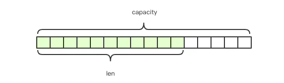
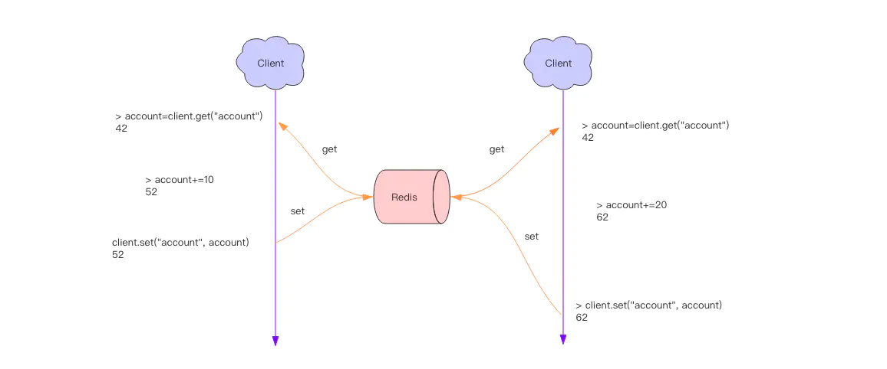
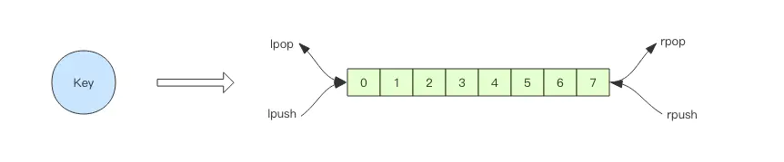

# Redis Basics ( from Juejin Book )

> **RE**mote **DI**ctionary **S**erver 远程字典服务

References

- 基本原理和方案设计
    - **Redis 深度历险 : 核心原理与应用实践** : https://juejin.im/book/5afc2e5f6fb9a07a9b362527
- Home Page : https://redis.io
    - Introduce : https://redis.io/topics/introduction
    - _Clients_ : https://redis.io/clients
    - Commands : https://redis.io/commands
    - Documentation : https://redis.io/documentation
    - _Download_ : https://redis.io/download
- Others
    - ZH Docs : http://redisdoc.com
    - 容量评估
        - **Redis 容量预估** - 极数云舟 : http://www.redis.cn/redis_memory/
        - Redis 容量评估模型 - 腾讯游戏学院 : https://gameinstitute.qq.com/community/detail/114987

## Basics : Data Structure

Reference

- 基础 : 万丈高楼平地起 —— Redis 基础数据结构 : https://juejin.cn/book/6844733724618129422/section/6844733724697985038

Data Structure

- string 字符串
- list 列表
- set 集合
- zset ( sorted set ) 有序集合
- hash 字典/哈希

### String

> 字符串

Redis 的字符串是 **动态字符串**,

- 是可以修改的字符串.
- **内部结构实现上类似于 Java 的 ArrayList**
    - 采用 **预分配冗余空间的方式来减少内存的频繁分配**
- 内部为当前字符串实际分配的空间 capacity 一般要高于实际字符串长度 len.
    - **当字符串长度小于 1M 时, 扩容都是加倍现有的空间,**
    - **如果超过 1M, 扩容时一次只会多扩 1M 的空间.**
    - 注意 : **字符串最大长度为 512M.**



### List

> 列表

**Redis 的列表相当于 Java 语言里面的 LinkedList.**

- 注意 : 它 **是链表而不是数组**.
    - 这意味着 list 的插入和删除操作非常快, 时间复杂度为 O(1)
    - 但是索引定位很慢, 时间复杂度为 O(n) _( icehe : 不过范围查询还行 )_
- 当列表弹出了最后一个元素之后, 该数据结构自动被删除, 内存被回收.


**Redis 的列表结构常用来做异步队列使用.**

- 将需要延后处理的任务结构体序列化成字符串塞进 Redis 的列表,
- 另一个线程从这个列表中轮询数据进行处理.

#### Queue

作为 队列 使用 : 右进左出

```bash
> rpush books python java golang
(integer) 3
> llen books
(integer) 3
> lpop books
"python"
> lpop books
"java"
> lpop books
"golang"
> lpop books
(nil)
```

#### Stack

作为 栈 使用 : 右进左出

```bash
> rpush books python java golang
(integer) 3
> rpop books
"golang"
> rpop books
"java"
> rpop books
"python"
> rpop books
(nil)
```

#### Slow Query

`lindex` _( list index )_ 相当于 Java 链表的 `get(int index)` 方法

- 它需要对链表进行遍历, 性能随着参数 index 增大而变差.

`ltrim` _( list trim )_ 和字面上的含义不太一样 _( 个人觉得它叫 `lretain ` ( 保留 ) 更合适, )_

- 参数 start_index 和 end_index 定义了一个区间,
    - 在这个区间内的值, ltrim 要保留, 区间之外统统砍掉.
- 可以通过 `ltrim` 来实现一个定长的链表, _这一点非常有用._
- index 可以为负数
    - index=-1 表示倒数第一个元素,
    - index=-2 表示倒数第二个元素.

#### Quicklist, Ziplist


Redis 底层的存储结构不是一个简单的 linkedlist,

- 而是称之为 **快速链表 quicklist** 的一个结构.
- 首先在 **列表元素较少的情况下会使用一块连续的内存存储**, 这个结构是 **ziplist 即压缩列表**.
    - 它将所有的元素紧挨着一起存储, 分配的是一块连续的内存.
- 当 **数据量比较多的时候才会改成 quicklist 快速链表**.
    - 因为普通的链表需要的附加指针空间太大, 会比较浪费空间, 而且会加重内存的碎片化.
        - 例如, 这个列表里存的只是 int 类型的数据, 结构上还需要两个额外的指针 prev 和 next.
    - 所以 Redis **将链表和 ziplist 结合起来组成了 quicklist**!
        - 也就是 **将多个 ziplist 使用双向指针串起来使用**.
        - 这样 **既满足了快速的插入删除性能, 又不会出现太大的空间冗余**.

### Hash

**Redis 的字典相当于 Java 语言里面的 HashMap**,

- 它是无序字典.
- 内部实现结构上同 Java 的 HashMap 也是一致的, 同样的 **数组 + 链表二维结构**.
- **第一维 hash 的数组位置碰撞时, 就会将碰撞的元素使用链表串接起来**.


#### Rehash

- 与 Java 不同的是, **Redis 的字典的值只能是字符串**,
- **rehash 方式** 也不一样,
    - 因为 Java 的 HashMap 在字典很大时, rehash 是个耗时的操作, 需要一次性全部 rehash.
    - Redis 为了高性能, 不能堵塞服务, 所以采用了 **渐进式 rehash 策略**.


- 渐进式 rehash 会在 rehash 的同时, 保留新旧两个 hash 结构, 查询时会同时查询两个 hash 结构,
- 然后 **在后续的定时任务中以及 hash 操作指令中, 循序渐进地将旧 hash 的内容一点点迁移到新的 hash 结构中**.
- 当搬迁完成了, 就会使用新的 hash 结构取而代之.
- 当 hash 移除了最后一个元素之后, 该数据结构自动被删除, 内存被回收.

#### String vs. Hash


- hash 结构也可以用来存储用户信息, 不同于字符串一次性需要全部序列化整个对象, **hash 可以对用户结构中的每个字段单独存储.
    - 这样当需要获取用户信息时 **可以进行部分获取**.
    - 而以 **整个字符串的形式去保存用户信息的话就只能一次性全部读取, 这样就会比较浪费网络流量**.
- hash 也有缺点, **hash 结构的存储消耗要高于单个字符串**,
    - 到底该使用 hash 还是字符串, 需要根据实际情况再三权衡.

在 Redis 存储结构体到底应该使用 hash 还是 string?

- Redis strings vs Redis hashes to represent JSON: efficiency? - StackOverflow : https://stackoverflow.com/questions/16375188/redis-strings-vs-redis-hashes-to-represent-json-efficiency

### Set

> 集合

**Redis 的集合相当于 Java 语言里面的 HashSet**,

- 它内部的键值对是无序的唯一的.
- 它的 **内部实现相当于一个特殊的字典, 字典中所有的 value 都是一个值 NULL**.


### Zset

> 有序集合

**zset 可能是 Redis 提供的最为特色的数据结构**,

- _它也是在面试中面试官最爱问的数据结构._
- 它 **类似于 Java 的 SortedSet 和 HashMap 的结合体**,
    - **一方面它是一个 set, 保证了内部 value 的唯一性**,
    - **另一方面它可以给每个 value 赋予一个 score, 代表这个 value 的排序权重**.
- 它的内部实现用的是一种叫做「**跳跃列表**」的数据结构.
- zset 中最后一个 value 被移除后, 数据结构自动删除, 内存被回收.


- _zset 可以用来存粉丝列表,_
    - _value 值是粉丝的用户 ID,_
    - _score 是关注时间._
    - _可以对粉丝列表按关注时间进行排序._
- _zset 还可以用来存储学生的成绩,_
    - _value 值是学生的 ID,_
    - _score 是他的考试成绩._
    - _可以对成绩按分数进行排序就可以得到他的名次._

#### Skiplist

> 跳跃表

- **zset 内部的排序功能是通过「跳跃列表」数据结构来实现的,
    - _它的结构非常特殊, 也比较复杂._
- 因为 **zset 要支持随机的插入和删除**, 所以它不好使用数组来表示.
- 因为 **zset 需要链表按照 score 值进行排序**,
    - 这意味着当有新元素需要插入时, 要定位到特定位置的插入点, 这样才可以继续保证链表是有序的.
    - 通常我们会通过二分查找来找到插入点, 但是二分查找的对象必须是数组, 只有数组才可以支持快速位置定位, 链表做不到


- 跳跃列表就是类似于层级制,
    - 最下面一层所有的元素都会串起来.
    - 然后每隔几个元素挑选出一个代表来, 再将这几个代表使用另外一级指针串起来.
    - 然后在这些代表里再挑出二级代表, 再串起来.
    - 最终就形成了金字塔结构.


- 「跳跃列表」之所以「跳跃」, 是因为内部的元素可能「身兼数职」,
    - 比如上图中间的这个元素, 同时处于 L0、L1 和 L2 层, 可以快速在不同层次之间进行「跳跃」.
    - 定位插入点时, 先在顶层进行定位, 然后下潜到下一级定位, 一直下潜到最底层找到合适的位置, 将新元素插进去.
- 跳跃列表 **采取一个随机策略来决定新元素可以兼职到第几层**.
    - **首先 L0 层肯定是 100% 了, L1 层只有 50% 的概率, L2 层只有 25% 的概率, L3 层只有 12.5% 的概率, 一直随机到最顶层 L31 层**.
    - _绝大多数元素都过不了几层, 只有极少数元素可以深入到顶层. 列表中的元素越多, 能够深入的层次就越深, 能进入到顶层的概率就会越大._

### General Principles

> 容器型数据结构的通用规则

list / hash / set / zset 这 4 种数据结构是 **容器型数据结构**, 共享下面两条通用规则 :

- 1\. **create if not exists**
    - **如果容器不存在, 那就创建一个, 再进行操作.**
    - _比如 rpush 操作刚开始是没有列表的, Redis 就会自动创建一个, 然后再 rpush 进去新元素._
- 2\. **drop if no elements**
    - **如果容器里元素没有了, 那么立即删除元素, 释放内存**.
    - _这意味着 lpop 操作到最后一个元素, 列表就消失了._

### Expiration

> 过期时间

Redis 所有的数据结构都可以设置过期时间, 时间到了, Redis 会自动删除相应的对象.

- **过期是以对象为单位**!
    - 例如, **一个 hash 结构的过期是整个 hash 对象的过期, 而不是其中的某个子 key**!
- 小心 string 的过期时间被移除!
    - 例如, **如果一个字符串已经设置了过期时间, 然后你调用了 set 方法修改了它, 它的过期时间会消失!**

```bash
$ redis-server &
$ redis-cli
127.0.0.1:6379> set foo bar
OK
127.0.0.1:6379> expire foo 600
(integer) 1
127.0.0.1:6379> ttl foo
(integer) 596
127.0.0.1:6379> set foo ice
OK
127.0.0.1:6379> ttl foo
(integer) -1
127.0.0.1:6379>
```

## Usage 1 : Distributed Lock

> 应用 1 : 分布式锁

Reference

- 应用 1 : 千帆竞发 —— 分布式锁 : https://juejin.cn/book/6844733724618129422/section/6844733724702015495

_分布式应用进行逻辑处理时经常会遇到并发问题._

- _比如, 一个操作要修改用户的状态, 修改状态需要先读出用户的状态, 在内存里进行修改, 改完了再存回去._
- _如果这样的操作同时进行了, 就会出现并发问题, 因为 读取和保存状态这两个操作不是原子的._

**原子操作** : **不会被线程调度机制打断的操作**

- 这种 **操作一旦开始, 就一直运行到结束, 中间不会有任何 context switch 线程切换**.



_这时就要使用分布式锁来限制程序的并发执行._

### Distributed Lock

- _分布式锁本质上要实现的目标就是在 Redis 里面占一个 "茅坑" , 当别的进程也要来占时, 发现已经有人蹲在那里了, 就只好放弃或者稍后再试._
- 占坑一般是使用 `setnx` ( set if not exists ) 指令, 只允许被一个客户端占坑. 先来先占, 用完了, 再调用 `del` 指令释放茅坑.

```bash
# 这里的冒号 : 就是一个普通的字符, 没特别含义, 它可以是任意其它字符, 不要误解
> setnx lock:codehole true
OK

# ... do something critical ...
> del lock:codehole
(integer) 1
```

- 但是有个问题, **如果逻辑执行到中间出现异常了, 可能会导致 del 指令没有被调用**,
    - 这样 **就会陷入死锁, 锁永远得不到释放.**
- 于是在拿到锁之后, 再给锁加上一个过期时间,
    - 比如 5s, 这样 **即使中间出现异常也可以保证 5 秒之后锁会自动释放**.

```bash
> setnx lock:codehole true
OK
> expire lock:codehole 5

# ... do something critical ...

> del lock:codehole
(integer) 1
```

- 但是以上逻辑还有问题.
    - **如果在 `setnx` 和 `expire` 之间服务器进程突然挂掉了, 可能是因为机器掉电或者是被人为杀掉的**,
    - **就会导致 `expire` 得不到执行, 也会造成死锁.**
- 这种问题的 **根源就在于 `setnx` 和 `expire` 是两条指令而不是原子指令.
    - 如果这两条指令可以一起执行就不会出现问题.
- 也许你会想到用 Redis 事务来解决. 但是这里不行,
    - 因为 `expire` 是依赖于 `setnx` 的执行结果的,
    - **如果 setnx 没抢到锁, expire 是不应该执行的.**
- 事务里没有 if-else 分支逻辑,
    - **事务的特点是一口气执行, 要么全部执行要么一个都不执行.
- 最终 Redis 2.8 版本中作者 **加入了 set 指令的扩展参数, 使得 setnx 和 expire 指令可以一起执行**, 彻底解决了分布式锁的乱象.
    - _( icehe : 虽然以上问题, 现在已经得到基本的解决, 但是还是该好好理解记住这些历史经验 )_

```bash
> set lock:codehole true ex 5 nx
OK
# ... do something critical ...
> del lock:codehole
```

### Timeout

> 超时

- Redis 的分布式锁不能解决超时问题,
    - **如果在加锁和释放锁之间的逻辑执行的太长, 以至于超出了锁的超时限制, 就会出现问题!**
    - 因为这时 **第一个线程持有的锁过期了, 临界区的逻辑还没有执行完,**
        - 这时 **第二个线程就提前重新持有了这把锁, 导致临界区代码不能得到严格的串行执行.**
- 为了避免这个问题, **Redis 分布式锁不要用于较长时间的任务!**
    - **如果真的偶尔出现了, 数据出现的小波错乱可能需要人工介入解决.**

```python
tag = random.nextint()  # 随机数
if redis.set(key, tag, nx=True, ex=5):
    do_something()
    redis.delifequals(key, tag)  # 假想的 delifequals 指令
```

- 有一个稍微安全一点的方案是 :
    - **为 set 指令的 value 参数设置为一个随机数, 释放锁时先匹配随机数是否一致, 然后再删除 key,**
        - 这是 **为了确保当前线程占有的锁不会被其它线程释放, 除非这个锁是过期了被服务器自动释放的.**
    - 但是匹配 value 和删除 key 不是一个原子操作, Redis 也没有提供类似于 `delifequals` 这样的指令,
        - 这就需要使用 Lua 脚本来处理了, 因为 **Lua 脚本可以保证连续多个指令的原子性执行.**

```lua
# delifequals
if redis.call("get",KEYS[1]) == ARGV[1] then
    return redis.call("del",KEYS[1])
else
    return 0
end
```

- 但是这也不是一个完美的方案, 它只是相对安全一点,
    - 因为如果真的超时了, 当前线程的逻辑没有执行完, 其它线程也会乘虚而入.

### Reenterability

> 可重入性

- **可重入性** 是指 **线程在持有锁的情况下再次请求加锁, 如果一个锁支持同一个线程的多次加锁, 那么这个锁就是可重入的.**
    - 比如 Java 语言里有个 ReentrantLock 就是可重入锁.
- Redis 分布式锁如果要支持可重入, **需要对客户端的 set 方法进行包装, 使用线程的 Threadlocal 变量存储当前持有锁的计数.**

```python
# -*- coding: utf-8
import redis
import threading


locks = threading.local()
locks.redis = {}

def key_for(user_id):
    return "account_{}".format(user_id)

def _lock(client, key):
    return bool(client.set(key, True, nx=True, ex=5))

def _unlock(client, key):
    client.delete(key)

def lock(client, user_id):
    key = key_for(user_id)
    if key in locks.redis:
        locks.redis[key] += 1
        return True
    ok = _lock(client, key)
    if not ok:
        return False
    locks.redis[key] = 1
    return True

def unlock(client, user_id):
    key = key_for(user_id)
    if key in locks.redis:
        locks.redis[key] -= 1
        if locks.redis[key] <= 0:
            del locks.redis[key]
            self._unlock(key)
        return True
    return False

client = redis.StrictRedis()
print "lock", lock(client, "codehole")
print "lock", lock(client, "codehole")
print "unlock", unlock(client, "codehole")
print "unlock", unlock(client, "codehole")
```

- 以上还不是可重入锁的全部, **精确一点还需要考虑内存锁计数的过期时间, 代码复杂度将会继续升高.**
    - 所以 **不推荐使用可重入锁!**
    - 它 **加重了客户端的复杂性, 在编写业务方法时注意在逻辑结构上进行调整完全可以不使用可重入锁.**

## Usage 2 : Delayed Queue

> 应用 2 : 延时队列

Reference

- 应用 2 : 缓兵之计 —— 延时队列 : https://juejin.cn/book/6844733724618129422/section/6844733724702015496

平时习惯于使用 Rabbitmq 和 Kafka 作为消息队列中间件, 来给应用程序之间增加异步消息传递功能. 这两个中间件都是专业的消息队列中间件, 特性之多超出了大多数人的理解能力.

- _使用过_ RabbitMQ _的就知道它使用起来有多复杂,_
    - 发消息之前要创建 Exchange, 再创建 Queue, 还要将 Queue 和 Exchange 通过某种规则绑定起来,
    - 发消息的时候要指定 routing-key, 还要控制头部信息.
- _消费者在消费消息之前也要进行上面一系列的繁琐过程._
    - _但是绝大多数情况下, 虽然消息队列只有一组消费者, 但还是需要经历上面这些繁琐的过程._
- _有了 Redis, 它就可以让我们解脱出来, 对于那些只有一组消费者的消息队列, 使用 Redis 就可以非常轻松的搞定._
    - **Redis 的消息队列不是专业的消息队列, 它没有非常多的高级特性, 没有 ack 保证,**
    - **如果对消息的可靠性有着极致的追求, 那么它就不适合使用.**

### Asynchronous Message Queue

> 异步消息队列

Redis 的 list 数据结构常用来作为异步消息队列使用,

- 使用 `rpush` / `lpush` 操作入队列,
- 使用 `lpop` 和 `rpop` 来出队列.



```bash
> rpush notify-queue apple banana pear
(integer) 3
> llen notify-queue
(integer) 3
> lpop notify-queue
"apple"
> llen notify-queue
(integer) 2
> lpop notify-queue
"banana"
> llen notify-queue
(integer) 1
> lpop notify-queue
"pear"
> llen notify-queue
(integer) 0
> lpop notify-queue
(nil)
```

### _队列空了怎么办?_

_处理完了再接着获取消息, 再进行处理. 如此循环往复, 这便是作为队列消费者的客户端的生命周期._

可是如果队列空了, 客户端就会陷入 pop 的死循环, 不停地 pop, 没有数据, 接着再 pop, 又没有数据. 这就是浪费生命的空轮询.

空轮询不但拉高了客户端的 CPU, redis 的 QPS 也会被拉高, 如果这样空轮询的客户端有几十个, Redis 的慢查询可能会显著增多.

**通常使用 sleep 来解决这个问题, 让线程睡一会, 睡个 1s 钟就可以了. 不但客户端的 CPU 能降下来, Redis 的 QPS 也降下来了.**

### Queue Delay Time

用上面睡眠的办法可以解决问题.

- 但是有个小问题, 那就是 **睡眠会导致消息的延迟增大.**
    - 如果只有 1 个消费者, 那么这个延迟就是 1s.
    - 如果有多个消费者, 这个延迟会有所下降, 因为每个消费者的睡觉时间是岔开来的.
- **有没有什么办法能显著降低延迟呢?** 你当然可以很快想到 :
    - A. 那就把睡觉的时间缩短点. 这种方式当然可以,
        - 不过有没有更好的解决方案呢?
    - B. 当然也有, 那就是 **`blpop` / `brpop`**.
        - 这两个 **指令的前缀字符 b 代表的是 blocking, 也就是阻塞读.**
- **阻塞读在队列没有数据的时候, 会立即进入休眠状态, 一旦数据到来, 则立刻醒过来.**
    - 消息的延迟几乎为零.
    - 用 `blpop` / `brpop` 替代前面的 `lpop` / `rpop` , 就完美解决了上面的问题.

### 空闲连接自动断开

上面的方案并非完美, 还有 **空闲连接** 的问题需要解决.

- **如果线程一直阻塞在哪里, Redis 的客户端连接就成了闲置连接,**
    - **闲置过久, 服务器一般会主动断开连接, 减少闲置资源占用.**
- **这时 `blpop` / `brpop` 会抛出异常来.**
    - 所以, 必须注意捕获异常, 还要重试.

所以编写客户端消费者的时候要小心, 注意捕获异常, 还要重试.

### 锁冲突处理

客户端在处理分布式锁请求时, **加锁没加成功怎么办?** 一般有 3 种策略来处理加锁失败 :

- A. **直接抛出异常, 通知用户稍后重试**
- B. **sleep 一会再重试**
- C. **将请求转移至延时队列, 过一会再试**

A. 直接抛出特定类型的异常

- 这种方式比较适合由用户直接发起的请求,
    - 用户看到错误对话框后, 会先阅读对话框的内容, 再点击重试, 这样就可以起到人工延时的效果.
    - 如果考虑到用户体验, 可以由前端的代码替代用户自己来进行延时重试控制.
    - 它本质上是 **对当前请求的放弃, 由用户决定是否重新发起新的请求.**

B. Sleep

- sleep 会阻塞当前的消息处理线程, 会导致队列的后续消息处理出现延迟.
    - **如果碰撞的比较频繁或者队列里消息比较多, sleep 可能并不合适.**
    - **如果因为个别死锁的 key 导致加锁不成功, 线程会彻底堵死, 导致后续消息永远得不到及时处理.**

C. 延时队列

- 这种方式 **比较适合异步消息处理**,
    - **将当前冲突的请求扔到另一个队列延后处理以避开冲突.**

### Implementation of Delayed Queue

> 延时队列的实现

- 延时队列可以通过 Redis 的 zset ( 有序列表 ) 来实现.
    - **将消息序列化成一个字符串作为 zset 的 value, 到期处理时间作为 score,**
    - 然后用 **多个线程轮询 zset 获取到期的任务进行处理,**
    - **多个线程是为了保障可用性, 万一挂了一个线程还有其它线程可以继续处理.**
    - 因为有多个线程, 所以 **需要考虑并发争抢任务, 确保任务不能被多次执行.**
- Redis 的 **`zrem` 方法是多线程多进程争抢任务的关键, 它的返回值决定了当前实例有没有抢到任务,
    - 因为 loop 方法可能会被多个线程、多个进程调用, 同一个任务可能会被多个进程线程抢到, 通过 zrem 来决定唯一的属主.
    - 同时, 要注意一定要对 `handle_msg` 进行异常捕获, 避免因为个别任务处理问题导致循环异常退出.

进一步优化

- 上面的算法中同一个任务可能会被多个进程取到之后再使用 zrem 进行争抢, 那些没抢到的进程都是白取了一次任务, 这是浪费.
    - 可以考虑 **使用 lua scripting 来原子化地执行这个逻辑, 将 zrangebyscore 和 zrem 一同挪到服务器端进行原子化操作**,
    - 这样多个进程之间争抢任务时就不会出现这种浪费了.

## Usage 3 : Bitmap

> 应用 3 : 节衣缩食 —— 位图

- 有一些 bool 型数据需要存取, 比如用户一年的签到记录, 签了是 1, 没签是 0, 要记录 365 天.
    - _如果使用普通的 key / value, 每个用户要记录 365 个, 当用户上亿的时候, 需要的存储空间是惊人的._
- 为了解决这个问题, **Redis 提供了位图数据结构**,
    - _这样每天的签到记录只占据一个位, 365 天就是 365 个位, 46 个字节 ( 一个稍长一点的字符串 ) 就可以完全容纳下, 这就大大节约了存储空间._
- **位图 就是普通的字符串, 也就是 byte 数组.**
    - 可以使用普通的 `get` / `set` 直接获取和设置整个位图的内容,
    - 也可以使用位图操作 `getbit` / `setbit` 等将 byte 数组看成「位数组」来处理.
- 当要统计月活的时候, 因为需要去重, 需要使用 set 来记录所有活跃用户的 id, 这非常浪费内存.
    - 这时就可以考虑使用位图来标记用户的活跃状态.
    - _每个用户会都在这个位图的一个确定位置上, 0 表示不活跃, 1 表示活跃._
    - _然后到月底遍历一次位图就可以得到月度活跃用户数._
    - 不过这个方法也是有条件的, 那就是 userid 是整数连续的, 并且活跃占比较高, 否则可能得不偿失.

### Basic Usage

Redis 的 **位数组是自动扩展的**,

- 如果设置了某个偏移位置超出了现有的内容范围, 就会自动将位数组进行零扩充.
- 此处不赘述, 暂略

零存整取

```bash
127.0.0.1:6379> setbit s 1 1
(integer) 0
127.0.0.1:6379> setbit s 2 1
(integer) 0
127.0.0.1:6379> setbit s 4 1
(integer) 0
127.0.0.1:6379> setbit s 9 1
(integer) 0
127.0.0.1:6379> setbit s 10 1
(integer) 0
127.0.0.1:6379> setbit s 13 1
(integer) 0
127.0.0.1:6379> setbit s 15 1
(integer) 0
127.0.0.1:6379> get s
"he"
```

零存零取

```bash
127.0.0.1:6379> setbit w 1 1
(integer) 0
127.0.0.1:6379> setbit w 2 1
(integer) 0
127.0.0.1:6379> setbit w 4 1
(integer) 0
127.0.0.1:6379> getbit w 1  # 获取某个具体位置的值 0/1
(integer) 1
127.0.0.1:6379> getbit w 2
(integer) 1
127.0.0.1:6379> getbit w 4
(integer) 1
127.0.0.1:6379> getbit w 5
(integer) 0
```

整存零取

```bash
127.0.0.1:6379> set w h  # 整存
(integer) 0
127.0.0.1:6379> getbit w 1
(integer) 1
127.0.0.1:6379> getbit w 2
(integer) 1
127.0.0.1:6379> getbit w 4
(integer) 1
127.0.0.1:6379> getbit w 5
(integer) 0
```

### 统计与查找

Redis 提供了指令

- 位图统计 `bitcount`
- 位图查找 `bitpos`
- `bitcount` 统计指定位置范围内 1 的个数
- `bitpos` 用来查找指定范围内出现的第一个 0 或 1

比如,

- 可以通过 `bitcount` 统计用户一共签到了多少天,
- 通过 `bitpos` 指令查找用户从哪一天开始第一次签到.
- 如果指定了范围参数 `[start, end]` ,
    - 就可以统计在某个时间范围内用户签到了多少天,
    - 用户自某天以后的哪天开始签到.
- 遗憾的是 start 和 end 参数是字节索引, 也就是说指定的位范围必须是 8 的倍数, 而不能任意指定.
    - _这很奇怪, 一般人表示不是很能理解 Antirez 为什么要这样设计._
    - _因为这个设计, 无法直接计算某个月内用户签到了多少天,_
    - _而必须要将这个月所覆盖的字节内容全部取出来 ( `getrange` 可以取出字符串的子串 )_
    - _然后在内存里进行统计, 这个非常繁琐._

_bitcount 指令和 bitpos 指令 示例 :_

```bash
127.0.0.1:6379> set w hello
OK

127.0.0.1:6379> bitcount w
(integer) 21

# 第一个字符中 1 的位数
127.0.0.1:6379> bitcount w 0 0
(integer) 3

# 前两个字符中 1 的位数
127.0.0.1:6379> bitcount w 0 1
(integer) 7

# 第一个 0 位
127.0.0.1:6379> bitpos w 0
(integer) 0

# 第一个 1 位
127.0.0.1:6379> bitpos w 1
(integer) 1

# 从第二个字符算起, 第一个 1 位
127.0.0.1:6379> bitpos w 1 1 1
(integer) 9

# 从第三个字符算起, 第一个 1 位
127.0.0.1:6379> bitpos w 1 2 2
(integer) 17
```

### _魔术指令 bitfield_

- 前文设置 `setbit` 和获取 `getbit` 指定位的值都是单个位的,
    - 如果要一次操作多个位, 就必须使用管道来处理.
- _不过 Redis 的 3.2 版本以后新增了功能强大的指令 `bitfield`,_
    - 有了这条指令, 不用管道也可以一次进行多个位的操作.
- `bitfield` 有三个子指令, 分别是 `get` / `set` / `incrby`,
    - 它们都可以对指定位片段进行读写, 但是最多只能处理 64 个连续的位,
    - 如果超过 64 位, 就得使用多个子指令, bitfield 可以一次执行多个子指令.
- ……

多次执行

```bash
127.0.0.1:6379> set w hello
OK
# 从第一个位开始取 4 个位, 结果是无符号数 (u)
127.0.0.1:6379> bitfield w get u4 0
(integer) 6

# 从第三个位开始取 3 个位, 结果是无符号数 (u)
127.0.0.1:6379> bitfield w get u3 2
(integer) 5

# 从第一个位开始取 4 个位, 结果是有符号数 (i)
127.0.0.1:6379> bitfield w get i4 0
1) (integer) 6

# 从第三个位开始取 3 个位, 结果是有符号数 (i)
127.0.0.1:6379> bitfield w get i3 2
1) (integer) -3
```

不使用 pipeline 的情况下, 一次性执行

```bash
127.0.0.1:6379> bitfield w get u4 0 get u3 2 get i4 0 get i3 2
1) (integer) 6
2) (integer) 5
3) (integer) 6
4) (integer) -3
```

……

后文内容较少使用, 暂略 ( TODO )

- 饱和截断 SAT
- 失败不执行 FAIL

## Usage 4 : HyperLogLog

Reference

- 应用 4 : 四两拨千斤 —— HyperLogLog : https://juejin.cn/book/6844733724618129422/section/6844733724706209805

思考一个常见的业务问题 : 如果开发维护一个大型的网站, 我们需要网站每个网页每天的 UV 数据, 然后计划开发这个统计模块, 如何实现?

- 如果统计 PV 那非常好办, 给每个网页一个独立的 Redis 计数器就可以了, 这个计数器的 key 后缀加上当天的日期.
    - _这样来一个请求, incrby 一次, 最终就可以统计出所有的 PV 数据._
- 但是 UV 不一样, 它要去重, 同一个用户一天之内的多次访问请求只能计数一次.
    - _这就要求每一个网页请求都需要带上用户的 ID, 无论是登陆用户还是未登陆用户都需要一个唯一 ID 来标识._

也许可以使用一个简单的方案

- 为每一个页面一个独立的 set 集合来存储所有当天访问过此页面的用户 ID.
- 当一个请求过来时, 我们使用 sadd 将用户 ID 塞进去就可以了.
- 通过 scard 可以取出这个集合的大小, 这个数字就是这个页面的 UV 数据. 没错, 这是一个非常简单的方案.

但是, 如果你的页面访问量非常大,

- 比如一个爆款页面几千万的 UV, 你需要一个很大的 set 集合来统计, 这就非常浪费空间.
- 如果这样的页面很多, 那所需要的存储空间是惊人的.
- 为这样一个去重功能就耗费这样多的存储空间, 值得么?
- 其实老板需要的数据又不需要太精确, 105w 和 106w 这两个数字对于老板们来说并没有多大区别.

_那么, 有没有更好的解决方案呢?_

- Redis 提供了 **HyperLogLog 数据结构, 用来解决统计问题.**
    - HyperLogLog **提供不精确的去重计数方案, 虽然不精确但是也不是非常不精确, 标准误差是 0.81%**,
    - 这样的精确度已经可以满足上面的 UV 统计需求了.

### How to Use

HyperLogLog 提供了两个指令

- **`pfadd` 增加计数**
    - _跟 set 集合的 `sadd` 用法一样, 来一个用户 ID, 就将用户 ID 塞进去就是._
- **`pfcount` 获取计数**
    - _跟 `scard` 用法是一样, 直接获取计数值._

_PF 是 HyperLogLog 这个数据结构的发明人 Philippe Flajolet 的首字母缩写._

测试部分不赘述, 暂略, 详见原文

### pfmerge 适合什么场景

HyperLogLog 除了上面的 `pfadd` 和 `pfcount` 之外, 还提供了第三个指令

- **`pfmerge` 用于将多个 pf 计数值累加在一起形成一个新的 pf 值.**

_比如, 在网站中我们有两个内容差不多的页面, 运营说需要这两个页面的数据进行合并. 其中页面的 UV 访问量也需要合并, 那这个时候 `pfmerge` 就可以派上用场了._

### Precautions

> 注意事项

使用 HyperLogLog 这个数据结构的内存成本较高

- 它需要占据一定 12k 的存储空间, 所以它不适合统计单个用户相关的数据.
- 如果你的用户上亿, 可以算算, 这个空间成本是非常惊人的.
- 但是相比 set 存储方案, HyperLogLog 所使用的空间那真是可以使用千斤对比四两来形容了.

不过你也不必过于担心, 因为 **Redis 对 HyperLogLog 的存储进行了优化**,

- **在计数比较小时, 它的存储空间采用稀疏矩阵存储, 空间占用很小,**
- **仅仅在计数慢慢变大, 稀疏矩阵占用空间渐渐超过了阈值时才会一次性转变成稠密矩阵, 才会占用 12k 的空间.**

原理比较复杂, 难以理解, 暂略, 详见原文

### Usage 5 : Bloom Filter

Reference

- 应用 5 : 层峦叠嶂 —— 布隆过滤器 : https://juejin.cn/book/6844733724618129422/section/6844733724706209806


_使用 HyperLogLog 数据结构来进行估数, 它非常有价值, 可以解决很多精确度不高的统计需求._

_但是如果想知道某一个值是不是已经在 HyperLogLog 结构里面了, 它就无能为力了, 它只提供了 `pfadd` 和 `pfcount` 方法, 没有提供 ~~`pfcontains`~~ 这种方法._

比如, 在使用新闻客户端看新闻时, 它会给我们不停地推荐新的内容, 它 **每次推荐时要去重, 去掉那些已经看过的内容.**

- _问题 :_
    - _新闻客户端推荐系统如何实现推送去重的？_
- 直接的解法 :
    - 做法 : 服务器记录了用户看过的所有历史记录, 当推荐系统推荐新闻时会从每个用户的历史记录里进行筛选, 过滤掉那些已经存在的记录.
    - 缺点 : 当用户量很大, 每个用户看过的新闻又很多的情况下, 这种方式, 推荐系统的去重工作在性能上很难跟上

实际上,

- 如果历史记录存储在关系数据库里, 去重就需要频繁地对数据库进行 exists 查询,
- 当系统并发量很高时, 数据库是很难扛住压力的.

然后考虑引入缓存,

- 但是将大量的历史记录全部缓存起来, 浪费大量存储空间.
- 而且这个存储空间是随着时间线性增长, 撑不住长期的积累.
- 但是不缓存的话, 性能又跟不上.

**布隆过滤器 ( Bloom Filter )** 就是 **专门用来解决去重问题的**.

- 它在起到去重的同时, 在空间上还能节省 90% 以上,
- 只是稍微有那么点不精确, 也就是有一定的误判概率.
- _( icehe : 需要花时间计算这个紧凑的数据结构, 用计算时间换存储空间 )_

### What is Bloom Filter?

布隆过滤器 **可以理解为一个不怎么精确的 set 结构**,

- **使用 contains 方法判断某个对象是否存在时, 可能会误判.**
- 但是布隆过滤器也不是特别不精确,
    - **只要参数设置的合理, 它的精确度可以控制的相对足够精确, 只会有很小的误判概率.**

特点

- **当布隆过滤器说某个值存在时, 这个值可能不存在;**
- **当它说不存在时, 那就肯定不存在.**

套在上面的使用场景中,

- 布隆过滤器能准确过滤掉那些已经看过的内容,
- 那些没有看过的新内容, 它也会过滤掉极小一部分 ( 误判 ) ,
- 但是绝大多数新内容它都能准确识别.

就可以完全保证推荐给用户的内容都是无重复的.

Redis 官方提供的布隆过滤器功能

- **Redis 4.0 版本才开始有**
- **作为一个插件加载到 Redis Server 中**

### Basic Usage

布隆过滤器有两个基本指令

- `bf.add` 添加一个元素
    - `bf.madd` 添加多个元素
- `bf.exists` 查询一个元素是否存在
    - `bf.mexists` 查询多个元素是否存在

它们的用法和 set 集合的 `sadd` 和 `sismember` 差不多.

_准确率的测试, 在此不赘述, 暂略, 详见原文_

### Precaustions

注意事项
布隆过滤器的initial_size估计的过大, 会浪费存储空间, 估计的过小, 就会影响准确率, 用户在使用之前一定要尽可能地精确估计好元素数量, 还需要加上一定的冗余空间以避免实际元素可能会意外高出估计值很多.

布隆过滤器的error_rate越小, 需要的存储空间就越大, 对于不需要过于精确的场合, error_rate设置稍大一点也无伤大雅. 比如在新闻去重上而言, 误判率高一点只会让小部分文章不能让合适的人看到, 文章的整体阅读量不会因为这点误判率就带来巨大的改变.

## Intro

Reference

- Introduce : https://redis.io/topics/introduction

Redis is an _open source ( BSD licensed ) ,_ **in-memory data structure store**, **used as a database, cache and message broker**.

- It supports **data structures** such as [strings](https://redis.io/topics/data-types-intro#strings), [hashes](https://redis.io/topics/data-types-intro#hashes), [lists](https://redis.io/topics/data-types-intro#lists), [sets](https://redis.io/topics/data-types-intro#sets), [sorted sets](https://redis.io/topics/data-types-intro#sorted-sets) with range queries, [bitmaps](https://redis.io/topics/data-types-intro#bitmaps), [hyperloglogs](https://redis.io/topics/data-types-intro#hyperloglogs), [geospatial indexes](https://redis.io/commands/geoadd) with radius queries and [streams](https://redis.io/topics/streams-intro).
- Redis has built-in [replication](https://redis.io/topics/replication), [Lua scripting](https://redis.io/commands/eval), [LRU eviction](https://redis.io/topics/lru-cache), [transactions](https://redis.io/topics/transactions) and different levels of [on-disk persistence](https://redis.io/topics/persistence), and provides high availability via [Redis Sentinel](https://redis.io/topics/sentinel) and automatic partitioning with [Redis Cluster](https://redis.io/topics/cluster-tutorial).

You can run **atomic operations** on these types, like

- [appending to a string](https://redis.io/commands/append);
- [incrementing the value in a hash](https://redis.io/commands/hincrby);
- [pushing an element to a list](https://redis.io/commands/lpush);
- [computing set intersection](https://redis.io/commands/sinter), [union](https://redis.io/commands/sunion) and [difference](https://redis.io/commands/sdiff);
- or [getting the member with highest ranking in a sorted set](https://redis.io/commands/zrangebyscore).

In order to achieve its outstanding performance, Redis works with an **in-memory dataset**.

- Depending on your use case, you can **persist it either by** [dumping the dataset to disk](https://redis.io/topics/persistence#snapshotting) every once in a while, or by [appending each command](https://redis.io/topics/persistence#append-only-file) to a log.
- _Persistence can be optionally disabled, if you just need a feature-rich, networked, in-memory cache._

Redis also supports trivial-to-setup ( 微不足道的设置 ) [master-slave asynchronous replication](https://redis.io/topics/replication), with very fast non-blocking first synchronization, auto-reconnection with partial resynchronization on net split.

Other features include:

- [Transactions](https://redis.io/topics/transactions)
- [Pub/Sub](https://redis.io/topics/pubsub)
- [Lua scripting](https://redis.io/commands/eval)
- [Keys with a limited time-to-live](https://redis.io/commands/expire)
- [LRU eviction of keys](https://redis.io/topics/lru-cache)
- [Automatic failover](https://redis.io/topics/sentinel)

_You can use Redis from [most programming languages](https://redis.io/clients) out there._

Redis is written in **ANSI C** _and works in most POSIX systems like Linux, \*BSD, macOS without external dependencies._

- Linux and macOS are the two operating systems where Redis is developed and tested the most, and we **recommend using Linux for deploying**.
- _Redis may work in Solaris-derived systems like SmartOS, but the support is best effort._
- _There is no official support for Windows builds._

## Documentation

Reference

- Documentation : https://redis.io/documentation

Note :

- The Redis Documentation is also available in raw (computer friendly) format in the redis-doc github repository.
    - The Redis Documentation is released under the Creative Commons Attribution-ShareAlike 4.0 International license.

### Programming with Redis

- _[The full list of commands](https://redis.io/commands)
    - implemented by Redis, along with thorough documentation for each of them._
- [Pipelining](https://redis.io/topics/pipelining)
    - Learn how to **send multiple commands at once, saving on round trip time.**
- [Redis Pub/Sub](https://redis.io/topics/pubsub)
    - Redis is a **fast and stable Publish/Subscribe messaging system!** Check it out.
- [Redis Lua scripting](https://redis.io/commands/eval)
    - Redis Lua scripting feature documentation.
- [Debugging Lua scripts](https://redis.io/topics/ldb)
    - _Redis 3.2 introduces a native Lua debugger for Redis scripts._
- [Memory optimization](https://redis.io/topics/memory-optimization)
    - Understand **how Redis uses RAM and learn some tricks to use less of it.**
- [Expires](https://redis.io/commands/expire)
    - Redis allows to **set a time to live different for every key** so that the key will be **automatically removed from the server when it expires.**
- [Redis as an LRU cache](https://redis.io/topics/lru-cache)
    - How to configure and use Redis **as a cache with a fixed amount of memory and auto eviction of keys.**
- [Redis transactions](https://redis.io/topics/transactions)
    - It is possible to **group commands together so that they are executed as a single transaction.**
- [Client side caching](https://redis.io/topics/client-side-caching)
    - Starting with version 6 Redis supports **server assisted client side caching.**
    - _This document describes how to use it._
- [Mass insertion of data](https://redis.io/topics/mass-insert)
    - How to **add a big amount of pre existing or generated data to a Redis instance in a short time.**
- [Partitioning](https://redis.io/topics/partitioning)
    - How to **distribute your data among multiple Redis instances.**
- [Distributed locks](https://redis.io/topics/distlock)
    - Implementing a **distributed lock manager** with Redis.
- [Redis keyspace notifications](https://redis.io/topics/notifications)
    - **Get notifications of keyspace events via Pub/Sub** (Redis 2.8 or greater).
- [Creating secondary indexes with Redis](https://redis.io/topics/indexes)
    - Use Redis data structures to **create secondary indexes, composed indexes and traverse graphs.**

### Redis modules API

- [Introduction to Redis modules](https://redis.io/topics/modules-intro).
    - A good place to start learing about Redis 4.0 modules programming.
- [Implementing native data types](https://redis.io/topics/modules-native-types).
    - Modules scan **implement new data types** (data structures and more) that **look like built-in data types.**
    - _This documentation covers the API to do so._
- [Blocking operations with modules](https://redis.io/topics/modules-blocking-ops).
    - _This is still an experimental API, but a very powerful one to write commands that can **block the client (without blocking Redis) and can execute tasks in other threads**._
- [Redis modules API reference](https://redis.io/topics/modules-api-ref).
    - _Directly generated from the top comments in the source code inside src/module.c._
    - _Contains many low level details about API usage._

### Tutorials & FAQ

- [Introduction to Redis data types](https://redis.io/topics/data-types-intro)
    - _This is a good starting point to learn the Redis API and data model._
- [Introduction to Redis streams](https://redis.io/topics/streams-intro)
    - _A detailed description of the Redis 5 new data type, the Stream._
- [Writing a simple Twitter clone with PHP and Redis](https://redis.io/topics/twitter-clone)
- [Auto complete with Redis](http://autocomplete.redis.io/)
- [Data types short summary](https://redis.io/topics/data-types)
    - A short summary of the different types of values that Redis supports, not as updated and info rich as the first tutorial listed in this section.
- [FAQ](https://redis.io/topics/faq)
    - Some common questions about Redis.

### Administration

- [Redis-cli](https://redis.io/topics/rediscli)
    - Learn how to master the Redis command line interface, something you'll be using a lot in order to administer, troubleshoot and experiment with Redis.
- [Configuration](https://redis.io/topics/config)
    - How to configure redis.
- [Replication](https://redis.io/topics/replication)
    - What you need to know in order to set up master-replicas replication.
- [Persistence](https://redis.io/topics/persistence)
    - Know your options when configuring Redis' durability.
- [Redis Administration](https://redis.io/topics/admin)
    - Selected administration topics.
- [Security](https://redis.io/topics/security)
    - An overview of Redis security.
- [Redis Access Control Lists](https://redis.io/topics/acl)
    - Starting with version 6 Redis supports ACLs.
    - It is possible to configure users able to run only selected commands and able to access only specific key patterns.
- [Encryption](https://redis.io/topics/encryption)
    - How to encrypt Redis client-server communication.
- [Signals Handling](https://redis.io/topics/signals)
    - How Redis handles signals.
- [Connections Handling](https://redis.io/topics/clients)
    - How Redis handles clients connections.
- [High Availability](https://redis.io/topics/sentinel)
    - Redis Sentinel is the official high availability solution for Redis.
- [Latency monitoring](https://redis.io/topics/latency-monitor)
    - Redis integrated latency monitoring and reporting capabilities are helpful to tune Redis instances for low latency workloads.
- [Benchmarks](https://redis.io/topics/benchmarks)
    - See **how fast Redis is in different platforms.**
- _[Redis Releases](https://redis.io/topics/releases)_
    - _Redis development cycle and version numbering._

### _Embedded and IoT_

- [Redis on ARM and Raspberry Pi](https://redis.io/topics/ARM)
    - _Starting with Redis 4.0 ARM and the Raspberry Pi are officially supported platforms. This page contains general information and benchmarks._
- _[A reference implementation of Redis for IoT and Edge Computing can be found here](https://redislabs.com/redis-enterprise/more/redis-edge/)._

### Troubleshooting

- [Redis problems?](https://redis.io/topics/problems)
    - Bugs? **High latency?** Other issues?
    - Use [our problems troubleshooting page](https://redis.io/topics/problems) as a starting point to find more information.

### Redis Cluster

- [Redis Cluster tutorial](https://redis.io/topics/cluster-tutorial)
    - a gentle introduction and setup guide to Redis Cluster.
- [Redis Cluster specification](https://redis.io/topics/cluster-spec)
    - the more formal description of the behavior and algorithms used in Redis Cluster.

### Other distributed systems based on Redis

- [Redis CRDTs](https://redislabs.com/redis-enterprise/technology/active-active-geo-distribution/) an **active-active geo-distribution solutions** for Redis.
- [Roshi](https://github.com/soundcloud/roshi) is a large-scale CRDT set implementation for timestamped events based on Redis and implemented in Go.
    - It was initially developed for the [SoundCloud stream](https://developers.soundcloud.com/blog/roshi-a-crdt-system-for-timestamped-events).

### Redis on SSD and persistent memory

- [Redis on Flash](https://redislabs.com/redis-enterprise/technology/redis-on-flash/) by Redis Labs extends DRAM capacity with SSD and persistent memory.

### Specifications

- [Redis Design Drafts](https://redis.io/topics/rdd)
    - Design drafts of new proposals.
- [Redis Protocol specification](https://redis.io/topics/protocol)
    - if you're implementing a client, or out of curiosity, learn how to communicate with Redis at a low level.
- [Redis RDB format](https://github.com/sripathikrishnan/redis-rdb-tools/wiki/Redis-RDB-Dump-File-Format) specification, and [RDB version history](https://github.com/sripathikrishnan/redis-rdb-tools/blob/master/docs/RDB_Version_History.textile).
- [Internals](https://redis.io/topics/internals)
    - Learn details about how Redis is implemented under the hood.

### Resources

- [Redis Cheat Sheet](https://cheatography.com/tasjaevan/cheat-sheets/redis/)
    - Online or printable function reference for Redis.

### Use cases

- [Who is using Redis](https://redis.io/topics/whos-using-redis)

### Books

The following is a list of books covering Redis that are already published. Books are ordered by release date (newer books first).

- [Mastering Redis](https://www.packtpub.com/product/mastering-redis/9781783988181) (Packt, 2016) by Jeremy Nelson.
- [Redis Essentials](https://www.amazon.com/Redis-Essentials-Maxwell-Dayvson-Silva-ebook/dp/B00ZXFCFLO) (Packt, 2015) by Maxwell Da Silva and [Hugo Tavares](https://twitter.com/hltbra)
- [Redis in Action](http://www.manning.com/carlson/) (Manning, 2013) by [Josiah L. Carlson](https://twitter.com/dr_josiah) (early access edition).
- [Instant Redis Optimization How-to](http://www.packtpub.com/redis-optimization-how-to/book) (Packt, 2013) by [Arun Chinnachamy](https://twitter.com/ArunChinnachamy).
- ~~Instant Redis Persistence (Packt, 2013) by Matt Palmer.~~
- [The Little Redis Book](https://www.openmymind.net/2012/1/23/The-Little-Redis-Book/) (Free Book, 2012) by Karl Seguin is a great free and concise book that will get you started with Redis.
- [Redis Cookbook](https://www.oreilly.com/library/view/redis-cookbook/9781449311353/) (O'Reilly Media, 2011) by [Tiago Macedo](https://twitter.com/tmacedo) and [Fred Oliveira](https://twitter.com/f).

_The following books have Redis related content but are not specifically about Redis:_

- _[Seven databases in seven weeks (The Pragmatic Bookshelf, 2012)](http://pragprog.com/book/rwdata/seven-databases-in-seven-weeks)._
- _[Mining the Social Web (O'Reilly Media, 2011)](https://www.oreilly.com/library/view/mining-the-social/9781449394752/)_
- _[Professional NoSQL (Wrox, 2011)](https://www.wiley.com/en-jp/Professional+NoSQL-p-9780470942246)_

## Commands

Reference

- Commands : https://redis.io/commands

Omited…

- See [Redis Usage](redis-usage.md)
