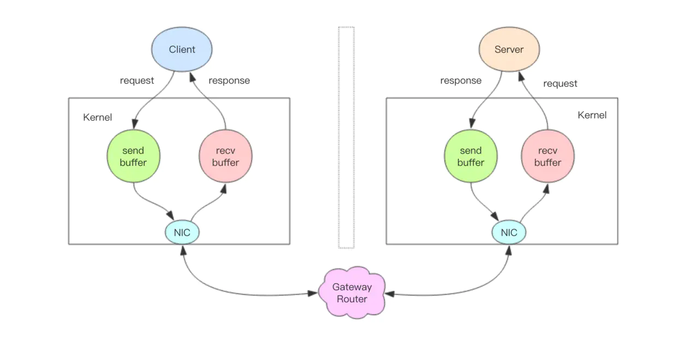

# Redis Basics ( from Juejin Book )

> **RE**mote **DI**ctionary **S**erver 远程字典服务

References

- 基本原理和方案设计
    - **Redis 深度历险 : 核心原理与应用实践** : https://juejin.im/book/5afc2e5f6fb9a07a9b362527
- Home Page : https://redis.io
    - Introduce : https://redis.io/topics/introduction
    - _Clients_ : https://redis.io/clients
    - Commands : https://redis.io/commands
    - Documentation : https://redis.io/documentation
    - _Download_ : https://redis.io/download
- Others
    - ZH Docs : http://redisdoc.com
    - 容量评估
        - **Redis 容量预估** - 极数云舟 : http://www.redis.cn/redis_memory/
        - Redis 容量评估模型 - 腾讯游戏学院 : https://gameinstitute.qq.com/community/detail/114987

## Basics : Data Structure

Reference

- 基础 : 万丈高楼平地起 —— Redis 基础数据结构 : https://juejin.cn/book/6844733724618129422/section/6844733724697985038

Data Structure

- string 字符串
- list 列表
- set 集合
- zset ( sorted set ) 有序集合
- hash 字典/哈希

### String

> 字符串

Redis 的字符串是 **动态字符串**,

- 是可以修改的字符串.
- **内部结构实现上类似于 Java 的 ArrayList**
    - 采用 **预分配冗余空间的方式来减少内存的频繁分配**
- 内部为当前字符串实际分配的空间 capacity 一般要高于实际字符串长度 len.
    - **当字符串长度小于 1M 时, 扩容都是加倍现有的空间,**
    - **如果超过 1M, 扩容时一次只会多扩 1M 的空间.**
    - 注意 : **字符串最大长度为 512M.**


### List

> 列表

**Redis 的列表相当于 Java 语言里面的 LinkedList.**

- 注意 : 它 **是链表而不是数组**.
    - 这意味着 list 的插入和删除操作非常快, 时间复杂度为 O(1)
    - 但是索引定位很慢, 时间复杂度为 O(n) _( icehe : 不过范围查询还行 )_
- 当列表弹出了最后一个元素之后, 该数据结构自动被删除, 内存被回收.


**Redis 的列表结构常用来做异步队列使用.**

- 将需要延后处理的任务结构体序列化成字符串塞进 Redis 的列表,
- 另一个线程从这个列表中轮询数据进行处理.

#### Queue

作为 队列 使用 : 右进左出

```bash
> rpush books python java golang
(integer) 3
> llen books
(integer) 3
> lpop books
"python"
> lpop books
"java"
> lpop books
"golang"
> lpop books
(nil)
```

#### Stack

作为 栈 使用 : 右进左出

```bash
> rpush books python java golang
(integer) 3
> rpop books
"golang"
> rpop books
"java"
> rpop books
"python"
> rpop books
(nil)
```

#### Slow Query

`lindex` _( list index )_ 相当于 Java 链表的 `get(int index)` 方法

- 它需要对链表进行遍历, 性能随着参数 index 增大而变差.

`ltrim` _( list trim )_ 和字面上的含义不太一样 _( 个人觉得它叫 `lretain ` ( 保留 ) 更合适, )_

- 参数 start_index 和 end_index 定义了一个区间,
    - 在这个区间内的值, ltrim 要保留, 区间之外统统砍掉.
- 可以通过 `ltrim` 来实现一个定长的链表, _这一点非常有用._
- index 可以为负数
    - index=-1 表示倒数第一个元素,
    - index=-2 表示倒数第二个元素.

#### Quicklist, Ziplist


Redis 底层的存储结构不是一个简单的 linkedlist,

- 而是称之为 **快速链表 quicklist** 的一个结构.
- 首先在 **列表元素较少的情况下会使用一块连续的内存存储**, 这个结构是 **ziplist 即压缩列表**.
    - 它将所有的元素紧挨着一起存储, 分配的是一块连续的内存.
- 当 **数据量比较多的时候才会改成 quicklist 快速链表**.
    - 因为普通的链表需要的附加指针空间太大, 会比较浪费空间, 而且会加重内存的碎片化.
        - 例如, 这个列表里存的只是 int 类型的数据, 结构上还需要两个额外的指针 prev 和 next.
    - 所以 Redis **将链表和 ziplist 结合起来组成了 quicklist**!
        - 也就是 **将多个 ziplist 使用双向指针串起来使用**.
        - 这样 **既满足了快速的插入删除性能, 又不会出现太大的空间冗余**.

### Hash

**Redis 的字典相当于 Java 语言里面的 HashMap**,

- 它是无序字典.
- 内部实现结构上同 Java 的 HashMap 也是一致的, 同样的 **数组 + 链表二维结构**.
- **第一维 hash 的数组位置碰撞时, 就会将碰撞的元素使用链表串接起来**.


#### Rehash

- 与 Java 不同的是, **Redis 的字典的值只能是字符串**,
- **rehash 方式** 也不一样,
    - 因为 Java 的 HashMap 在字典很大时, rehash 是个耗时的操作, 需要一次性全部 rehash.
    - Redis 为了高性能, 不能堵塞服务, 所以采用了 **渐进式 rehash 策略**.


- 渐进式 rehash 会在 rehash 的同时, 保留新旧两个 hash 结构, 查询时会同时查询两个 hash 结构,
- 然后 **在后续的定时任务中以及 hash 操作指令中, 循序渐进地将旧 hash 的内容一点点迁移到新的 hash 结构中**.
- 当搬迁完成了, 就会使用新的 hash 结构取而代之.
- 当 hash 移除了最后一个元素之后, 该数据结构自动被删除, 内存被回收.

#### String vs. Hash


- hash 结构也可以用来存储用户信息, 不同于字符串一次性需要全部序列化整个对象, **hash 可以对用户结构中的每个字段单独存储.
    - 这样当需要获取用户信息时 **可以进行部分获取**.
    - 而以 **整个字符串的形式去保存用户信息的话就只能一次性全部读取, 这样就会比较浪费网络流量**.
- hash 也有缺点, **hash 结构的存储消耗要高于单个字符串**,
    - 到底该使用 hash 还是字符串, 需要根据实际情况再三权衡.

在 Redis 存储结构体到底应该使用 hash 还是 string?

- Redis strings vs Redis hashes to represent JSON: efficiency? - StackOverflow : https://stackoverflow.com/questions/16375188/redis-strings-vs-redis-hashes-to-represent-json-efficiency

### Set

> 集合

**Redis 的集合相当于 Java 语言里面的 HashSet**,

- 它内部的键值对是无序的唯一的.
- 它的 **内部实现相当于一个特殊的字典, 字典中所有的 value 都是一个值 NULL**.


### Zset

> 有序集合

**zset 可能是 Redis 提供的最为特色的数据结构**,

- _它也是在面试中面试官最爱问的数据结构._
- 它 **类似于 Java 的 SortedSet 和 HashMap 的结合体**,
    - **一方面它是一个 set, 保证了内部 value 的唯一性**,
    - **另一方面它可以给每个 value 赋予一个 score, 代表这个 value 的排序权重**.
- 它的内部实现用的是一种叫做「**跳跃列表**」的数据结构.
- zset 中最后一个 value 被移除后, 数据结构自动删除, 内存被回收.


- _zset 可以用来存粉丝列表,_
    - _value 值是粉丝的用户 ID,_
    - _score 是关注时间._
    - _可以对粉丝列表按关注时间进行排序._
- _zset 还可以用来存储学生的成绩,_
    - _value 值是学生的 ID,_
    - _score 是他的考试成绩._
    - _可以对成绩按分数进行排序就可以得到他的名次._

#### Skiplist

> 跳跃表

- **zset 内部的排序功能是通过「跳跃列表」数据结构来实现的,
    - _它的结构非常特殊, 也比较复杂._
- 因为 **zset 要支持随机的插入和删除**, 所以它不好使用数组来表示.
- 因为 **zset 需要链表按照 score 值进行排序**,
    - 这意味着当有新元素需要插入时, 要定位到特定位置的插入点, 这样才可以继续保证链表是有序的.
    - 通常我们会通过二分查找来找到插入点, 但是二分查找的对象必须是数组, 只有数组才可以支持快速位置定位, 链表做不到


- 跳跃列表就是类似于层级制,
    - 最下面一层所有的元素都会串起来.
    - 然后每隔几个元素挑选出一个代表来, 再将这几个代表使用另外一级指针串起来.
    - 然后在这些代表里再挑出二级代表, 再串起来.
    - 最终就形成了金字塔结构.


- 「跳跃列表」之所以「跳跃」, 是因为内部的元素可能「身兼数职」,
    - 比如上图中间的这个元素, 同时处于 L0、L1 和 L2 层, 可以快速在不同层次之间进行「跳跃」.
    - 定位插入点时, 先在顶层进行定位, 然后下潜到下一级定位, 一直下潜到最底层找到合适的位置, 将新元素插进去.
- 跳跃列表 **采取一个随机策略来决定新元素可以兼职到第几层**.
    - **首先 L0 层肯定是 100% 了, L1 层只有 50% 的概率, L2 层只有 25% 的概率, L3 层只有 12.5% 的概率, 一直随机到最顶层 L31 层**.
    - _绝大多数元素都过不了几层, 只有极少数元素可以深入到顶层. 列表中的元素越多, 能够深入的层次就越深, 能进入到顶层的概率就会越大._

### General Principles

> 容器型数据结构的通用规则

list / hash / set / zset 这 4 种数据结构是 **容器型数据结构**, 共享下面两条通用规则 :

- 1\. **create if not exists**
    - **如果容器不存在, 那就创建一个, 再进行操作.**
    - _比如 rpush 操作刚开始是没有列表的, Redis 就会自动创建一个, 然后再 rpush 进去新元素._
- 2\. **drop if no elements**
    - **如果容器里元素没有了, 那么立即删除元素, 释放内存**.
    - _这意味着 lpop 操作到最后一个元素, 列表就消失了._

### Expiration

> 过期时间

Redis 所有的数据结构都可以设置过期时间, 时间到了, Redis 会自动删除相应的对象.

- **过期是以对象为单位**!
    - 例如, **一个 hash 结构的过期是整个 hash 对象的过期, 而不是其中的某个子 key**!
- 小心 string 的过期时间被移除!
    - 例如, **如果一个字符串已经设置了过期时间, 然后你调用了 set 方法修改了它, 它的过期时间会消失!**

```bash
$ redis-server &
$ redis-cli
127.0.0.1:6379> set foo bar
OK
127.0.0.1:6379> expire foo 600
(integer) 1
127.0.0.1:6379> ttl foo
(integer) 596
127.0.0.1:6379> set foo ice
OK
127.0.0.1:6379> ttl foo
(integer) -1
127.0.0.1:6379>
```

## Usage 1 : Distributed Lock

> 应用 1 : 分布式锁

Reference

- 应用 1 : 千帆竞发 —— 分布式锁 : https://juejin.cn/book/6844733724618129422/section/6844733724702015495

_分布式应用进行逻辑处理时经常会遇到并发问题._

- _比如, 一个操作要修改用户的状态, 修改状态需要先读出用户的状态, 在内存里进行修改, 改完了再存回去._
- _如果这样的操作同时进行了, 就会出现并发问题, 因为 读取和保存状态这两个操作不是原子的._

**原子操作** : **不会被线程调度机制打断的操作**

- 这种 **操作一旦开始, 就一直运行到结束, 中间不会有任何 context switch 线程切换**.


_这时就要使用分布式锁来限制程序的并发执行._

### Distributed Lock

- _分布式锁本质上要实现的目标就是在 Redis 里面占一个 "茅坑" , 当别的进程也要来占时, 发现已经有人蹲在那里了, 就只好放弃或者稍后再试._
- 占坑一般是使用 `setnx` ( set if not exists ) 指令, 只允许被一个客户端占坑. 先来先占, 用完了, 再调用 `del` 指令释放茅坑.

```bash
# 这里的冒号 : 就是一个普通的字符, 没特别含义, 它可以是任意其它字符, 不要误解
> setnx lock:codehole true
OK

# ... do something critical ...
> del lock:codehole
(integer) 1
```

- 但是有个问题, **如果逻辑执行到中间出现异常了, 可能会导致 del 指令没有被调用**,
    - 这样 **就会陷入死锁, 锁永远得不到释放.**
- 于是在拿到锁之后, 再给锁加上一个过期时间,
    - 比如 5s, 这样 **即使中间出现异常也可以保证 5 秒之后锁会自动释放**.

```bash
> setnx lock:codehole true
OK
> expire lock:codehole 5

# ... do something critical ...

> del lock:codehole
(integer) 1
```

- 但是以上逻辑还有问题.
    - **如果在 `setnx` 和 `expire` 之间服务器进程突然挂掉了, 可能是因为机器掉电或者是被人为杀掉的**,
    - **就会导致 `expire` 得不到执行, 也会造成死锁.**
- 这种问题的 **根源就在于 `setnx` 和 `expire` 是两条指令而不是原子指令.
    - 如果这两条指令可以一起执行就不会出现问题.
- 也许你会想到用 Redis 事务来解决. 但是这里不行,
    - 因为 `expire` 是依赖于 `setnx` 的执行结果的,
    - **如果 setnx 没抢到锁, expire 是不应该执行的.**
- 事务里没有 if-else 分支逻辑,
    - **事务的特点是一口气执行, 要么全部执行要么一个都不执行.
- 最终 Redis 2.8 版本中作者 **加入了 set 指令的扩展参数, 使得 setnx 和 expire 指令可以一起执行**, 彻底解决了分布式锁的乱象.
    - _( icehe : 虽然以上问题, 现在已经得到基本的解决, 但是还是该好好理解记住这些历史经验 )_

```bash
> set lock:codehole true ex 5 nx
OK
# ... do something critical ...
> del lock:codehole
```

### Timeout

> 超时

- Redis 的分布式锁不能解决超时问题,
    - **如果在加锁和释放锁之间的逻辑执行的太长, 以至于超出了锁的超时限制, 就会出现问题!**
    - 因为这时 **第一个线程持有的锁过期了, 临界区的逻辑还没有执行完,**
        - 这时 **第二个线程就提前重新持有了这把锁, 导致临界区代码不能得到严格的串行执行.**
- 为了避免这个问题, **Redis 分布式锁不要用于较长时间的任务!**
    - **如果真的偶尔出现了, 数据出现的小波错乱可能需要人工介入解决.**

```python
tag = random.nextint()  # 随机数
if redis.set(key, tag, nx=True, ex=5):
    do_something()
    redis.delifequals(key, tag)  # 假想的 delifequals 指令
```

- 有一个稍微安全一点的方案是 :
    - **为 set 指令的 value 参数设置为一个随机数, 释放锁时先匹配随机数是否一致, 然后再删除 key,**
        - 这是 **为了确保当前线程占有的锁不会被其它线程释放, 除非这个锁是过期了被服务器自动释放的.**
    - 但是匹配 value 和删除 key 不是一个原子操作, Redis 也没有提供类似于 `delifequals` 这样的指令,
        - 这就需要使用 Lua 脚本来处理了, 因为 **Lua 脚本可以保证连续多个指令的原子性执行.**

```lua
# delifequals
if redis.call("get",KEYS[1]) == ARGV[1] then
    return redis.call("del",KEYS[1])
else
    return 0
end
```

- 但是这也不是一个完美的方案, 它只是相对安全一点,
    - 因为如果真的超时了, 当前线程的逻辑没有执行完, 其它线程也会乘虚而入.

### Reenterability

> 可重入性

- **可重入性** 是指 **线程在持有锁的情况下再次请求加锁, 如果一个锁支持同一个线程的多次加锁, 那么这个锁就是可重入的.**
    - 比如 Java 语言里有个 ReentrantLock 就是可重入锁.
- Redis 分布式锁如果要支持可重入, **需要对客户端的 set 方法进行包装, 使用线程的 Threadlocal 变量存储当前持有锁的计数.**

```python
# -*- coding: utf-8
import redis
import threading


locks = threading.local()
locks.redis = {}

def key_for(user_id):
    return "account_{}".format(user_id)

def _lock(client, key):
    return bool(client.set(key, True, nx=True, ex=5))

def _unlock(client, key):
    client.delete(key)

def lock(client, user_id):
    key = key_for(user_id)
    if key in locks.redis:
        locks.redis[key] += 1
        return True
    ok = _lock(client, key)
    if not ok:
        return False
    locks.redis[key] = 1
    return True

def unlock(client, user_id):
    key = key_for(user_id)
    if key in locks.redis:
        locks.redis[key] -= 1
        if locks.redis[key] <= 0:
            del locks.redis[key]
            self._unlock(key)
        return True
    return False

client = redis.StrictRedis()
print "lock", lock(client, "codehole")
print "lock", lock(client, "codehole")
print "unlock", unlock(client, "codehole")
print "unlock", unlock(client, "codehole")
```

- 以上还不是可重入锁的全部, **精确一点还需要考虑内存锁计数的过期时间, 代码复杂度将会继续升高.**
    - 所以 **不推荐使用可重入锁!**
    - 它 **加重了客户端的复杂性, 在编写业务方法时注意在逻辑结构上进行调整完全可以不使用可重入锁.**

## Usage 2 : Delayed Queue

> 应用 2 : 延时队列

Reference

- 应用 2 : 缓兵之计 —— 延时队列 : https://juejin.cn/book/6844733724618129422/section/6844733724702015496

平时习惯于使用 Rabbitmq 和 Kafka 作为消息队列中间件, 来给应用程序之间增加异步消息传递功能. 这两个中间件都是专业的消息队列中间件, 特性之多超出了大多数人的理解能力.

- _使用过_ RabbitMQ _的就知道它使用起来有多复杂,_
    - 发消息之前要创建 Exchange, 再创建 Queue, 还要将 Queue 和 Exchange 通过某种规则绑定起来,
    - 发消息的时候要指定 routing-key, 还要控制头部信息.
- _消费者在消费消息之前也要进行上面一系列的繁琐过程._
    - _但是绝大多数情况下, 虽然消息队列只有一组消费者, 但还是需要经历上面这些繁琐的过程._
- _有了 Redis, 它就可以让我们解脱出来, 对于那些只有一组消费者的消息队列, 使用 Redis 就可以非常轻松的搞定._
    - **Redis 的消息队列不是专业的消息队列, 它没有非常多的高级特性, 没有 ack 保证,**
    - **如果对消息的可靠性有着极致的追求, 那么它就不适合使用.**

### Asynchronous Message Queue

> 异步消息队列

Redis 的 list 数据结构常用来作为异步消息队列使用,

- 使用 `rpush` / `lpush` 操作入队列,
- 使用 `lpop` 和 `rpop` 来出队列.


```bash
> rpush notify-queue apple banana pear
(integer) 3
> llen notify-queue
(integer) 3
> lpop notify-queue
"apple"
> llen notify-queue
(integer) 2
> lpop notify-queue
"banana"
> llen notify-queue
(integer) 1
> lpop notify-queue
"pear"
> llen notify-queue
(integer) 0
> lpop notify-queue
(nil)
```

### _队列空了怎么办?_

_处理完了再接着获取消息, 再进行处理. 如此循环往复, 这便是作为队列消费者的客户端的生命周期._

可是如果队列空了, 客户端就会陷入 pop 的死循环, 不停地 pop, 没有数据, 接着再 pop, 又没有数据. 这就是浪费生命的空轮询.

空轮询不但拉高了客户端的 CPU, redis 的 QPS 也会被拉高, 如果这样空轮询的客户端有几十个, Redis 的慢查询可能会显著增多.

**通常使用 sleep 来解决这个问题, 让线程睡一会, 睡个 1s 钟就可以了. 不但客户端的 CPU 能降下来, Redis 的 QPS 也降下来了.**

### Queue Delay Time

用上面睡眠的办法可以解决问题.

- 但是有个小问题, 那就是 **睡眠会导致消息的延迟增大.**
    - 如果只有 1 个消费者, 那么这个延迟就是 1s.
    - 如果有多个消费者, 这个延迟会有所下降, 因为每个消费者的睡觉时间是岔开来的.
- **有没有什么办法能显著降低延迟呢?** 你当然可以很快想到 :
    - A. 那就把睡觉的时间缩短点. 这种方式当然可以,
        - 不过有没有更好的解决方案呢?
    - B. 当然也有, 那就是 **`blpop` / `brpop`**.
        - 这两个 **指令的前缀字符 b 代表的是 blocking, 也就是阻塞读.**
- **阻塞读在队列没有数据的时候, 会立即进入休眠状态, 一旦数据到来, 则立刻醒过来.**
    - 消息的延迟几乎为零.
    - 用 `blpop` / `brpop` 替代前面的 `lpop` / `rpop` , 就完美解决了上面的问题.

### 空闲连接自动断开

上面的方案并非完美, 还有 **空闲连接** 的问题需要解决.

- **如果线程一直阻塞在哪里, Redis 的客户端连接就成了闲置连接,**
    - **闲置过久, 服务器一般会主动断开连接, 减少闲置资源占用.**
- **这时 `blpop` / `brpop` 会抛出异常来.**
    - 所以, 必须注意捕获异常, 还要重试.

所以编写客户端消费者的时候要小心, 注意捕获异常, 还要重试.

### 锁冲突处理

客户端在处理分布式锁请求时, **加锁没加成功怎么办?** 一般有 3 种策略来处理加锁失败 :

- A. **直接抛出异常, 通知用户稍后重试**
- B. **sleep 一会再重试**
- C. **将请求转移至延时队列, 过一会再试**

A. 直接抛出特定类型的异常

- 这种方式比较适合由用户直接发起的请求,
    - 用户看到错误对话框后, 会先阅读对话框的内容, 再点击重试, 这样就可以起到人工延时的效果.
    - 如果考虑到用户体验, 可以由前端的代码替代用户自己来进行延时重试控制.
    - 它本质上是 **对当前请求的放弃, 由用户决定是否重新发起新的请求.**

B. Sleep

- sleep 会阻塞当前的消息处理线程, 会导致队列的后续消息处理出现延迟.
    - **如果碰撞的比较频繁或者队列里消息比较多, sleep 可能并不合适.**
    - **如果因为个别死锁的 key 导致加锁不成功, 线程会彻底堵死, 导致后续消息永远得不到及时处理.**

C. 延时队列

- 这种方式 **比较适合异步消息处理**,
    - **将当前冲突的请求扔到另一个队列延后处理以避开冲突.**

### Implementation of Delayed Queue

> 延时队列的实现

- 延时队列可以通过 Redis 的 zset ( 有序列表 ) 来实现.
    - **将消息序列化成一个字符串作为 zset 的 value, 到期处理时间作为 score,**
    - 然后用 **多个线程轮询 zset 获取到期的任务进行处理,**
    - **多个线程是为了保障可用性, 万一挂了一个线程还有其它线程可以继续处理.**
    - 因为有多个线程, 所以 **需要考虑并发争抢任务, 确保任务不能被多次执行.**
- Redis 的 **`zrem` 方法是多线程多进程争抢任务的关键, 它的返回值决定了当前实例有没有抢到任务,
    - 因为 loop 方法可能会被多个线程、多个进程调用, 同一个任务可能会被多个进程线程抢到, 通过 zrem 来决定唯一的属主.
    - 同时, 要注意一定要对 `handle_msg` 进行异常捕获, 避免因为个别任务处理问题导致循环异常退出.

进一步优化

- 上面的算法中同一个任务可能会被多个进程取到之后再使用 zrem 进行争抢, 那些没抢到的进程都是白取了一次任务, 这是浪费.
    - 可以考虑 **使用 lua scripting 来原子化地执行这个逻辑, 将 zrangebyscore 和 zrem 一同挪到服务器端进行原子化操作**,
    - 这样多个进程之间争抢任务时就不会出现这种浪费了.

## Usage 3 : Bitmap

> 应用 3 : 节衣缩食 —— 位图

- 有一些 bool 型数据需要存取, 比如用户一年的签到记录, 签了是 1, 没签是 0, 要记录 365 天.
    - _如果使用普通的 key / value, 每个用户要记录 365 个, 当用户上亿的时候, 需要的存储空间是惊人的._
- 为了解决这个问题, **Redis 提供了位图数据结构**,
    - _这样每天的签到记录只占据一个位, 365 天就是 365 个位, 46 个字节 ( 一个稍长一点的字符串 ) 就可以完全容纳下, 这就大大节约了存储空间._
- **位图 就是普通的字符串, 也就是 byte 数组.**
    - 可以使用普通的 `get` / `set` 直接获取和设置整个位图的内容,
    - 也可以使用位图操作 `getbit` / `setbit` 等将 byte 数组看成「位数组」来处理.
- 当要统计月活的时候, 因为需要去重, 需要使用 set 来记录所有活跃用户的 id, 这非常浪费内存.
    - 这时就可以考虑使用位图来标记用户的活跃状态.
    - _每个用户会都在这个位图的一个确定位置上, 0 表示不活跃, 1 表示活跃._
    - _然后到月底遍历一次位图就可以得到月度活跃用户数._
    - 不过这个方法也是有条件的, 那就是 userid 是整数连续的, 并且活跃占比较高, 否则可能得不偿失.

### Basic Usage

Redis 的 **位数组是自动扩展的**,

- 如果设置了某个偏移位置超出了现有的内容范围, 就会自动将位数组进行零扩充.
- _此处不赘述, 详见自行查询_

零存整取

```bash
127.0.0.1:6379> setbit s 1 1
(integer) 0
127.0.0.1:6379> setbit s 2 1
(integer) 0
127.0.0.1:6379> setbit s 4 1
(integer) 0
127.0.0.1:6379> setbit s 9 1
(integer) 0
127.0.0.1:6379> setbit s 10 1
(integer) 0
127.0.0.1:6379> setbit s 13 1
(integer) 0
127.0.0.1:6379> setbit s 15 1
(integer) 0
127.0.0.1:6379> get s
"he"
```

零存零取

```bash
127.0.0.1:6379> setbit w 1 1
(integer) 0
127.0.0.1:6379> setbit w 2 1
(integer) 0
127.0.0.1:6379> setbit w 4 1
(integer) 0
127.0.0.1:6379> getbit w 1  # 获取某个具体位置的值 0/1
(integer) 1
127.0.0.1:6379> getbit w 2
(integer) 1
127.0.0.1:6379> getbit w 4
(integer) 1
127.0.0.1:6379> getbit w 5
(integer) 0
```

整存零取

```bash
127.0.0.1:6379> set w h  # 整存
(integer) 0
127.0.0.1:6379> getbit w 1
(integer) 1
127.0.0.1:6379> getbit w 2
(integer) 1
127.0.0.1:6379> getbit w 4
(integer) 1
127.0.0.1:6379> getbit w 5
(integer) 0
```

### 统计与查找

Redis 提供了指令

- 位图统计 `bitcount`
- 位图查找 `bitpos`
- `bitcount` 统计指定位置范围内 1 的个数
- `bitpos` 用来查找指定范围内出现的第一个 0 或 1

比如,

- 可以通过 `bitcount` 统计用户一共签到了多少天,
- 通过 `bitpos` 指令查找用户从哪一天开始第一次签到.
- 如果指定了范围参数 `[start, end]` ,
    - 就可以统计在某个时间范围内用户签到了多少天,
    - 用户自某天以后的哪天开始签到.
- 遗憾的是 start 和 end 参数是字节索引, 也就是说指定的位范围必须是 8 的倍数, 而不能任意指定.
    - _这很奇怪, 一般人表示不是很能理解 Antirez 为什么要这样设计._
    - _因为这个设计, 无法直接计算某个月内用户签到了多少天,_
    - _而必须要将这个月所覆盖的字节内容全部取出来 ( `getrange` 可以取出字符串的子串 )_
    - _然后在内存里进行统计, 这个非常繁琐._

_bitcount 指令和 bitpos 指令 示例 :_

```bash
127.0.0.1:6379> set w hello
OK

127.0.0.1:6379> bitcount w
(integer) 21

# 第一个字符中 1 的位数
127.0.0.1:6379> bitcount w 0 0
(integer) 3

# 前两个字符中 1 的位数
127.0.0.1:6379> bitcount w 0 1
(integer) 7

# 第一个 0 位
127.0.0.1:6379> bitpos w 0
(integer) 0

# 第一个 1 位
127.0.0.1:6379> bitpos w 1
(integer) 1

# 从第二个字符算起, 第一个 1 位
127.0.0.1:6379> bitpos w 1 1 1
(integer) 9

# 从第三个字符算起, 第一个 1 位
127.0.0.1:6379> bitpos w 1 2 2
(integer) 17
```

### _魔术指令 bitfield_

- 前文设置 `setbit` 和获取 `getbit` 指定位的值都是单个位的,
    - 如果要一次操作多个位, 就必须使用管道来处理.
- _不过 Redis 的 3.2 版本以后新增了功能强大的指令 `bitfield`,_
    - 有了这条指令, 不用管道也可以一次进行多个位的操作.
- `bitfield` 有三个子指令, 分别是 `get` / `set` / `incrby`,
    - 它们都可以对指定位片段进行读写, 但是最多只能处理 64 个连续的位,
    - 如果超过 64 位, 就得使用多个子指令, bitfield 可以一次执行多个子指令.
- ……

多次执行

```bash
127.0.0.1:6379> set w hello
OK
# 从第一个位开始取 4 个位, 结果是无符号数 (u)
127.0.0.1:6379> bitfield w get u4 0
(integer) 6

# 从第三个位开始取 3 个位, 结果是无符号数 (u)
127.0.0.1:6379> bitfield w get u3 2
(integer) 5

# 从第一个位开始取 4 个位, 结果是有符号数 (i)
127.0.0.1:6379> bitfield w get i4 0
1) (integer) 6

# 从第三个位开始取 3 个位, 结果是有符号数 (i)
127.0.0.1:6379> bitfield w get i3 2
1) (integer) -3
```

不使用 pipeline 的情况下, 一次性执行

```bash
127.0.0.1:6379> bitfield w get u4 0 get u3 2 get i4 0 get i3 2
1) (integer) 6
2) (integer) 5
3) (integer) 6
4) (integer) -3
```

……

后文内容较少使用, 暂略 ( TODO )

- 饱和截断 SAT
- 失败不执行 FAIL

## Usage 4 : HyperLogLog

Reference

- 应用 4 : 四两拨千斤 —— HyperLogLog : https://juejin.cn/book/6844733724618129422/section/6844733724706209805

思考一个常见的业务问题 : 如果开发维护一个大型的网站, 我们需要网站每个网页每天的 UV 数据, 然后计划开发这个统计模块, 如何实现?

- 如果统计 PV 那非常好办, 给每个网页一个独立的 Redis 计数器就可以了, 这个计数器的 key 后缀加上当天的日期.
    - _这样来一个请求, incrby 一次, 最终就可以统计出所有的 PV 数据._
- 但是 UV 不一样, 它要去重, 同一个用户一天之内的多次访问请求只能计数一次.
    - _这就要求每一个网页请求都需要带上用户的 ID, 无论是登陆用户还是未登陆用户都需要一个唯一 ID 来标识._

也许可以使用一个简单的方案

- 为每一个页面一个独立的 set 集合来存储所有当天访问过此页面的用户 ID.
- 当一个请求过来时, 我们使用 sadd 将用户 ID 塞进去就可以了.
- 通过 scard 可以取出这个集合的大小, 这个数字就是这个页面的 UV 数据. 没错, 这是一个非常简单的方案.

但是, 如果你的页面访问量非常大,

- 比如一个爆款页面几千万的 UV, 你需要一个很大的 set 集合来统计, 这就非常浪费空间.
- 如果这样的页面很多, 那所需要的存储空间是惊人的.
- 为这样一个去重功能就耗费这样多的存储空间, 值得么?
- 其实老板需要的数据又不需要太精确, 105w 和 106w 这两个数字对于老板们来说并没有多大区别.

_那么, 有没有更好的解决方案呢?_

- Redis 提供了 **HyperLogLog 数据结构, 用来解决统计问题.**
    - HyperLogLog **提供不精确的去重计数方案, 虽然不精确但是也不是非常不精确, 标准误差是 0.81%**,
    - 这样的精确度已经可以满足上面的 UV 统计需求了.

### How to Use

HyperLogLog 提供了两个指令

- **`pfadd` 增加计数**
    - _跟 set 集合的 `sadd` 用法一样, 来一个用户 ID, 就将用户 ID 塞进去就是._
- **`pfcount` 获取计数**
    - _跟 `scard` 用法是一样, 直接获取计数值._

_PF 是 HyperLogLog 这个数据结构的发明人 Philippe Flajolet 的首字母缩写._

_测试部分不赘述, 详见原文_

### pfmerge 适合什么场景

HyperLogLog 除了上面的 `pfadd` 和 `pfcount` 之外, 还提供了第三个指令

- **`pfmerge` 用于将多个 pf 计数值累加在一起形成一个新的 pf 值.**

_比如, 在网站中我们有两个内容差不多的页面, 运营说需要这两个页面的数据进行合并. 其中页面的 UV 访问量也需要合并, 那这个时候 `pfmerge` 就可以派上用场了._

### Precautions

> 注意事项

使用 HyperLogLog 这个数据结构的内存成本较高

- 它需要占据一定 12k 的存储空间, 所以它不适合统计单个用户相关的数据.
- 如果你的用户上亿, 可以算算, 这个空间成本是非常惊人的.
- 但是相比 set 存储方案, HyperLogLog 所使用的空间那真是可以使用千斤对比四两来形容了.

不过你也不必过于担心, 因为 **Redis 对 HyperLogLog 的存储进行了优化**,

- **在计数比较小时, 它的存储空间采用稀疏矩阵存储, 空间占用很小,**
- **仅仅在计数慢慢变大, 稀疏矩阵占用空间渐渐超过了阈值时才会一次性转变成稠密矩阵, 才会占用 12k 的空间.**

原理比较复杂, 难以理解, 详见原文

## Usage 5 : Bloom Filter

Reference

- 应用 5 : 层峦叠嶂 —— 布隆过滤器 : https://juejin.cn/book/6844733724618129422/section/6844733724706209806


_使用 HyperLogLog 数据结构来进行估数, 它非常有价值, 可以解决很多精确度不高的统计需求._

_但是如果想知道某一个值是不是已经在 HyperLogLog 结构里面了, 它就无能为力了, 它只提供了 `pfadd` 和 `pfcount` 方法, 没有提供 ~~`pfcontains`~~ 这种方法._

比如, 在使用新闻客户端看新闻时, 它会给我们不停地推荐新的内容, 它 **每次推荐时要去重, 去掉那些已经看过的内容.**

- _问题 :_
    - _新闻客户端推荐系统如何实现推送去重的? _
- 直接的解法 :
    - 做法 : 服务器记录了用户看过的所有历史记录, 当推荐系统推荐新闻时会从每个用户的历史记录里进行筛选, 过滤掉那些已经存在的记录.
    - 缺点 : 当用户量很大, 每个用户看过的新闻又很多的情况下, 这种方式, 推荐系统的去重工作在性能上很难跟上

实际上,

- 如果历史记录存储在关系数据库里, 去重就需要频繁地对数据库进行 exists 查询,
- 当系统并发量很高时, 数据库是很难扛住压力的.

然后考虑引入缓存,

- 但是将大量的历史记录全部缓存起来, 浪费大量存储空间.
- 而且这个存储空间是随着时间线性增长, 撑不住长期的积累.
- 但是不缓存的话, 性能又跟不上.

**布隆过滤器 ( Bloom Filter )** 就是 **专门用来解决去重问题的**.

- 它在起到去重的同时, 在空间上还能节省 90% 以上,
- 只是稍微有那么点不精确, 也就是有一定的误判概率.
- _( icehe : 需要花时间计算这个紧凑的数据结构, 用计算时间换存储空间 )_

### What is Bloom Filter?

布隆过滤器 **可以理解为一个不怎么精确的 set 结构**,

- **使用 contains 方法判断某个对象是否存在时, 可能会误判.**
- 但是布隆过滤器也不是特别不精确,
    - **只要参数设置的合理, 它的精确度可以控制的相对足够精确, 只会有很小的误判概率.**

特点

- **当布隆过滤器说某个值存在时, 这个值可能不存在;**
- **当它说不存在时, 那就肯定不存在.**

套在上面的使用场景中,

- 布隆过滤器能准确过滤掉那些已经看过的内容,
- 那些没有看过的新内容, 它也会过滤掉极小一部分 ( 误判 ) ,
- 但是绝大多数新内容它都能准确识别.

就可以完全保证推荐给用户的内容都是无重复的.

Redis 官方提供的布隆过滤器功能

- **Redis 4.0 版本才开始有**
- **作为一个插件加载到 Redis Server 中**

### Basic Usage

布隆过滤器有两个基本指令

- `bf.add` 添加一个元素
    - `bf.madd` 添加多个元素
- `bf.exists` 查询一个元素是否存在
    - `bf.mexists` 查询多个元素是否存在

它们的用法和 set 集合的 `sadd` 和 `sismember` 差不多.

_准确率的测试, 在此不赘述, 详见原文_

### Precaustions

> 注意事项

布隆过滤器的 **initial_size**

- 估计的过大, 会浪费存储空间,
- 估计的过小, 就会影响准确率,

用户在使用之前

- 一定要 **尽可能地精确估计好元素数量,**
- 还需要 **加上一定的冗余空间以避免实际元素可能会意外高出估计值很多.**

布隆过滤器的 error_rate 越小, 需要的存储空间就越大, 对于不需要过于精确的场合, error_rate 设置稍大一点也无伤大雅.

- _比如, 在新闻去重上而言, 误判率高一点只会让小部分文章不能让合适的人看到, 文章的整体阅读量不会因为这点误判率就带来巨大的改变._

### Working Principles


- **每个布隆过滤器对应到 Redis 的数据结构里面就是一个大型的位数组和几个不一样的无偏 hash 函数.**
    - 所谓无偏就是能够把元素的 hash 值算得比较均匀.
- **向布隆过滤器中添加 key 时, 会使用多个 hash 函数对 key 进行 hash,**
    - **算得一个整数索引值然后对位数组长度进行取模运算得到一个位置,**
    - **每个 hash 函数都会算得一个不同的位置. 再把位数组的这几个位置都置为 1 就完成了 add 操作.**
- 向布隆过滤器询问 key 是否存在时, 跟 add 一样,
    - 也会 **把 hash 的几个位置都算出来, 看看位数组中这几个位置是否都为 1,**
        - **只要有一个位为 0, 那么说明布隆过滤器中这个 key 不存在.**
        - **如果都是 1, 这并不能说明这个 key 就一定存在, 只是极有可能存在,**
            - 因为这些位被置为 1 可能是因为其它的 key 存在所致.
    - 如果这个位数组比较稀疏, 判断正确的概率就会很大, 如果这个位数组比较拥挤, 判断正确的概率就会降低.
    - _具体的概率计算公式比较复杂, 感兴趣可以阅读扩展阅读, 在此不赘述_
- **使用时不要让实际元素远大于初始化大小,**
    - **当实际元素开始超出初始化大小时, 应该对布隆过滤器进行重建**,
        - **重新分配一个 size 更大的过滤器, 再将所有的历史元素批量 add 进去.**
        - ( 这要求在其它的存储器中记录所有的历史元素 )
    - 因为 error_rate 不会因为数量超出就急剧增加, 这就给我们重建过滤器提供了较为宽松的时间.

布隆过滤器的原理涉及到较为复杂的数学知识, 感兴趣可以阅读文章继续深入了解内部原理 :

- 【原】布隆过滤器 (Bloom Filter) 详解 : https://www.cnblogs.com/allensun/archive/2011/02/16/1956532.html

### _Estimate Space Occupation_

_公式推导过程, 在此不赘述, 详情自行查询_

布隆过滤器有两个参数

- 预计元素的数量 n
- 错误率 f

公式根据这两个输入得到两个输出

- 位数组的长度 l _( 也就是需要的存储空间大小 (bit) )_
- hash 函数的最佳数量 k

hash 函数的数量也会直接影响到错误率, 最佳的数量会有最低的错误率.

```bash
k = 0.7 * ( l / n )     # 约等于
f = 0.6185 ^ ( l / n )  # ^ 表示次方计算, 即 math.pow
```

_从公式中可以看出_

- 位数组相对越长 ( l / n )
    - 错误率 f 越低
    - hash 函数需要的最佳数量也越多, 影响计算效率
- 当一个元素平均需要 1 个字节 ( 8 bit ) 的指纹空间时 ( l / n = 8 ) ,
    - 错误率大约为 2%
- 错误率为 10%
    - 一个元素需要的平均指纹空间为 4.792 个 bit, 大约为 5bit
- 错误率为 1%
    - 一个元素需要的平均指纹空间为 9.585 个 bit, 大约为 10bit
- 错误率为 0.1%
    - 一个元素需要的平均指纹空间为 14.377 个 bit, 大约为 15bit

如果一个元素需要占据 15 个 bit, 那相对 set 集合的空间优势是不是就没有那么明显了?

- _需要明确的是, set 中会存储每个元素的内容, 而布隆过滤器仅仅存储元素的指纹._
- 元素的内容大小就是字符串的长度, 它一般会有多个字节, 甚至是几十个上百个字节,
    - 每个元素本身还需要一个指针被 set 集合来引用, 这个指针又会占去 4 个字节或 8 个字节, 取决于系统是 32bit 还是 64bit.
- 而指纹空间只有接近 2 个字节, 所以布隆过滤器的空间优势还是非常明显的.

有现成的网站已经支持计算空间占用的功能了, 只要把参数输进去, 就可以直接看到结果

- 例如, 布隆计算器 : https://krisives.github.io/bloom-calculator

### 实际元素超出时, 误判率会怎样变化

当实际元素超出预计元素时, 错误率会有多大变化? _它会急剧上升么, 还是平缓地上升_

这就需要另外一个公式, 引入参数 t 表示 实际元素跟预计元素的比率

```bash
# 极限近似, k 是 hash 函数的最佳数量
f = ( 1 - 0.5 ^ t ) ^ k
```

- 当 t 增大时, 错误率 f 也会跟着增大
- 分别选择错误率为 10%, 1%, 0.1% 的 k 值, 画出它的曲线进行直观观察


- 纵轴 : 错误率
- 横轴 : 实际元素跟预计元素的比率

_从这个图中可以看出曲线还是比较陡峭的_

- 错误率为 10% 时, 比率比为 2 时, 错误率就会升至接近 40%, _这个就比较危险了_
- 错误率为 1% 时, 比率比为 2 时, 错误率升至 15%, _也挺可怕的_
- 错误率为 0.1%, 比率比为 2 时, 错误率升至 5%, _也比较悬了_

### 非 Redis 4.0 如何用上布隆过滤器?

_此处暂略, 详见原文_

### 布隆过滤器的其它应用

在爬虫系统中, 需要对 URL 进行去重, 已经爬过的网页就可以不用爬了.

- 但是 URL 太多了, 几千万几个亿, 如果用一个集合装下这些 URL 地址那是非常浪费空间的.
- 这时候就可以考虑使用布隆过滤器.
- 它可以大幅降低去重存储消耗, 只不过也会使得爬虫系统错过少量的页面.

布隆过滤器在 NoSQL 数据库领域使用非常广泛,

- 平时用到的 HBase、Cassandra 还有 LevelDB、RocksDB 内部都有布隆过滤器结构, 布隆过滤器可以显著降低数据库的 IO 请求数量.
- **当用户来查询某个 row 时, 可以先通过内存中的布隆过滤器过滤掉大量不存在的 row 请求, 然后再去磁盘进行查询.**

邮箱系统的垃圾邮件过滤功能也普遍用到了布隆过滤器,

- 因为用了这个过滤器, 所以平时也会遇到某些正常的邮件被放进了垃圾邮件目录中, 这个就是误判所致, 概率很低.

## Usage 6 : Simple Limiter

> 简单限流器

Reference

- 应用 6 : 断尾求生 —— 简单限流 : https://juejin.cn/book/6844733724618129422/section/6844733724706209800

场景 : 当系统的处理能力有限时, **阻止计划外的请求继续对系统施压**, _这是一个需要重视的问题._

除了控制流量, 限流还有一个应用目的是用于控制用户行为, 避免垃圾请求.

- _比如在 UGC 社区, 用户的发帖、回复、点赞等行为都要严格受控,_
    - _一般要严格限定某行为在规定时间内允许的次数, 超过了次数那就是非法行为._
- _对非法行为, 业务必须规定适当的惩处策略._

### 实现简单限流策略

**系统要限定用户的某个行为在指定的时间里只能允许发生 N 次,** _如何使用 Redis 的数据结构来实现这个限流的功能?_

先定义这个接口

```python
# 指定用户 user_id 的某个行为 action_key 在特定的时间内 period 只允许发生一定的次数 max_count
def is_action_allowed(user_id, action_key, period, max_count):
    return True

# 调用这个接口 , 60 秒内只允许最多回复 5 个帖子
can_reply = is_action_allowed("icehe", "reply", 60, 5)
if can_reply:
    do_reply()
else:
    raise ActionThresholdOverflow()
```

### Solution

> 解决方案

限流需求中存在一个滑动时间窗口,

- zset 数据结构可以使用 score 值来圈出时间窗口.
- 而且只需要保留这个时间窗口, 窗口之外的数据都可以删掉.
- 那么 zset 的 value 只需要保证唯一性即可
    - _用 uuid 会比较浪费空间,_ 使用 毫秒时间戳 即可.


- 用一个 zset 结构记录用户的行为历史, 每一个行为都会作为 zset 中的一个 key 保存下来.
    - 同一个用户同一种行为用一个 zset 记录.
- 为节省内存, 只需要保留时间窗口内的行为记录,
    - 同时如果用户是冷用户, 滑动时间窗口内的行为是空记录, 那么这个 zset 就可以从内存中移除, 不再占用空间.
- 通过统计滑动窗口内的行为数量与阈值 max_count 进行比较就可以得出当前的行为是否允许.

### Implementation

用代码表示如下 :

- _( icehe : O(n) 线性的空间复杂度, 与行为数量成正比 )_

```python
# coding: utf8

import time
import redis

client = redis.StrictRedis()

def is_action_allowed(user_id, action_key, period, max_count):
    key = 'hist:%s:%s' % (user_id, action_key)
    now_ts = int(time.time() * 1000)  # 毫秒时间戳
    with client.pipeline() as pipe:  # client 是 StrictRedis 实例
        # 记录行为
        pipe.zadd(key, now_ts, now_ts)  # value 和 score 都使用毫秒时间戳
        # 移除时间窗口之前的行为记录, 剩下的都是时间窗口内的
        pipe.zremrangebyscore(key, 0, now_ts - period * 1000)
        # 获取窗口内的行为数量
        pipe.zcard(key)
        # 设置 zset 过期时间, 避免冷用户持续占用内存
        # 过期时间应该等于时间窗口的长度, 再多宽限 1s
        pipe.expire(key, period + 1)
        # 批量执行
        _, _, current_count, _ = pipe.execute()
    # 比较数量是否超标
    return current_count <= max_count

for i in range(20):
    print is_action_allowed("laoqian", "reply", 60, 5)
```

```java
public class SimpleRateLimiter {

  private Jedis jedis;

  public SimpleRateLimiter(Jedis jedis) {
    this.jedis = jedis;
  }

  public boolean isActionAllowed(String userId, String actionKey, int period, int maxCount) {
    String key = String.format("hist:%s:%s", userId, actionKey);
    long nowTs = System.currentTimeMillis();
    Pipeline pipe = jedis.pipelined();
    pipe.multi();
    pipe.zadd(key, nowTs, "" + nowTs);
    pipe.zremrangeByScore(key, 0, nowTs - period * 1000);
    Response<Long> count = pipe.zcard(key);
    pipe.expire(key, period + 1);
    pipe.exec();
    pipe.close();
    return count.get() <= maxCount;
  }

  public static void main(String[] args) {
    Jedis jedis = new Jedis();
    SimpleRateLimiter limiter = new SimpleRateLimiter(jedis);
    for(int i=0;i<20;i++) {
      System.out.println(limiter.isActionAllowed("laoqian", "reply", 60, 5));
    }
  }
}
```

## Usage 7 : Funnel Limiter

> 漏斗限流器

### Solution

> 解决方案

漏斗限流是最常用的限流方法之一, _顾名思义, 这个算法的灵感源于漏斗 ( funnel ) 的结构._


- _漏斗的容量是有限的, 如果将漏嘴堵住, 然后一直往里面灌水, 它就会变满, 直至再也装不进去._
- _如果将漏嘴放开, 水就会往下流, 流走一部分之后, 就又可以继续往里面灌水._
- _如果漏嘴流水的速率大于灌水的速率, 那么漏斗永远都装不满._
- _如果漏嘴流水速率小于灌水的速率, 那么一旦漏斗满了, 灌水就需要暂停并等待漏斗腾空._

所以

- **漏斗的剩余空间** 就代表着 **当前行为可以持续进行的数量**,
- **漏嘴的流水速率** 代表着 **系统允许该行为的最大频率**.

### Implementation

使用代码来描述单机漏斗算法 :

_( icehe : 这个应用很有趣! 上次看过之后已经, 忘掉了… 有空得实现一下. )_

```python
# coding: utf8

import time

class Funnel(object):

    def __init__(self, capacity, leaking_rate):
        # 漏斗容量
        self.capacity = capacity
        # 漏嘴流水速率
        self.leaking_rate = leaking_rate
        # 漏斗剩余空间
        self.left_quota = capacity
        # 上一次漏水时间
        self.leaking_ts = time.time()

    def make_space(self):
        now_ts = time.time()
        # 距离上一次漏水过去了多久
        delta_ts = now_ts - self.leaking_ts
        # 又可以腾出不少空间了
        delta_quota = delta_ts * self.leaking_rate
        # 腾的空间太少, 那就等下次再继续j
        if delta_quota < 1:
            return
        # 增加剩余空间
        self.left_quota += delta_quota
        # 记录漏水时间
        self.leaking_ts = now_ts
        # 剩余空间不得高于容量
        if self.left_quota > self.capacity:
            self.left_quota = self.capacity

    def watering(self, quota):
        self.make_space()
        # 判断剩余空间是否足够
        if self.left_quota >= quota:
            self.left_quota -= quota
            return True
        return False

# 所有的漏斗
funnels = {}

# capacity  漏斗容量
# leaking_rate 漏嘴流水速率 quota/s
def is_action_allowed(
    user_id, action_key, capacity, leaking_rate):
    key = '%s:%s' % (user_id, action_key)
    funnel = funnels.get(key)
    if not funnel:
        funnel = Funnel(capacity, leaking_rate)
        funnels[key] = funnel
    return funnel.watering(1)

for i in range(20):
    print is_action_allowed('laoqian', 'reply', 15, 0.5)
```

```java
public class FunnelRateLimiter {

  static class Funnel {
    int capacity;
    float leakingRate;
    int leftQuota;
    long leakingTs;

    public Funnel(int capacity, float leakingRate) {
      this.capacity = capacity;
      this.leakingRate = leakingRate;
      this.leftQuota = capacity;
      this.leakingTs = System.currentTimeMillis();
    }

    void makeSpace() {
      long nowTs = System.currentTimeMillis();
      long deltaTs = nowTs - leakingTs;
      int deltaQuota = (int) (deltaTs * leakingRate);
      if (deltaQuota < 0) { // 间隔时间太长, 整数数字过大溢出
        this.leftQuota = capacity;
        this.leakingTs = nowTs;
        return;
      }
      if (deltaQuota < 1) { // 腾出空间太小, 最小单位是1
        return;
      }
      this.leftQuota += deltaQuota;
      this.leakingTs = nowTs;
      if (this.leftQuota > this.capacity) {
        this.leftQuota = this.capacity;
      }
    }

    boolean watering(int quota) {
      makeSpace();
      if (this.leftQuota >= quota) {
        this.leftQuota -= quota;
        return true;
      }
      return false;
    }
  }

  private Map<String, Funnel> funnels = new HashMap<>();

  public boolean isActionAllowed(String userId, String actionKey, int capacity, float leakingRate) {
    String key = String.format("%s:%s", userId, actionKey);
    Funnel funnel = funnels.get(key);
    if (funnel == null) {
      funnel = new Funnel(capacity, leakingRate);
      funnels.put(key, funnel);
    }
    return funnel.watering(1); // 需要1个quota
  }
}
```

Funnel 对象的 make_space 方法是漏斗算法的核心,

- 其在每次灌水前都会被调用以触发漏水, 给漏斗腾出空间来.
- 能腾出多少空间取决于过去了多久以及流水的速率.
- **Funnel 对象占据的空间大小不再和行为的频率成正比, 它的空间占用是一个常量!**
    - _( icehe : O(n) 线性的空间复杂度, 跟限流对象的数量成正比 )_

分布式的漏斗算法该如何实现? 能不能使用 Redis 的基础数据结构来搞定?

- 观察 Funnel 对象的几个字段,
    - 发现可以将 Funnel 对象的内容按字段存储到一个 hash 结构中,
    - 灌水的时候将 hash 结构的字段取出来进行逻辑运算后,
    - 再将新值回填到 hash 结构中就完成了一次行为频度的检测.
- 但是有个问题, 无法保证整个过程的原子性.
    - 从 hash 结构中取值, 然后在内存里运算, 再回填到 hash 结构,
    - 这三个过程无法原子化, 意味着需要进行适当的加锁控制.
    - 而一旦加锁, 就意味着会有加锁失败, 加锁失败就需要选择重试或者放弃.
- 如果重试的话, 就会导致性能下降. 如果放弃的话, 就会影响用户体验.
    - 同时, 代码的复杂度也跟着升高很多.

这是个艰难的选择, 该如何解决这个问题呢? 可以使用 Redis-Cell 解决!

### Redis-Cell

Redis 4.0 提供了一个 **限流模块 redis-cell**.

- 该模块 **使用 "漏斗算法", 并提供了原子的限流指令**!

该模块 **只有 1 条指令 `cl.throttle`**, _参数和返回值都略显复杂_

```bash
> cl.throttle icehe:reply 15 30 60 1
                  ▲       ▲  ▲  ▲  ▲
                  |       |  |  |  └───── need 1 quota (可选参数, 默认值也是1)
                  |       |  └──┴─────── 30 operations / 60 seconds 这是漏水速率
                  |       └───────────── 15 capacity 这是漏斗容量
                  └─────────────────── key laoqian
```

以上指令的意思是

- 允许「用户 icehe 的回复行为」的频率为每 60s 最多 30 次 ( 漏水速率 ) ,
- 漏斗的初始容量为 15, _也就是说一开始可以连续回复 15 个帖子, 然后才开始受漏水速率的影响._

_指令中漏水速率变成了 2 个参数, 替代了之前的单个浮点数._

- 用两个参数相除的结果来表达漏水速率相对单个浮点数要更加直观一些.

```bash
> cl.throttle laoqian:reply 15 30 60
1) (integer) 0   # 0 表示允许, 1 表示拒绝
2) (integer) 15  # 漏斗容量 capacity
3) (integer) 14  # 漏斗剩余空间 left_quota
4) (integer) -1  # 如果拒绝了, 需要多长时间后再试 ( 漏斗有空间了, 单位秒 )
5) (integer) 2   # 多长时间后, 漏斗完全空出来 ( left_quota==capacity, 单位秒 )
```

## Usage 8 : GeoHash

Reference

- 应用 8 : 近水楼台 —— GeoHash : https://juejin.cn/book/6844733724618129422/section/6844733724710404103

Redis 在 **3.2 版本以后增加了地理位置 GEO 模块**, 意味着可以使用 Redis 来实现摩拜单车「附近的 Mobike」、美团和饿了么「附近的餐馆」这样的功能了.

### 用 DB 来算附近的人

地图元素的位置数据使用二维的经纬度表示,

- 经度范围 (-180, 180], 纬度范围 (-90, 90],
- 纬度正负以赤道为界, 北正南负,
- 经度正负以本初子午线 (英国格林尼治天文台) 为界, 东正西负.

_比如掘金办公室在望京 SOHO, 它的经纬度坐标是 (116.48105, 39.996794), 都是正数, 因为中国位于东北半球._

当两个元素的距离不是很远时, 可以直接使用勾股定理就能算得元素之间的距离.

- 我们平时使用的「附近的人」的功能, 元素距离都不是很大, 勾股定理算距离足矣.
- 不过需要注意的是, 经纬度坐标的密度不一样 ( 地球是一个椭圆 ) ,
    - 勾股定律计算平方差时之后再求和时, 需要按一定的系数比加权求和,
    - 如果不求精确的话, 也可以不必加权.

问题 : 经度总共 360 度, 维度总共只有 180 度, 为什么距离密度不是 2:1 ?

- 现在, 如果要计算「附近的人」, 也就是给定一个元素的坐标, 然后计算这个坐标附近的其它元素, 按照距离进行排序, 该如何下手?


_如果现在元素的经纬度坐标使用关系数据库 (元素 id, 经度 x, 纬度 y) 存储, 你该如何计算?_

- _首先, 不可能通过遍历来计算所有的元素和目标元素的距离然后再进行排序,_
    - _这个计算量太大了, 性能指标肯定无法满足._
- 一般的方法都是 **通过矩形区域来限定元素的数量, 然后对区域内的元素进行全量距离计算再排序**.
    - _这样可以明显减少计算量._
- 如何划分矩形区域呢?
    - **可以指定一个半径 r, 使用一条 SQL 就可以圈出来.**
    - **当用户对筛出来的结果不满意, 那就扩大半径继续筛选.**

```sql
select id from positions where x0 - r < x < x0 + r and y0 - r < y < y0 + r;
```

- **为了满足高性能的矩形区域算法, 数据表需要在经纬度坐标加上双向复合索引 (x, y)**, 这样可以最大优化查询性能.
    - _( icehe : "双向复合索引" 是啥? )_
- 但是数据库查询性能毕竟有限, 如果「附近的人」查询请求非常多, 在高并发场合, 这可能并不是一个很好的方案.

### GeoHash 算法

**业界比较通用的 地理位置距离排序算法是 GeoHash 算法**, _Redis 也使用 GeoHash 算法._

- GeoHash 算法将二维的经纬度数据映射到一维的整数,
    - 这样所有的元素都将在挂载到一条线上, 距离靠近的二维坐标映射到一维后的点之间距离也会很接近.
    - _当我们想要计算「附近的人时」, 首先将目标位置映射到这条线上, 然后在这个一维的线上获取附近的点就行了._
- 那这个映射算法具体是怎样的呢?
    - **将整个地球看成一个二维平面, 然后划分成了一系列正方形的方格**, 就好比围棋棋盘.
    - **所有的地图元素坐标都将放置于唯一的方格中**. 方格越小, 坐标越精确.
    - **然后对这些方格进行整数编码, 越是靠近的方格编码越是接近.**
    - 那如何编码呢? 一个最简单的方案就是切蛋糕法.
        - **设想一个正方形的蛋糕摆在你面前, 二刀下去均分分成四块小正方形,**
            - 这四个小正方形可以 **分别标记为 00,01,10,11 四个二进制整数.**
        - 然后 **对每一个小正方形继续用二刀法切割一下, 这时每个小小正方形就可以使用 4bit 的二进制整数予以表示.**
        - 然后继续切下去, 正方形就会越来越小, 二进制整数也会越来越长, 精确度就会越来越高.


- **上面的例子中使用的是二刀法,**
    - **真实算法中还会有很多其它刀法**, 最终编码出来的整数数字也都不一样.
- 编码之后, 每个地图元素的坐标都将变成一个整数,
    - 通过这个整数可以还原出元素的坐标, 整数越长, 还原出来的坐标值的损失程度就越小.
    - 对于「附近的人」这个功能而言, 损失的一点精确度可以忽略不计.
- GeoHash 算法会 **继续对这个整数做一次 base32 编码 ( 0-9,a-z 去掉 a,i,l,o 四个字母 ) 变成一个字符串.**
    - 在 Redis 里面, **经纬度使用 52 位的整数进行编码, 放进了 zset 里面,**
        - **zset 的 value 是元素的 key** _( 例如, "三里屯SOHO" )_ ,
        - **score 是 GeoHash 的 52 位整数值.**
    - **zset 的 score 虽然是浮点数, 但是对于 52 位的整数值, 它可以无损存储.**
- Redis 进行 Geo 查询时, **GeoHash 的内部结构实际上只是一个 zset ( skiplist )** .
    - **通过 zset 的 score 范围查询就可以得到坐标附近的其它元素,**
        - _( 实际情况要复杂一些, 不过这样理解足够了)_
    - 通过将 score 还原成坐标值就可以得到元素的原始坐标.

### Redis 的 Geo 指令基本使用

_使用时, 务必记住 : 它只是一个普通的 zset 结构._

增加位置 `geoadd`

- 入参为 集合名称, 以及由 经度、纬度、位置名称 组成的三元组
- 可以加入多个三元组

```bash
127.0.0.1:6379> geoadd company 116.48105 39.996794 juejin
(integer) 1
127.0.0.1:6379> geoadd company 116.514203 39.905409 ireader
(integer) 1
127.0.0.1:6379> geoadd company 116.489033 40.007669 meituan
(integer) 1
127.0.0.1:6379> geoadd company 116.562108 39.787602 jd 116.334255 40.027400 xiaomi
(integer) 2
```

删除位置 `zrem`

- Redis 没有直接提供 geo 删除指令
    - 因为 geo 存储结构上使用的是 zset,
    - 意味着可以使用 zset 相关的指令来操作 geo 数据,
    - 所以 **删除直接使用 `zrem` 指令** 即可.

位置间的距离

- `geodist` 计算两个元素之间的距离
    - 入参为 集合名称, 以及 2 个位置名称和距离单位.

```bash
127.0.0.1:6379> geodist company juejin ireader km
"10.5501"
127.0.0.1:6379> geodist company juejin meituan km
"1.3878"
127.0.0.1:6379> geodist company juejin jd km
"24.2739"
127.0.0.1:6379> geodist company juejin xiaomi km
"12.9606"
127.0.0.1:6379> geodist company juejin juejin km
"0.0000"
```

获取元素位置 `geopos`

- 可以获取集合中任意元素的经纬度坐标,
- 可以一次获取多个.

```bash
127.0.0.1:6379> geopos company juejin
1) 1) "116.48104995489120483"
   2) "39.99679348858259686"
127.0.0.1:6379> geopos company ireader
1) 1) "116.5142020583152771"
   2) "39.90540918662494363"
127.0.0.1:6379> geopos company juejin ireader
1) 1) "116.48104995489120483"
   2) "39.99679348858259686"
2) 1) "116.5142020583152771"
   2) "39.90540918662494363"
```

- 观察到获取的经纬度坐标和 geoadd 进去的坐标有轻微的误差,
    - 原因是 geohash 对二维坐标进行的一维映射是有损的, 通过映射再还原回来的值会出现较小的差别.
    - 对于「附近的人」这种功能来说, 这点误差根本不是事.

获取元素的 hash 值 `geohash`

- 可以 **获取元素的经纬度编码字符串, 它是 base32 编码.**
- 可以 **使用这个编码值去 http://geohash.org 中进行直接定位, 它是 geohash 的标准编码值.**

查询附近的位置 `georadiusbymember`

- _最为关键的指令, 它的参数非常复杂._

```bash
# 范围 20 公里以内最多 3 个元素按距离正排, 它不会排除自身
127.0.0.1:6379> georadiusbymember company ireader 20 km count 3 asc
1) "ireader"
2) "juejin"
3) "meituan"

# 范围 20 公里以内最多 3 个元素按距离倒排
127.0.0.1:6379> georadiusbymember company ireader 20 km count 3 desc
1) "jd"
2) "meituan"
3) "juejin"

# 三个可选参数 withcoord withdist withhash 用来携带附加参数
# withdist 很有用, 它可以用来显示距离
127.0.0.1:6379> georadiusbymember company ireader 20 km withcoord withdist withhash count 3 asc
1) 1) "ireader"
   2) "0.0000"
   3) (integer) 4069886008361398
   4) 1) "116.5142020583152771"
      2) "39.90540918662494363"
2) 1) "juejin"
   2) "10.5501"
   3) (integer) 4069887154388167
   4) 1) "116.48104995489120483"
      2) "39.99679348858259686"
3) 1) "meituan"
   2) "11.5748"
   3) (integer) 4069887179083478
   4) 1) "116.48903220891952515"
      2) "40.00766997707732031"
```

根据坐标值来查询附近的位置 `georadius`

- _除了 georadiusbymember 指令根据元素查询附近的元素,_
    - Redis 还提供了根据坐标值来查询附近的元素, 这个指令更加有用,
    - _它可以根据用户的定位来计算「附近的车」, 「附近的餐馆」等._
    - **参数和 georadiusbymember 基本一致, 除了将目标元素改成经纬度坐标值.**

```bash
127.0.0.1:6379> georadius company 116.514202 39.905409 20 km withdist count 3 asc
1) 1) "ireader"
   2) "0.0000"
2) 1) "juejin"
   2) "10.5501"
3) 1) "meituan"
   2) "11.5748"
```

### Precautions

- 在一个地图应用中, 车的数据、餐馆的数据、人的数据可能会有百万千万条,
    - 如果使用 Redis 的 Geo 数据结构, 它们将全部放在一个 zset 集合中.
- 在 Redis 的 **集群环境中, 集合可能会从一个节点迁移到另一个节点,**
    - **如果单个 key 的数据过大, 会对集群的迁移工作造成较大的影响,**
    - **在集群环境中单个 key 对应的数据量不宜超过 1M,**
        - **否则会导致集群迁移出现卡顿现象, 影响线上服务的正常运行.**
- 所以, **建议 Geo 的数据使用单独的 Redis 实例部署, 不使用集群环境!**
    - **如果数据量过亿甚至更大, 就需要对 Geo 数据进行拆分,**
        - 按国家拆分、按省拆分, 按市拆分, 在人口特大城市甚至可以按区拆分.
    - _这样就可以显著降低单个 zset 集合的大小._

## Usage 8 : Scan

Reference

- 应用 9 : 大海捞针 —— Scan : https://juejin.cn/book/6844733724618129422/section/6844733724710404110

_在平时线上 Redis 维护工作中, 有时候需要从 Redis 实例成千上万的 key 中找出特定前缀的 key 列表来手动处理数据, 可能是修改它的值, 也可能是删除 key._

_这里就有一个问题, 如何从海量的 key 中找出满足特定前缀的 key 列表来?_

```bash
127.0.0.1:6379> set codehole1 a
OK
127.0.0.1:6379> set codehole2 b
OK
127.0.0.1:6379> set codehole3 c
OK
127.0.0.1:6379> set code1hole a
OK
127.0.0.1:6379> set code2hole b
OK
127.0.0.1:6379> set code3hole b
OK
127.0.0.1:6379> keys *
1) "codehole1"
2) "code3hole"
3) "codehole3"
4) "code2hole"
5) "codehole2"
6) "code1hole"
127.0.0.1:6379> keys codehole*
1) "codehole1"
2) "codehole3"
3) "codehole2"
127.0.0.1:6379> keys code*hole
1) "code3hole"
2) "code2hole"
3) "code1hole"
```

**指令 `keys` 列出所有满足特定正则字符串规则的 key**.

使用非常简单, 提供一个简单的正则字符串即可, 但是有很明显的两个缺点 :

- 1\. **没有 offset、limit 参数, 一次性吐出所有满足条件的 key,**
    - _万一实例中有几百 w 个 key 满足条件, 当看到满屏的字符串刷的没有尽头时, 你就知道难受了._
- 2\. **keys 算法是遍历算法, 复杂度是 O(n),**
    - **如果实例中有千万级以上的 key, 这个指令就会导致 Redis 服务卡顿, 所有读写 Redis 的其它的指令都会被延后甚至会超时报错,**
    - **因为 Redis 是单线程程序, 顺序执行所有指令, 其它指令必须等到当前的 keys 指令执行完了才可以继续.**

Redis 为了解决这个问题, 它在 2.8 版本中加入了指令 `scan`, 相比 `keys` 具备有以下特点 :

- 1\. _复杂度虽然也是 O(n), 但是它是_ **通过游标分步进行的, 不会阻塞线程**;
- 2\. **提供 limit 参数, 可以控制每次返回结果的最大条数**,
    - limit 只是一个 hint, 返回的结果可多可少;
- 3\. _同 keys 一样, 它也_ **提供模式匹配功能**;
- 4\. 服务器 **不需要为游标保存状态**,
    - **游标的唯一状态就是 scan 返回给客户端的游标整数**;
- 5\. 注意! **返回的结果可能会有重复, 需要客户端去重复**;
- 6\. **遍历的过程中如果有数据修改, 改动后的数据能不能遍历到是不确定的**;
- 7\. **单次返回的结果是空的并不意味着遍历结束, 而要看返回的游标值是否为零**;

### Basic Usage

> 基础使用

测试 : 在使用之前, 往 Redis 里插入 10000 条数据

```python
import redis

client = redis.StrictRedis()
for i in range(10000):
    client.set("key%d" % i, i)
```

`scan` 提供了三个参数

- 1\. `cursor` 整数值
- 2\. `key` 的正则模式
- 3\. 遍历的 `limit` hint

`scan` 查询过程

- **第一次遍历时, cursor 值为 0,**
- 然后 **将返回结果中第一个整数值作为下一次遍历的 cursor.**
- 一直 **遍历到返回的 cursor 值为 0 时结束.**

```bash
127.0.0.1:6379> scan 0 match key99* count 1000
1) "13976"
2)  1) "key9911"
    2) "key9974"
    3) "key9994"
    4) "key9910"
    5) "key9907"
    6) "key9989"
    7) "key9971"
    8) "key99"
    9) "key9966"
   10) "key992"
   11) "key9903"
   12) "key9905"
127.0.0.1:6379> scan 13976 match key99* count 1000
1) "1996"
2)  1) "key9982"
    2) "key9997"
    3) "key9963"
    4) "key996"
    5) "key9912"
    6) "key9999"
    7) "key9921"
    8) "key994"
    9) "key9956"
   10) "key9919"
127.0.0.1:6379> scan 1996 match key99* count 1000
1) "12594"
2) 1) "key9939"
   2) "key9941"
   3) "key9967"
   4) "key9938"
   5) "key9906"
   6) "key999"
   7) "key9909"
   8) "key9933"
   9) "key9992"
......
127.0.0.1:6379> scan 11687 match key99* count 1000
1) "0"
2)  1) "key9969"
    2) "key998"
    3) "key9986"
    4) "key9968"
    5) "key9965"
    6) "key9990"
    7) "key9915"
    8) "key9928"
    9) "key9908"
   10) "key9929"
   11) "key9944"
```

- 从上面的过程可以看到虽然提供的 limit 是 1000, 但是返回的结果只有 10 个左右.
    - 因为 **limit 不是限定返回结果的数量, 而是限定服务器单次遍历的字典槽位数量 ( 约等于 )** .
    - 如果将 limit 设置为 10, 但是 **返回结果可能为空, 只要游标值不为 0, 意味着遍历还没结束.**

```bash
127.0.0.1:6379> scan 0 match key99* count 10
1) "3072"
2) (empty list or set)
```

### Dictionary Structure

> 字典的结构

**在 Redis 中的所有 key 都存储在一个很大的字典中**,

- 这个字典的结构 **跟 Java 中的 HashMap 一样**,
    - 是 **一维数组 + 二维链表结构**,
    - **第一维数组的大小总是 2 ^ n** _( n >= 0 )_ ,
    - **扩容一次数组大小空间加倍**, 也就是 n++.


- **`scan` 指令返回的游标 cursor 就是 <u>第一维数组的位置索引</u>**,
    - 将 **这个位置索引称为 槽 ( slot )**.
    - 如果不考虑字典的扩容缩容, 直接按数组下标挨个遍历就行了.
- **limit 参数表示需要遍历的槽位数**,
    - 之所以返回的结果可能多可能少, 是因为不是所有的槽位上都会挂接链表, 有些槽位可能是空的,
    - 还有些槽位上挂接的链表上的元素可能会有多个.
- **每一次遍历都会将 limit 数量的槽位上挂接的所有链表元素进行模式匹配过滤后, 一次性返回** 给客户端.

### Scan Traverse Sequence

> scan 遍历顺序

scan 不是从第一维数组的第 0 位一直遍历到末尾, 而是 **采用了 高位进位加法来 遍历**.

- 之所以使用这样特殊的方式进行遍历, 是 **考虑到字典的扩容和缩容时避免槽位的遍历重复和遗漏**.

用动画演示一下普通加法和高位进位加法的区别 :


### Dictionary Expansion

> 字典扩容

Java 中的 HashMap 有 **扩容** 的概念,

- 当 loadFactor 达到阈值时, 需要重新分配一个新的 2 倍大小的数组,
- 然后将所有的元素全部 rehash 挂到新的数组下面.

rehash 就是将元素的 hash 值对数组长度进行取模运算,

- 因为长度变了, 所以每个元素挂接的槽位可能也发生了变化.
- 又因为数组的长度是 2^n 次方, 所以取模运算等价于位与操作.

```bash
a mod 8  = a & (  8 - 1 ) = a & 7
a mod 16 = a & ( 16 - 1 ) = a & 15
a mod 32 = a & ( 32 - 1 ) = a & 31
```

- 7, 15, 31 之所谓被称为字典的 mask 值, **mask 的作用就是保留 hash 值的低位, 高位都被设置为 0**.

_接下来看看 rehash 前后元素槽位的变化._

- _假设当前的字典的数组长度由 8 位扩容到 16 位, 那么 3 号槽位 011 将会被 rehash 到 3 号槽位和 11 号槽位,_
    - _也就是说该槽位链表中大约有一半的元素还是 3 号槽位, 其它的元素会放到 11 号槽位,_
    - _11 这个数字的二进制是 1011, 就是对 3 的二进制 011 增加了一个高位 1._


- _抽象一点说, 假设开始槽位的二进制数是 xxx,_
    - _那么该槽位中的元素将被 rehash 到 0xxx 和 1xxx ( xxx+8 ) 中._
- _如果字典长度由 16 位扩容到 32 位,_
    - _那么对于二进制槽位 xxxx 中的元素将被 rehash 到 0xxxx 和 1xxxx ( xxxx+16 ) 中._

### Traverse Sequence Before and After Rehashing

> 对比扩容所有前后的遍历顺序


**采用高位进位加法的遍历顺序, rehash 后的槽位在遍历顺序上是相邻的.**

- 假设当前要即将遍历 110 这个位置 ( 橙色 ) ,
    - 那么扩容后, 当前槽位上所有的元素对应的新槽位是 0110 和 1110(深绿色), 也就是在槽位的二进制数增加一个高位 0 或 1.
    - 这时可以直接从 0110 这个槽位开始往后继续遍历, 0110 槽位之前的所有槽位都是已经遍历过的, 这样就可以避免扩容后对已经遍历过的槽位进行重复遍历.
- 再考虑缩容, 假设当前即将遍历 110 这个位置 ( 橙色 ) ,
    - 那么缩容后, 当前槽位所有的元素对应的新槽位是 10(深绿色), 也就是去掉槽位二进制最高位.
    - 这时可以直接从 10 这个槽位继续往后遍历, 10 槽位之前的所有槽位都是已经遍历过的, 这样就可以避免缩容的重复遍历.
    - 不过缩容还是不太一样, 它会对图中 010 这个槽位上的元素进行重复遍历, 因为缩融后 10 槽位的元素是 010 和 110 上挂接的元素的融合.

### Progressive Rehash

> 渐进式 rehash

Java 的 HashMap 在扩容时会一次性将旧数组下挂接的元素全部转移到新数组下面.

- 如果 HashMap 中元素特别多, 线程就会出现卡顿现象. Redis 为了解决这个问题, 它采用渐进式 rehash.
- 它会 **同时保留旧数组和新数组**,
    - **然后在定时任务中以及后续对 hash 的指令操作中渐渐地将旧数组中挂接的元素迁移到新数组上**.
    - 这意味着要 **操作处于 rehash 中的字典, 需要同时访问新旧两个数组结构**.
    - **如果在旧数组下面找不到元素, 还需要去新数组下面去寻找**.
- `scan` 也需要考虑这个问题,
    - 对与 rehash 中的字典, 它需要同时扫描新旧槽位,
    - _然后将结果融合后返回给客户端._

### More Scan Commands

`scan` 指令是一系列指令, 除了可以遍历所有的 key 之外, 还 **可以对指定的容器集合进行遍历**. 比如 :

- **`zscan`** 遍历 zset 集合元素
- **`hscan`** 遍历 hash 字典的元素
- **`sscan`** 遍历 set 集合的元素

原理同 `scan` 都会类似的, _因为_

- _hash 底层就是字典,_
- _set 也是一个特殊的 hash ( 所有的 value 指向同一个元素 ) ,_
- _zset 内部也使用了字典来存储所有的元素内容,_

_所以这里不再赘述._

### Big Key Scan

> 大 key 扫描

_有时候会因为业务人员使用不当, 在 Redis 实例中会形成很大的对象,_

- _比如一个很大的 hash, 一个很大的 zset 这都是经常出现的._

这样的对象对 Redis 的集群数据迁移带来了很大的问题,

- 因为 **在集群环境下, 如果某个 key 太大, 会数据导致迁移卡顿**.
- 另外 **在内存分配上, 如果一个 key 太大, 那么当它需要扩容时, 会一次性申请更大的一块内存**, 这也会导致卡顿.
- 如果这个 **大 key 被删除, 内存会一次性回收**, 卡顿现象会再一次产生.

在平时的业务开发中, **要尽量避免大 key 的产生**.

- 如果 **观察到 Redis 的内存大起大落, 这极有可能是因为大 key 导致的,**
- 这时候你就需要定位出具体是那个 key, 进一步定位出具体的业务来源, 然后再改进相关业务代码设计.

那如何定位大 key 呢?

- 为了避免对线上 Redis 带来卡顿, 这就要用到 scan 指令,
    - 对于扫描出来的每一个 key, 使用 type 指令获得 key 的类型,
    - 然后使用相应数据结构的 size 或者 len 方法来得到它的大小,
    - 对于每一种类型, 保留大小的前 N 名作为扫描结果展示出来.

这样的过程需要编写脚本, 比较繁琐, 不过 Redis **官方已经在 `redis-cli` 指令中提供了 `--bigkeys` 扫描功能**.

```bash
# e.g.
redis-cli -h 127.0.0.1 -p 7001 –-bigkeys

# Local Example
$ redis-cli --bigkeys

# Scanning the entire keyspace to find biggest keys as well as
# average sizes per key type.  You can use -i 0.1 to sleep 0.1 sec
# per 100 SCAN commands (not usually needed).

[00.00%] Biggest string found so far '"foo"' with 3 bytes

-------- summary -------

Sampled 1 keys in the keyspace!
Total key length in bytes is 3 (avg len 3.00)

Biggest string found '"foo"' has 3 bytes

1 strings with 3 bytes (100.00% of keys, avg size 3.00)
0 lists with 0 items (00.00% of keys, avg size 0.00)
0 hashs with 0 fields (00.00% of keys, avg size 0.00)
0 streams with 0 entries (00.00% of keys, avg size 0.00)
0 sets with 0 members (00.00% of keys, avg size 0.00)
0 zsets with 0 members (00.00% of keys, avg size 0.00)
```

- 如果 **担心这个指令会大幅抬升 Redis 的 ops 导致线上报警, 还可以增加一个休眠参数.**

```bash
redis-cli -h 127.0.0.1 -p 7001 –-bigkeys -i 0.1
```

- 参数 `-i 0.1` 表示 : **每隔 100 条 scan 指令就会休眠 0.1s**
    - 这样 ops 就不会剧烈抬升, 但是扫描的时间会变长.

拓展阅读

- 美团近期修复的 scan 的一个 bug : https://mp.weixin.qq.com/s/ufoLJiXE0wU4Bc7ZbE9cDQ

## Principle 1 : Thread IO Model

> 线程 IO 模型

Reference

- 原理 1 : 鞭辟入里 —— 线程 IO 模型 : https://juejin.cn/book/6844733724618129422/section/6844733724710420487

**Redis 是个单线程程序**! 这点必须铭记.

_( icehe : 注意从 Redis 6.0 开始, 支持多线程 IO 处理模型 )_

_除了 Redis 之外, Node.js 也是单线程, Nginx 也是单线程, 但是它们都是服务器高性能的典范._

Redis 单线程为什么还能这么快?

- 因为它 **所有的数据都在内存中, 所有的运算都是内存级别的运算.**
- 正因为 Redis 是单线程, 所以要小心使用 Redis 指令,
    - 对于那些时间复杂度为 O(n) 级别的指令, 一定要谨慎使用,
    - _一不小心就可能会导致 Redis 卡顿._

Redis 单线程如何处理那么多的并发客户端连接?

- 利用 **多路复用** : `select` 系列的事件轮询 API, 支持非阻塞 IO.

拓展阅读

- 为什么 Redis 选择单线程模型 : https://draveness.me/whys-the-design-redis-single-thread

_( icehe : 看这篇文章的评论区, 看出其评价一般…… )_

### Non-Blocking IO

> 非阻塞 IO

当调用套接字的读写方法, 默认它们是阻塞的,

- 比如 **read 方法要传递进去一个参数 n, 表示最多读取这么多字节后再返回,**
    - **如果一个字节都没有, 那么线程就会卡在那里,**
    - **直到新的数据到来或者连接关闭了, read方法才可以返回, 线程才能继续处理.**
- 而 **write 方法一般来说不会阻塞,**
    - **除非内核为套接字分配的写缓冲区已经满了, write方法就会阻塞,**
    - **直到缓存区中有空闲空间挪出来了.**



非阻塞 IO 在套接字对象上提供了一个选项 `Non_Blocking`,

- 当选项 `Non_Blocking` 打开时, 读写方法不会阻塞, 而是能读多少读多少, 能写多少写多少.
    - 能读多少 取决于 : 内核为套接字分配的 **读缓冲区** 内部的数据字节数,
    - 能写多少 取决于 : 内核为套接字分配的 **写缓冲区** 的空闲空间字节数.
- 读方法和写方法都会通过返回值来告知程序实际读写了多少字节.
    - 有了非阻塞 IO 意味着线程在读写 IO 时可以不必再阻塞了,
    - 读写可以瞬间完成然后线程可以继续干别的事了.

### Event Polling ( Multiplexing )

> 事件轮询 ( 多路复用 )

_非阻塞 IO 有个问题, 那就是线程要读数据, 结果读了一部分就返回了, 线程如何知道何时才应该继续读._

- _也就是当数据到来时, 线程如何得到通知._
- _写也是一样, 如果缓冲区满了, 写不完, 剩下的数据何时才应该继续写, 线程也应该得到通知._


事件轮询 API 就是用来解决这个问题的,

**最简单的事件轮询 API 是 `select` 函数**, 它是操作系统提供给用户程序的 API.

- 输入 : 读写描述符列表 **read_fds & write_fds**,
- 输出 : 与之对应的可读可写事件.
- 参数 :
    - timeout : 如果没有任何事件到来, 那么就最多等待 timeout 时间, 线程处于阻塞状态.
        - 一旦期间有任何事件到来, 就可以立即返回.
        - 时间过了之后还是没有任何事件到来, 也会立即返回.

拿到事件后, 线程就可以继续挨个处理相应的事件.

- 处理完了继续过来轮询, 于是线程就进入了一个死循环,
- 把这个死循环称为 **事件循环**, 一个循环为一个周期.

每个客户端套接字 socket 都有对应的读写文件描述符.

```python
read_events, write_events = select(read_fds, write_fds, timeout)
for event in read_events:
    handle_read(event.fd)
for event in write_events:
    handle_write(event.fd)
handle_others() # 处理其它事情, 如定时任务等
```

因为 **通过 `select` 系统调用同时处理多个通道描述符的读写事件**, 所以将这类系统调用称为 **多路复用 API**.

- 现代操作系统的多路复用 API 已经不再使用 `select` 系统调用, 而改用 **`epoll`** _( on Linux )_ & **`kqueue`** _( on FreeBSD & macOS )_
    - 因为 **`select` 系统调用的性能在描述符特别多时性能会非常差.**
    - 它们使用起来可能在形式上略有差异, 但是本质上都是差不多的, 都可以使用上面的伪代码逻辑进行理解.

_服务器套接字 `serversocket` 对象的读操作是指调用 `accept` 接受客户端新连接. 何时有新连接到来, 也是通过 `select` 系统调用的读事件来得到通知的._

**事件轮询 API 就是 Java 语言里面的 NIO 技术.**

_Java 的 NIO 并不是 Java 特有的技术, 其它计算机语言都有这个技术, 只不过换了一个词汇, 不叫 NIO 而已._

### Others

#### 指令队列

- Redis 会 **将每个客户端套接字都关联一个指令队列.**
- 客户端的 **指令通过队列来排队进行顺序处理, 先到先服务.**

#### 响应队列

- Redis 同样也会 **为每个客户端套接字关联一个响应队列.**
- Redis 服务器 **通过响应队列来将指令的返回结果回复给客户端.**
    - 如果队列为空, 那么意味着连接暂时处于空闲状态, 不需要去获取写事件,
        - 也就是可以将当前的客户端描述符从 write_fds 里面移出来.
    - 等到队列有数据了, 再将描述符放进去.
        - 避免 `select` 系统调用立即返回写事件, 结果发现没什么数据可以写.
        - 出这种情况的线程会飙高 CPU.

#### 定时任务

_服务器处理要响应 IO 事件外, 还要处理其它事情. 比如 **定时任务** 就是非常重要的一件事._

_如果线程阻塞在 `select` 系统调用上, 定时任务将无法得到准时调度. 那 Redis 是如何解决这个问题的呢?_

Redis 的 **定时任务会记录在一个称为最小堆的数据结构中.**

- 这个堆中, **最快要执行的任务排在堆的最上方.**
- **在每个循环周期, Redis 都会将最小堆里面已经到点的任务立即进行处理.**
- **处理完毕后, 将最快要执行的任务还需要的时间记录下来, 这个时间就是 `select` 系统调用的 timeout 参数.**
    - 因为 Redis 知道未来 timeout 时间内, 没有其它定时任务需要处理, 所以可以安心睡眠 timeout 的时间.

Nginx 和 Node 的事件处理原理跟 Redis 也是类似的

## Principle 2 : Communication Protocol

> 通信协议

References

- 原理 2 : 交头接耳 —— 通信协议 : https://juejin.cn/book/6844733724618129422/section/6844733724714598413
- Redis Protocol specification : https://redis.io/topics/protocol

Redis 的作者认为数据库系统的瓶颈一般不在于网络流量, 而是数据库自身内部逻辑处理上.

- 所以即使 Redis 使用了浪费流量的文本协议, 依然可以取得极高的访问性能.
- Redis 将所有数据都放在内存, 用一个单线程对外提供服务, 单个节点在跑满一个 CPU 核心的情况下可以达到了 10w/s 的超高 QPS.

### RESP

> RESP - Redis Serialization Protocol

_RESP 是 Redis 序列化协议的简写. 它是一种直观的文本协议, 优势在于实现异常简单, 解析性能极好._

Redis 协议将传输的结构数据分为 5 种最小单元类型, **单元结束时统一加上回车换行符号 `\r\n`**.

- 1\. **单行字符串 以 `+` 符号开头.**
- 2\. **多行字符串 以 `$` 符号开头, 后跟字符串长度.**
- 3\. **整数值 以 `:` 符号开头, 后跟整数的字符串形式.**
- 4\. **错误消息 以 `-` 符号开头.**
- 5\. **数组 以 `*` 号开头, 后跟数组的长度.**

单号字符串

```bash
+hello world\r\n
```

多行字符串

```bash
$11\r\nhello world\r\n
```

整数

```bash
:1024\r\n
```

错误 _( 参数类型错误 )_

```bash
-WRONGTYPE Operation against a key holding the wrong kind of value\r\n
```

数组

```bash
*3\r\n:1\r\n:2\r\n:3\r\n
```

NULL

- 用多行字符串表示, 不过长度要写成 -1.

```bash
$-1\r\n
```

空字符串

- 用多行字符串表示, 长度填 0.

```bash
$0\r\n\r\n
```

- 注意这里有两个 `\r\n`
    - 为什么是两个? 因为两个 `\r\n` 之间, 隔的是空串.

### Client -> Server

> 客户端 -> 服务器

**客户端向服务器发送的指令** 只有一种 **格式**, **多行字符串数组**.

- 比如一个简单的 `set` 指令 `set author codehole` 会被序列化成下面的字符串.

```bash
*3\r\n$3\r\nset\r\n$6\r\nauthor\r\n$8\r\ncodehole\r\n
```

在控制台输出这个字符串如下

```bash
*3
$3
set
$6
author
$8
codehole
```

### Server -> Client

> 服务器 -> 客户端

- 服务器向客户端回复的响应要支持多种数据结构, 所以消息响应在结构上要复杂不少.
- 不过再复杂的响应消息也是以上 5 中基本类型的组合.

#### 单行字符串响应

```bash
127.0.0.1:6379> set author codehole
OK
```

- 这里的 OK 就是单行响应, 没有使用引号括起来.

```bash
+OK

```

#### 错误响应

```bash
127.0.0.1:6379> incr author
(error) ERR value is not an integer or out of range
```

- 试图对一个字符串进行自增, 服务器抛出一个通用的错误.

```bash
-ERR value is not an integer or out of range

```

#### 整数响应

```bash
127.0.0.1:6379> incr books
(integer) 1
```

- 这里的 1 就是整数响应

```bash
:1

```

#### 多行字符串响应

```bash
127.0.0.1:6379> get author
"codehole"
```

- 这里使用双引号括起来的字符串就是多行字符串响应

```bash
$8
codehole

```

#### 数组响应

```bash
127.0.0.1:6379> hset info name laoqian
(integer) 1
127.0.0.1:6379> hset info age 30
(integer) 1
127.0.0.1:6379> hset info sex male
(integer) 1
127.0.0.1:6379> hgetall info
1) "name"
2) "laoqian"
3) "age"
4) "30"
5) "sex"
6) "male"
```

- 这里的 `hgetall` 命令返回的就是一个数组,
    - 第 0|2|4 位置的字符串是 hash 表的 key,
    - 第 1|3|5 位置的字符串是 value,
    - 客户端负责将数组组装成字典再返回.

```bash
*6
$4
name
$6
laoqian
$3
age
$2
30
$3
sex
$4
male

```

#### 嵌套

```bash
127.0.0.1:6379> scan 0
1) "0"
2) 1) "info"
   2) "books"
   3) "author"
```

- scan 命令用来扫描服务器包含的所有 key 列表, 它是以游标的形式获取, 一次只获取一部分.
- scan 命令返回的是一个嵌套数组.
    - 数组的第一个值表示游标的值, 如果这个值为零, 说明已经遍历完毕.
    - 如果不为零, 使用这个值作为 scan 命令的参数进行下一次遍历.
    - 数组的第二个值又是一个数组, 这个数组就是 key 列表.

```bash
*2
$1
0
*3
$4
info
$5
books
$6
author
```

- Redis 协议里有大量冗余的回车换行符, 但是这不影响它成为互联网技术领域非常受欢迎的一个文本协议.
- 有很多开源项目使用 RESP 作为它的通讯协议.
- 在技术领域性能并不总是一切, 还有简单性、易理解性和易实现性, 这些都需要进行适当权衡.

## Principle 3 : Persistency

> 持久化

Reference

- 原理 3 : 未雨绸缪 —— 持久化 : https://juejin.cn/book/6844733724618129422/section/6844733724714614797

_Redis 的数据全部在内存里,_

- _如果突然宕机, 数据就会全部丢失,_
- _因此必须有一种机制来保证 Redis 的数据不会因为故障而丢失,_

_这种机制就是 Redis 的持久化机制._

Redis 的持久化机制有两种,

- 1\. 快照 ( snapshot )
    - 一次 **全量备份**.
    - **内存数据的二进制序列化形式, 在存储上非常紧凑**.
- 2\. AOF 日志
    - 连续的 **增量备份**.
    - 记录的是 **内存数据修改的指令记录文本**.
    - AOF 日志在长期的运行过程中会变的无比庞大,
        - **数据库重启时需要加载 AOF 日志进行指令重放**, 这个时间就会无比漫长.
        - 所以 **需要定期进行 AOF 重写, 给 AOF 日志进行瘦身.**


### Snapshot Principle

> 快照原理

_Redis 是单线程程序, 这个线程要同时负责多个客户端套接字的并发读写操作和内存数据结构的逻辑读写._

在服务线上请求的同时, Redis 还需要进行内存快照, 内存快照要求 Redis 必须进行文件 IO 操作, 可文件 IO 操作是不能使用多路复用 API.

这意味着单线程同时在服务线上的请求还要进行文件 IO 操作, 文件 IO 操作会严重拖垮服务器请求的性能.

还有个重要的问题是为了不阻塞线上的业务, 就需要边持久化边响应客户端请求. 持久化的同时, 内存数据结构还在改变, **比如一个大型的 hash 字典正在持久化, 结果一个请求过来把它给删掉了, 还没持久化完……**

怎么办呢?

Redis **使用操作系统的多进程 COW ( Copy On Write ) 机制来实现快照持久化,**. _( 多进程 COW 也是鉴定程序员知识广度的一个重要指标. )_

### Fork ( 多线程 )

Redis **在持久化时会调用 glibc 的函数 `fork` 产生一个子进程, 快照持久化完全交给子进程来处理, 父进程继续处理客户端请求.**

- **子进程刚刚产生时, 它和父进程共享内存里面的代码段和数据段.**
    - 这是 Linux 操作系统的机制, 为了节约内存资源, 所以尽可能让它们共享起来.
    - 在进程分离的一瞬间, 内存的增长几乎没有明显变化.

_用 Python 语言描述进程分离的逻辑如下._

- `fork` 函数会在父子进程同时返回, **在父进程里返回子进程的 pid, 在子进程里返回 0.**
- **如果操作系统内存资源不足, pid 就会是负数, 表示 `fork` 失败.**

```python
pid = os.fork()
if pid > 0
    # 父进程继续处理客户端请求:
    handle_client_requests()
if pid == 0:
    # 子进程处理快照写磁盘
    handle_snapshot_write()
if pid < 0:
    # fork error
```

- 子进程做数据持久化, 它不会修改现有的内存数据结构,
    - 它只是对数据结构进行遍历读取, 然后序列化写到磁盘中.
    - 但是父进程不一样, 它必须持续服务客户端请求, 然后对内存数据结构进行不间断的修改.
- 这个时候就会 **使用操作系统的 COW 机制来进行数据段页面的分离.**
    - **数据段是由很多操作系统的页面组合而成, 当父进程对其中一个页面的数据进行修改时, 会将被共享的页面复制一份分离出来, 然后对这个复制的页面进行修改.**
    - **这时子进程相应的页面是没有变化的, 还是进程产生时那一瞬间的数据.**
- **随着父进程修改操作的持续进行, 越来越多的共享页面被分离出来, 内存就会持续增长.**
    - 但是也不会超过原有数据内存的 2 倍大小.
    - 另外, **一个 Redis 实例里冷数据占的比例往往是比较高的, 所以很少会出现所有的页面都会被分离, 被分离的往往只有其中一部分页面.**
        - _( icehe : 如果更新操作台多, 数据变化很大, 就要小心操作系统 OOM 了! )_
    - _每个页面的大小只有 4K, 一个 Redis 实例里面一般都会有成千上万的页面._
- **子进程因为数据没有变化, 它能看到的内存里的数据在进程产生的一瞬间就凝固了, 再也不会改变,** 这也是为什么 Redis 的持久化叫「快照」的原因.
    - _接下来子进程就可以非常安心的遍历数据了进行序列化写磁盘了._

### AOF Principle

> AOF 原理

**AOF 日志存储的是 Redis 服务器的顺序指令序列, AOF 日志只记录对内存进行修改的指令记录.**

- 假设 AOF 日志记录了自 Redis 实例创建以来所有的修改性指令序列,
    - 那么就可以通过对一个空的 Redis 实例顺序执行所有的指令, 也就是「**重放**」, 来恢复 Redis 当前实例的内存数据结构的状态.
- Redis 会在收到客户端修改指令后,
    - **进行参数校验进行逻辑处理后, 如果没问题, 就立即将该指令文本存储到 AOF 日志中, 也就是先执行指令才将日志存盘.**
    - 这点 **不同于 LevelDB、HBase 等存储引擎, 它们都是先存储日志再做逻辑处理.**
- Redis 在长期运行的过程中, AOF 的日志会越变越长.
    - **如果实例宕机重启, 重放整个 AOF 日志会非常耗时, 导致长时间 Redis 无法对外提供服务.**
    - 所以 **需要对 AOF 日志瘦身.**

### fsync

AOF 日志是以文件的形式存在的, **当程序对 AOF 日志文件进行写操作时, 实际上是将内容写到了内核为文件描述符分配的一个内存缓存中,** 然后 **内核会异步将脏数据刷回到磁盘的.**

这就意味着 **如果机器突然宕机, AOF 日志内容可能还没有来得及完全刷到磁盘中, 这个时候就会出现日志丢失**. 怎么办?

Linux 的 glibc 提供了 `fsync(int fd)` 函数可以将指定文件的内容强制从内核缓存刷到磁盘.

- **只要 Redis 进程实时调用 `fsync` 函数就可以保证 aof 日志不丢失.**
- **但是 `fsync` 是一个磁盘 IO 操作, 非常慢!**
    - 如果 Redis 执行一条指令就要 fsync 一次, 那么 Redis 的性能就会大大下降.

所以 **在生产环境的服务器中, Redis 通常是每隔 1s 左右执行一次 `fsync` 操作**, _周期 1s 是可以配置的._ 这是在数据安全性和性能之间做了一个折中, 在保持高性能的同时, 尽可能使得数据少丢失.

Redis 同样也提供了另外两种策略,

- A\. **永不 fsync**
    - 让操作系统来决定何时同步磁盘, 很不安全,
- B\. **每个指令 fsync 一次**
    - 非常慢. 在生产环境基本不会使用, 了解一下即可.

### Operation and Maintenance

> 运维

快照是通过开启子进程的方式进行的, 它是一个比较耗资源的操作.

- 1\. 遍历整个内存, 大块写磁盘会加重系统负载.
- 2\. AOF 的 `fsync` 是一个耗时的 IO 操作, 它会降低 Redis 性能, 同时也会增加系统 IO 负担.

所以 **通常 Redis 的主节点是不会进行持久化操作, 持久化操作主要在从节点进行**.

- _从节点是备份节点, 没有来自客户端请求的压力, 它的操作系统资源往往比较充沛._

但是 **如果出现网络分区, 从节点长期连不上主节点, 就会出现数据不一致的问题**,

- _特别是在网络分区出现的情况下又不小心主节点宕机了, 那么数据就会丢失,_
- 所以 **在生产环境要做好实时监控工作**, 保证网络畅通或者能快速修复.

_另外还应该再增加一个从节点以降低网络分区的概率, 只要有一个从节点数据同步正常, 数据也就不会轻易丢失._

### Redis 4.0 混合持久化

**重启 Redis 时, 很少使用 rdb 来恢复内存状态, 因为会丢失大量数据.**

- **通常使用 AOF 日志重放**, 但是重放 AOF 日志性能相对 rdb 来说要慢很多, 这样在 Redis 实例很大的情况下, 启动需要花费很长的时间.

Redis 4.0 为了解决这个问题, 带来了一个新的持久化选项 —— **混合持久化**.

- **将 RDB 文件的内容和增量的 AOF 日志文件存在一起.**
    - 这里的 **AOF 日志不再是全量的日志, 而是自持久化开始到持久化结束的这段时间发生的增量 AOF 日志**, 通常这部分 AOF 日志很小.
    - _( icehe : AOF 的速度必须能够尽快追上更新数据的速度, 不然不能这么干 )_


- 于是在 Redis 重启的时候,
    - 可以先加载 RDB 的内容,
    - 然后再重放增量 AOF 日志.
- 这就可以完全替代之前的 AOF 全量文件重放, 重启效率因此大幅得到提升.

## Principle 4 : Pipeline

> 管道

Reference

- 原理 4 : 雷厉风行 —— 管道 : https://juejin.cn/book/6844733724618129422/section/6844733724714598414

_有人一直以来对 Redis 管道有一个误解, 他们以为这是 Redis 服务器提供的一种特别的技术, 有了这种技术就可以加速 Redis 的存取效率._

_但是实际上_ Redis **管道 ( Pipeline ) 本身并不是 Redis 服务器直接提供的技术, 这个技术本质上是由客户端提供的**, 跟服务器没有什么直接的关系.

### Redis 的消息交互

_当使用客户端对 Redis 进行一次操作时, 客户端将请求传送给服务器, 服务器处理完毕后, 再将响应回复给客户端. 这要花费一个网络数据包来回的时间._

_如果连续执行多条指令, 那就会花费多个网络数据包来回的时间._


_此处不赘述, 详见原文_

……

_优化后 : 两个连续的写操作和两个连续的读操作总共只会花费一次网络来回, 就好比连续的 write 操作合并了, 连续的 read 操作也合并了一样._


_以上便是管道操作的本质_

- _服务器根本没有任何区别对待, 还是收到一条消息, 执行一条消息, 回复一条消息的正常的流程._
- _客户端通过对管道中的指令列表改变读写顺序就可以大幅节省 IO 时间._
- _管道中指令越多, 效果越好._

### Pipeline Benchmark

> 管道压力测试

_此处不赘述, 详见原文_

### 深入理解管道本质

_此处不赘述, 详见原文 ( 这段好像没抓住重点 )_

_( icehe : 简单来说, 就是将多次网络请求合并为一次网络请求, 节省多次网络往返的时延 )_

## Principle 5 : Transaction

> 事务

_为了确保连续多个操作的原子性, 一个成熟的数据库通常都会有事务支持, Redis 也不例外. Redis 的事务使用非常简单, 不同于关系数据库, 无须理解那么多复杂的事务模型, 就可以直接使用._ 不过也正是因为这种简单性, **它的事务模型很不严格**, 这要求 **不能像使用关系数据库的事务一样来使用 Redis**.

### Basic Usage

每个事务的操作 :

- `begin` 事务的开始
- `commit` 事务的提交
- `rollback` 事务的回滚

它大致的形式如下 :

```java
begin();
try {
    command1();
    command2();
    ....
    commit();
} catch(Exception e) {
    rollback();
}
```

Redis 在形式上看起来也差不多, 分别是

- **multi 事务的开始**
- **exec 事务的执行**
- **discard 事务的丢弃**

```bash
> multi
OK
> incr books
QUEUED
> incr books
QUEUED
> exec
(integer) 1
(integer) 2
```

上面的指令演示了一个完整的事务过程,

- 所有的指令在 exec 之前不执行, 而是缓存在服务器的一个事务队列中,
- 服务器一旦收到 exec 指令, 才开执行整个事务队列,
- 执行完毕后一次性返回所有指令的运行结果.

**因为 Redis 的单线程特性**, 它不用担心自己在执行队列的时候被其它指令打搅, **可以保证能得到的「原子性」执行**.


- _QUEUED 是一个简单字符串, 同 OK 是一个形式, 它表示指令已经被服务器缓存到队列里了._

### Atomicity

> 原子性

**事务的原子性是指要么事务全部成功, 要么全部失败**, _那么 Redis 事务执行是原子性的么?_

```bash
> multi
OK
> set books iamastring
QUEUED
> incr books
QUEUED
> set poorman iamdesperate
QUEUED
> exec
1) OK
2) (error) ERR value is not an integer or out of range
3) OK
> get books
"iamastring"
>  get poorman
"iamdesperate
```

_上面的例子是事务执行到中间遇到失败了, 因为我们不能对一个字符串进行数学运算; 事务在遇到指令执行失败后, 后面的指令还继续执行, 所以 poorman 的值能继续得到设置._

所以, **Redis 的事务根本不能算「原子性」, 而仅仅是满足了事务的「隔离性」, 隔离性中的串行化** —— 当前执行的事务有着不被其它事务打断的权利.

_( icehe : 啊这… 这也不算真正的 "隔离性" 吧? 真正的隔离指的是, 一个的事务看不到另一个事务中还没的数据; 当然对于单个 Redis 实例, 一个事务是串行执行得, 所以两个事务就天然隔离了… )_

### Discard

> 丢弃

**`discard` 指令 : 在 exec 执行之前, 丢弃事务缓存队列中的所有指令.**

```bash
> get books
(nil)
> multi
OK
> incr books
QUEUED
> incr books
QUEUED
> discard
OK
> get books
(nil)
```

### _优化_

_上面的 Redis 事务在发送每个指令到事务缓存队列时都要经过一次网络读写, 当一个事务内部的指令较多时, 需要的网络 IO 时间也会线性增长._

_所以通常 Redis 的客户端在执行事务时都会结合 pipeline 一起使用, 这样可以将多次 IO 操作压缩为单次 IO 操作._

_比如, 有的公司在使用 Python 的 Redis 客户端时执行事务时是要强制使用 pipeline 的._

### Watch

考虑到一个业务场景,

- Redis 存储了我们的账户余额数据, 它是一个整数.
- 现在有两个并发的客户端要对账户余额进行修改操作,
    - 这个修改不是一个简单的 incrby 指令, 而是要对余额乘以一个倍数.

Redis 可没有提供 `multiplyby` 这样的指令. 需要先取出余额然后在内存里乘以倍数, 再将结果写回 Redis. 这就会出现并发问题, 因为有多个客户端会并发进行操作.

**可以通过 Redis 的分布式锁来避免冲突**.

**分布式锁是一种悲观锁, 可以考虑使用乐观锁的方式来解决冲突.**

Redis 提供了这种 **`watch` 的机制, 就是一种乐观锁**. 使用方式如下 :

```python
while True:
    do_watch()
    commands()
    multi()
    send_commands()
    try:
        exec()
        break
    except WatchError:
        continue
```

- **`watch` 会在事务开始之前盯住 1 个或多个关键变量,**
- **当事务执行时, 也就是服务器收到了 `exec` 指令要顺序执行缓存的事务队列时, Redis 会检查关键变量自 watch 之后, 是否被修改了 ( 包括当前事务所在的客户端 )**.
- **如果关键变量被人动过了, exec 指令就会返回 null 回复告知客户端事务执行失败,**
    - 这个时候客户端一般会选择重试.

```bash
> watch books
OK
> incr books  # 被修改了
(integer) 1
> multi
OK
> incr books
QUEUED
> exec  # 事务执行失败
(nil)
```

_当服务器给 `exec` 指令返回一个 null 回复时, 客户端知道了事务执行是失败的, 通常客户端 (redis-py) 都会抛出一个 WatchError 这种错误, 不过也有些语言 (jedis) 不会抛出异常, 而是通过在 exec 方法里返回一个 null, 这样客户端需要检查一下返回结果是否为 null 来确定事务是否执行失败._

注意事项 :

- Redis 禁止在 `multi` 和 `exec` 之间执行 `watch` 指令,
    - 而必须在 `multi` 之前做好盯住关键变量, 否则会出错.

_以上场景的 Python 样例代码在此不赘述, 详情见原文_

## Principle 6 : PubSub

> 发布/订阅

Reference

- 原理 6 : 小道消息 —— PubSub : https://juejin.cn/book/6844733724618129422/section/6844733724718972936

可以用 Redis 实现简单的消息队列, 但是这样的消息队列 **不支持消息的多播机制**.


### Message Multicast

> 消息多播

- 消息多播允许生产者生产一次消息, 中间件负责将消息复制到多个消息队列, 每个消息队列由相应的消费组进行消费.
- 它是分布式系统常用的一种解耦方式, 用于将多个消费组的逻辑进行拆分.
    - 支持了消息多播, 多个消费组的逻辑就可以放到不同的子系统中.
- 如果是普通的消息队列, 就得将多个不同的消费组逻辑串接起来放在一个子系统中, 进行连续消费.

### PubSub

为了支持消息多播, Redis 不能再依赖于那 5 种基本数据类型了.

- 它单独使用了 **模块 PubSub 支持消息多播**,
    - 也就是 PublisherSubscriber, 发布者订阅者模型.

使用 Python 语言来演示一下 PubSub 如何使用 :

```python
# -*- coding: utf-8 -*-
import time
import redis

client = redis.StrictRedis()
p = client.pubsub()
p.subscribe("codehole")
time.sleep(1)
print p.get_message()
client.publish("codehole", "java comes")
time.sleep(1)
print p.get_message()
client.publish("codehole", "python comes")
time.sleep(1)
print p.get_message()
print p.get_message()
```

Output

```bash
{'pattern': None, 'type': 'subscribe', 'channel': 'codehole', 'data': 1L}
{'pattern': None, 'type': 'message', 'channel': 'codehole', 'data': 'java comes'}
{'pattern': None, 'type': 'message', 'channel': 'codehole', 'data': 'python comes'}
None
```


- 客户端发起订阅命令后, Redis 会立即给予一个反馈消息通知订阅成功.
    - 因为有网络传输延迟, 在 subscribe 命令发出后, 需要休眠一会, 再通过 get_message 才能拿到反馈消息.
- 客户端接下来执行发布命令, 发布了一条消息.
    - 同样因为网络延迟, 在 publish 命令发出后, 需要休眠一会, 再通过 get_message 才能拿到发布的消息.
    - 如果当前没有消息, get_message 会返回空, 告知当前没有消息, 所以它不是阻塞的.

_Redis PubSub 的生产者和消费者是不同的连接, 也就是上面这个例子实际上使用了两个 Redis 的连接. 这是必须的, 因为 Redis 不允许连接在 subscribe 等待消息时还要进行其它的操作._

#### Consumer

```python
# -*- coding: utf-8 -*-
import time
import redis

client = redis.StrictRedis()
p = client.pubsub()
p.subscribe("codehole")
while True:
    msg = p.get_message()
    if not msg:
        time.sleep(1)
        continue
    print msg
```

#### Producer

```python
# -*- coding: utf-8 -*-
import redis

client = redis.StrictRedis()
client.publish("codehole", "python comes")
client.publish("codehole", "java comes")
client.publish("codehole", "golang comes")
```

必须先启动消费者, 然后再执行生产者, 消费者我们可以启动多个, pubsub 会保证它们收到的是相同的消息序列.

消费者的输出

```bash
{'pattern': None, 'type': 'subscribe', 'channel': 'codehole', 'data': 1L}
{'pattern': None, 'type': 'message', 'channel': 'codehole', 'data': 'python comes'}
{'pattern': None, 'type': 'message', 'channel': 'codehole', 'data': 'java comes'}
{'pattern': None, 'type': 'message', 'channel': 'codehole', 'data': 'golang comes'}
```

从消费者的控制台窗口可以看到上面的输出, 每个消费者窗口都是同样的输出.

- 第一行是订阅成功消息, 它很快就会输出, 后面的三行会在生产者进程执行的时候立即输出.
- 上面的消费者是通过轮询 get_message 来收取消息的, 如果收取不到就休眠 1s. 这让我们想起了第 3 节的消息队列模型, 我们使用 blpop 来代替休眠来提高消息处理的及时性.

#### Blocking Consumer

**PubSub 的消费者如果使用休眠的方式来轮询消息, 也会遭遇消息处理不及时的问题.** 不过 **可以使用 `listen` 来阻塞监听消息来进行处理, 这点同 blpop 原理是一样的**.

```python
# -*- coding: utf-8 -*-
import time
import redis

client = redis.StrictRedis()
p = client.pubsub()
p.subscribe("codehole")
for msg in p.listen():
    print msg
```

- 不需要再休眠了, 消息处理也及时了.

### Pattern Subscribe

> 模式订阅

- **订阅模式是基于名称订阅的**,
    - 消费者订阅一个主题是必须明确指定主题的名称.
    - 如果 **订阅多个主题, 那就 subscribe 多个名称.**

Consumer / Subscriber

```bash
# 同时订阅三个主题, 会有三条订阅成功反馈信息
> subscribe codehole.image codehole.text codehole.blog
1) "subscribe"
2) "codehole.image"
3) (integer) 1
1) "subscribe"
2) "codehole.text"
3) (integer) 2
1) "subscribe"
2) "codehole.blog"
3) (integer) 3
```

Producer / Publisher

- _这样生产者向这三个主题发布的消息, 这个消费者都可以接收到._

```bash
> publish codehole.image https://www.google.com/dudo.png
(integer) 1
> publish codehole.text " 你好, 欢迎加入码洞 "
(integer) 1
> publish codehole.blog '{"content": "hello, everyone", "title": "welcome"}'
(integer) 1
```

如果现在要增加一个主题 codehole.group , 客户端必须也跟着增加一个订阅指令才可以收到新开主题的消息推送.

为了简化订阅的繁琐, Redis 提供了 **模式订阅功能 Pattern Subscribe**, 这样就 **可以一次订阅多个主题, 即使生产者新增加了同模式的主题, 消费者也可以立即收到消息**.

```bash
# 用模式匹配一次订阅多个主题, 主题以 "codehole." 字符开头的消息都可以收到
> psubscribe codehole.*
1) "psubscribe"
2) "codehole.*"
3) (integer) 1
```

### Message Structure

> 消息结构

```bash
{'pattern': None, 'type': 'subscribe', 'channel': 'codehole', 'data': 1L}
{'pattern': None, 'type': 'message', 'channel': 'codehole', 'data': 'python comes'}
{'pattern': None, 'type': 'message', 'channel': 'codehole', 'data': 'java comes'}
{'pattern': None, 'type': 'message', 'channel': 'codehole', 'data': 'golang comes'}
```

消息结构中几个字段的含义 :

- `data` 消息的内容, 一个字符串
- `channel` 当前订阅的主题名称
- `type` 消息的类型 :
    - 如果是一个普通的消息, 那么类型就是 **message**,
    - 如果是控制消息, 比如订阅指令的反馈, 它的类型就是 **subscribe**,
    - 如果是模式订阅的反馈, 它的类型就是 **psubscribe**,
    - 还有取消订阅指令的反馈 **unsubscribe** 和 **punsubscribe**.
- `pattern` 当前消息是使用哪种模式订阅到的,
    - 如果是通过 subscribe 指令订阅的, 那么这个字段就是空.

### Disadvantages

> 缺点

- PubSub 的生产者传递过来一个消息, Redis 会直接找到相应的消费者传递过去.
    - 如果一个消费者都没有, 那么消息直接丢弃.
    - 如果开始有三个消费者, 一个消费者突然挂掉了, 生产者会继续发送消息, 另外两个消费者可以持续收到消息.
    - 但是挂掉的消费者重新连上的时候, 这断连期间生产者发送的消息, 对于这个消费者来说就是彻底丢失了.
- 如果 Redis 停机重启, PubSub 的消息是不会持久化的,
    - 毕竟 Redis 宕机就相当于一个消费者都没有, 所有的消息直接被丢弃.

**正是因为 PubSub 有这些缺点, 它几乎找不到合适的应用场景.**

- _所以 Redis 的作者单独开启了一个项目 Disque 专门用来做多播消息队列._
- _该项目目前没有成熟, 一直长期处于 Beta 版本, 但是相应的客户端 sdk 已经非常丰富了, 就待 Redis 作者临门一脚发布一个 Release 版本._

_( icehe : 许多高级特性都没有, 相比高吞吐&持久化 kafka, 还有强大易用的 RabbitMQ, 实用性太差了. )_

## Principle 7 : Small Object Compression

> 小对象压缩

_Redis 是一个非常耗费内存的数据库, 它所有的数据都放在内存里. 如果不注意节约使用内存, Redis 就会因为我们的无节制使用出现内存不足而崩溃._

_Redis 作者为了优化数据结构的内存占用, 也苦心孤诣增加了非常多的优化点, 这些优化也是以牺牲代码的可读性为代价的, 但是毫无疑问这是非常值得的, 尤其像 Redis 这种数据库._

### 32bit vs 64bit

**Redis 如果使用 32bit 进行编译, 内部所有数据结构所使用的指针空间占用会少一半**, 如果对 Redis 使用内存不超过 4G, 可以考虑使用 32bit 进行编译, 可以节约大量内存. 4G 的容量作为一些小型站点的缓存数据库是绰绰有余了, 如果不足还可以通过增加实例的方式来解决.

### ziplist

> 小对象压缩存储 ziplist

**如果 Redis 内部管理的集合数据结构很小, 它会使用紧凑存储形式压缩存储.**

这就好比 HashMap 本来是二维结构, 但是如果内部元素比较少, 使用二维结构反而浪费空间, 还不如使用一维数组进行存储, 需要查找时, 因为元素少进行遍历也很快, 甚至可以比 HashMap 本身的查找还要快.

_比如下面我们可以使用数组来模拟 HashMap 的增删改操作._

- 此处不赘述, 详见原文

Redis 的 **ziplist 是一个紧凑的字节数组结构, 每个元素之间都是紧挨着的**.

_不用过于关心 zlbytes, zltail, zlend 的含义, 稍微了解一下就好._


- 如果它存储的是 hash 结构, 那么 key 和 value 会作为两个 entry 相邻存在一起.

```bash
127.0.0.1:6379> hset hello a 1
(integer) 1
127.0.0.1:6379> hset hello b 2
(integer) 1
127.0.0.1:6379> hset hello c 3
(integer) 1
127.0.0.1:6379> object encoding hello
"ziplist"
```

- 如果它存储的是 zset, 那么 value 和 score 会作为两个 entry 相邻存在一起.

```bash
127.0.0.1:6379> zadd world 1 a
(integer) 1
127.0.0.1:6379> zadd world 2 b
(integer) 1
127.0.0.1:6379> zadd world 3 c
(integer) 1
127.0.0.1:6379> object encoding world
"ziplist"
```

Redis 的 **intset 是一个紧凑的整数数组结构**, 它 **用于存放元素都是整数的并且元素个数较少的 set 集合**.

- 如果整数可以用 uint16 表示, 那么 intset 的元素就是 16 位的数组,
    - 如果新加入的整数超过了 uint16 的表示范围, 那么就使用 uint32 表示,
    - 如果新加入的元素超过了 uint32 的表示范围, 那么就使用 uint64 表示,
- Redis 支持 set 集合动态从 uint16 升级到 uint32, 再升级到 uint64.


```bash
127.0.0.1:6379> sadd hello 1 2 3
(integer) 3
127.0.0.1:6379> object encoding hello
"intset"
```

- 如果 set 里存储的是字符串, 那么 sadd 立即升级为 hashtable 结构.

```bash
127.0.0.1:6379> sadd hello yes no
(integer) 2
127.0.0.1:6379> object encoding hello
"hashtable"
```

**<u>存储界限</u> 当集合对象的元素不断增加, 或者某个 value 值过大, 这种小对象存储也会被升级为标准结构.**

Redis **规定在小对象存储结构的限制条件如下** :

```bash
# hash 的元素个数超过 512 就必须用标准结构存储
hash-max-ziplist-entries 512
# hash 的任意元素的 key/value 的长度超过 64 就必须用标准结构存储
hash-max-ziplist-value 64

# list 的元素个数超过 512 就必须用标准结构存储
list-max-ziplist-entries 512
# list 的任意元素的长度超过 64 就必须用标准结构存储
list-max-ziplist-value 64

# zset 的元素个数超过 128 就必须用标准结构存储
zset-max-ziplist-entries 128
# zset 的任意元素的长度超过 64 就必须用标准结构存储
zset-max-ziplist-value 64

# set 的整数元素个数超过 512 就必须用标准结构存储
set-max-intset-entries 512
```

实验

```python
import redis
client = redis.StrictRedis()
client.delete("hello")
for i in range(512):
    client.hset("hello", str(i), str(i))
print client.object("encoding", "hello")  # 获取对象的存储结构
client.hset("hello", "512", "512")
print client.object("encoding", "hello") # 再次获取对象的存储结构
```

输出

```bash
ziplist
hashtable
```

### 内存回收机制

Redis 并不总是可以将空闲内存立即归还给操作系统.

- 如果当前 Redis 内存有 10 GB, 当你删除了 1GB 的 key 后, 再去观察内存, 会发现内存变化不会太大.
    - 原因是操作系统回收内存是以页为单位, 如果这个页上只要有一个 key 还在使用, 那么它就不能被回收.
    - Redis 虽然删除了 1GB 的 key, 但是这些 key 分散到了很多页面中,
    - 每个页面都还有其它 key 存在, 这就导致了内存不会立即被回收.
- 不过, 如果你执行 `flushdb`, 然后再观察内存会发现内存确实被回收了.
    - 原因是所有的 key 都干掉了, 大部分之前使用的页面都完全干净了, 会立即被操作系统回收.
- Redis 虽然无法保证立即回收已经删除的 key 的内存, 但是它会重用那些尚未回收的空闲内存.

### Memeory Alloaction Algorithm

> 内存分配算法

**Redis 为了保持自身结构的简单性, 在内存分配这里直接使用第三方库, 将内存分配的细节丢给了第三方内存分配库去实现.**

**目前 Redis 可以使用 jemalloc (facebook) 库来管理内存, 也可以切换到 tcmalloc(google).**

_因为 jemalloc 相比 tcmalloc 的性能要稍好一些, 所以 Redis 默认使用了 jemalloc._

```bash
127.0.0.1:6379> info memory
# Memory
used_memory:809608
used_memory_human:790.63K
used_memory_rss:8232960
used_memory_peak:566296608
used_memory_peak_human:540.06M
used_memory_lua:36864
mem_fragmentation_ratio:10.17
mem_allocator:jemalloc-3.6.0
```

_( icehe : macOS 安装的 Redis 使用了 libc 的 mem_allocator )_

```bash
127.0.0.1:6379> info memory
# Memory
used_memory:1065392
used_memory_human:1.02M
used_memory_rss:761856
used_memory_rss_human:744.00K
used_memory_peak:1141936
used_memory_peak_human:1.09M
used_memory_peak_perc:93.30%
used_memory_overhead:1019272
used_memory_startup:1001536
used_memory_dataset:46120
used_memory_dataset_perc:72.23%
allocator_allocated:1020272
allocator_active:723968
allocator_resident:723968
total_system_memory:8589934592
total_system_memory_human:8.00G
used_memory_lua:37888
used_memory_lua_human:37.00K
used_memory_scripts:0
used_memory_scripts_human:0B
number_of_cached_scripts:0
maxmemory:0
maxmemory_human:0B
maxmemory_policy:noeviction
allocator_frag_ratio:0.71
allocator_frag_bytes:18446744073709255312
allocator_rss_ratio:1.00
allocator_rss_bytes:0
rss_overhead_ratio:1.05
rss_overhead_bytes:37888
mem_fragmentation_ratio:0.75
mem_fragmentation_bytes:-258416
mem_not_counted_for_evict:0
mem_replication_backlog:0
mem_clients_slaves:0
mem_clients_normal:17440
mem_aof_buffer:0
mem_allocator:libc
active_defrag_running:0
lazyfree_pending_objects:0
```

## Principle 8 : Master-Salve Synchronization

> 主从同步

Reference

- 原理 8 : 有备无患 —— 主从同步 : https://juejin.cn/book/6844733724618129422/section/6844733724722987015

很多企业都没有使用到 Redis 的集群, 但是至少都做了主从.

- 有了主从, 当 master 挂掉的时候, 运维让从库过来接管, 服务就可以继续,
- 否则 master 需要经过数据恢复和重启的过程, 这就可能会拖很长的时间, 影响线上业务的持续服务.

### CAP Theorem

> CAP 原理

- C - Consistent 一致性
- A - Availability 可用性
- P - Partition tolerance 分区容忍性

分布式系统的节点往往都是分布在不同的机器上进行网络隔离开的, 这意味着必然会有网络断开的风险, 这个 **网络断开的场景** 的专业词汇叫着「**网络分区**」.

- 在网络分区发生时, 两个分布式节点之间无法进行通信, 对一个节点进行的修改操作将无法同步到另外一个节点, 所以数据的「**一致性**」将无法满足, 因为两个分布式节点的数据不再保持一致.
- 除非牺牲「**可用性**」, 也就是暂停分布式节点服务, 在网络分区发生时, 不再提供修改数据的功能, 直到网络状况完全恢复正常再继续对外提供服务.

**CAP 原理 : 网络分区发生时, 一致性和可用性两难全.**


### Eventually Consistent

> 最终一致

Redis 的主从数据是异步同步的, 所以 **分布式的 Redis 系统并不满足「一致性」要求.**

当客户端在 Redis 的主节点修改了数据后, 立即返回, **即使在主从网络断开的情况下, 主节点依旧可以正常对外提供修改服务, 所以 Redis 满足「可用性」.** _( icehe : 这种情况到底算不算可用? 有争议 )_

**Redis 保证「最终一致性」, 从节点会努力追赶主节点, 最终从节点的状态会和主节点的状态将保持一致.** 如果网络断开了, 主从节点的数据将会出现大量不一致, 一旦网络恢复, 从节点会采用多种策略努力追赶上落后的数据, 继续尽力保持和主节点一致.

_( icehe : 最终一致性, 实质上并不算是什么特别有意义的保证…… )_

### Master-Slave Synchronization

> 主从同步

Redis 同步支持

- **主从同步** Master-Slave Synchronization
- **从从同步** Slave-Slave Synchronization

**从从同步**功能是 Redis 后续版本增加的功能, 为了减轻主库的同步负担. _后面为了描述上的方便, 统一理解为主从同步._

### Incremental Synchronization

> 增量同步

**Redis 同步的是指令流, 主节点会将那些对自己的状态产生修改性影响的指令记录在本地的内存 buffer 中, 然后异步将 buffer 中的指令同步到从节点, 从节点一边执行同步的指令流来达到和主节点一样的状态, 一边向主节点反馈自己同步到哪里了 ( 偏移量 ) .**

因为 **内存的 buffer 是有限的**, 所以 Redis 主库不能将所有的指令都记录在内存 buffer 中. **Redis 的复制内存 buffer 是一个定长的环形数组, 如果数组内容满了, 就会从头开始覆盖前面的内容.**


如果因为网络状况不好, 从节点在短时间内无法和主节点进行同步, 那么 **当网络状况恢复时, Redis 的主节点中那些没有同步的指令在 buffer 中有可能已经被后续的指令覆盖掉了**, 从节点将无法直接通过指令流来进行同步, 这个时候就需要用到更加复杂的同步机制 —— 快照同步.

### Snapshot Synchronization

> 快照同步

快照同步是一个非常耗费资源的操作, 它首先需要在主库上进行一次 bgsave 将当前内存的数据全部快照到磁盘文件中, 然后再将快照文件的内容全部传送到从节点.

- 从节点将快照文件接受完毕后, 立即执行一次全量加载, 加载之前先要将当前内存的数据清空. 加载完毕后通知主节点继续进行增量同步.

在整个快照同步进行的过程中, 主节点的复制 buffer 还在不停的往前移动, 如果快照同步的时间过长或者复制 buffer 太小, 都会导致同步期间的增量指令在复制 buffer 中被覆盖, 这样就会导致快照同步完成后无法进行增量复制, 然后会再次发起快照同步, 如此极有可能会陷入快照同步的死循环


