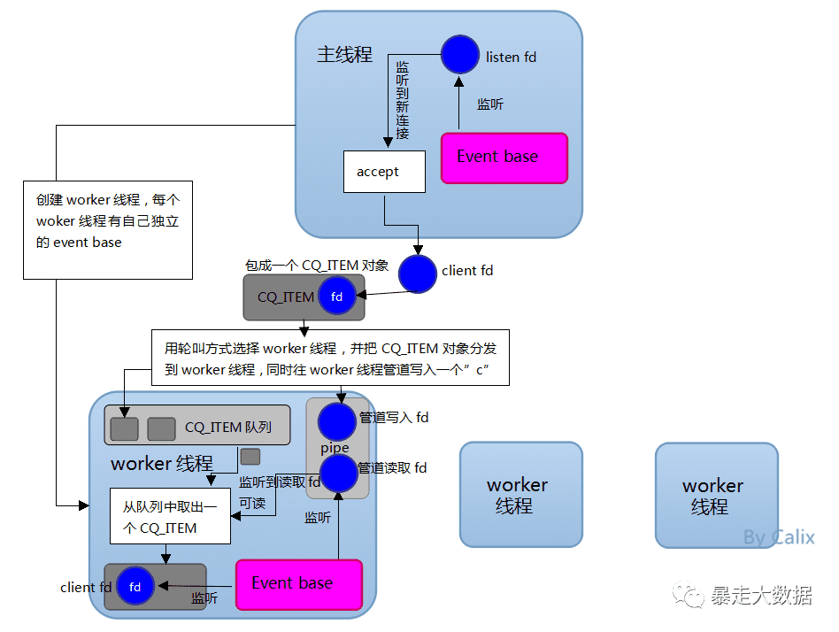

# Memcached ( todo )

References

- 对比 Memcached - Redis 6 新特性之 IO 多线程 : https://www.modb.pro/db/27969

前些年 Memcached 是各大互联网公司常用的缓存方案,

- _因此 Redis 和 Memcached 的区别基本成了面试官缓存方面必问的面试题,_
- 最近几年 Memcached 用的少了, 基本都是 Redis.

Memcached 服务器

- 采用 **master-woker** 模式进行工作,
    - **服务端采用 socket 与客户端通讯**.
- **主线程、工作线程 采用 pipe 管道进行通讯**.
- 主线程 **采用 libevent 监听 listen、accept 的读事件**,
    - 事件响应后将连接信息的数据结构封装起来,
    - 根据算法选择合适的工作线程, 将连接任务携带连接信息分发出去,
    - 相应的线程利用连接描述符建立与客户端的 socket 连接并进行后续的存取数据操作.
