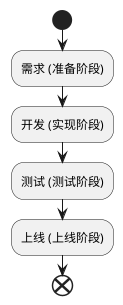
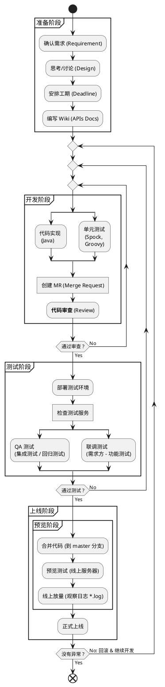

# Work Flow

以典型的业务需求相关的 Java Web 接口开发为例，仅供参考

## 流程图

### 四个阶段

注意：具体流程请根据实际情况调整

### 具体流程

## 准备阶段

### 需求确认

- 确认后，思考、讨论、确定实现方案

### 安排工期

- 确定截止时间
    - 实现
    - 测试
    - 上线（最终 deadline）

> 预留合理的工期（不要太长或太短）

### 撰写 Wiki

## 开发阶段

### 代码实现

- 事不宜迟，立即开发
- **保证质量，按照工期完成**
- **出现问题，及时反馈**（向需求方）！
    - 以便及时应对延期风险

### 单元测试

- Java 测试框架：[Spock](http://spockframework.org/spock/docs/1.1/index.html)（ [Groovy](http://groovy-lang.org/) 语言 ）
- 覆盖足够的场景
    - 成功失败：包括你撰写的 Wiki 中说明的成功返回 & 失败返回
    - 逻辑分支：不同的逻辑分支，产生相同或不同的结果
    - 边界情况：最大值 & 最小值
    - 异常境况：抛出错误
    - 兼容情况：特殊情况的兼容，例如针对特定版本输出格式不一样
    - ……

### 代码审查

创建 Merge Request

- 建议邀请他人参与代码审查

提出议题

- 通常审查者在 MR 的 Discussion 中，进行评论指出问题（会标记相关代码）

进行讨论

- 尽量当面进行讨论，提高效率
- 避免在 MR 的 Discussion 进行大段的讨论，节省时间

注意

- 通过代码审查（以及测试）MR 才能被 merge
- 希望 coder 严格要求自己，提交自认为最完美的代码

## 测试阶段

部署测试环境

- 开发人员必须自己先对测试环境的测试服务进行必要的测试、调试、检查，至少确保没有明显的问题，再交给需求方和 QA 人员！
- 这么做是必要的！负责任、靠谱的做法减少不必要的错误，避免浪费他人宝贵的时间！

QA 测试

- 提供必要测试信息
    - 测试环境的 IP:PORT
    - 接口 Wiki
        - 接口 URL
        - 请求方法 GET 或 POST 等
        - 参数 `param1=foo&param2=bar`
    - 需要关注的测试点

注意：由开发者自己推动进度，责任（期限）在己，而非在他人身上

### 联调测试

与 PM 等需求方方一同联合调试功能

## 上线阶段

- 预览
- 放量
- 全量 / 灰度
- 回滚
- 上线（TAG）

### 预览阶段

- 合并代码
- 预览
- 预览测试
- 线上放量

### 正式上线

- 观察线上日志
- 观察监控

### 名词解释

预览

- 上线前，先更新一台服务器的代码，并停止线上（生产环境）对这台服务器的调用，QA 在这台服务器上执行上线前的最终测试

放量

- 解除线上对预览机的调用限制

灰度

- 逐步扩大某一功能的发布范围（使用到该功能的用户越来越多），也叫灰度放量

仿真

- 搭建一套访问线上资源但不被业务调用的环境，用于排查某些常规手段解决不了的问题

全量

- 线上服务完成上线，新功能完全生效

回滚

- 出现异常时，服务器的代码恢复到之前的稳定版本

四层

- 运行在 OSI 模型第四层（传输层）的负载均衡工具，如 LVS

七层

- 运行在 OSI 模型第七层（应用层）的负载均衡工具，如 Nginx , Varnish 等

服务池

- 某类应用对应的一组服务器
- 某类应用对应的一组 Web 服务器或资源
- 某类应用对应的一组配置文件

上线 Tag

- Git Tag 标记服务版本

局方

- 机房
- 运营商：联通、移动、电信
