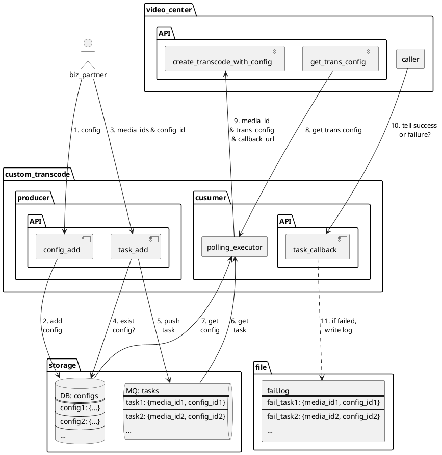

# 定制转码

## 需求

### 背景

时常会有业务方需要对一批媒体进行定制的转码，创建为新的媒体，或者替换原有的媒体。做一个新的「定制转码」服务，将该处理流程标准化，便于复用，提升效率。

### 功能

业务方提供媒体的 ID 以及定制配置，即可进行转码，然后创建新的媒体，或替换原有媒体。

- 接入方式
    - 调用「批量添加媒体 ID 定制转码任务」的接口
- 所需数据
    - 媒体 media_id 列表
    - 任务类型 task_type

## 接口

说明

- API
    - 请求方法：GET / POST
    - Host：待定
    - URL
    - 参数

### 定制配置

- 添加

```http
POST [host]/config/add
```

|参数|必选|类型|备注|
|-|:-:|-|-|
|TODO|

```json
{
    "config_id": "foObAR"
}
```

- 查询（支持批量）

```http
GET [host]/config/get
```

- 更新

```http
POST [host]/config/update
```

- 删除（暂不支持）

```http
POST [host]/config/delete
```

|参数|必选|类型|备注|
|-|:-:|-|-|
|config_id|1|string|配置 ID|

```json
{
    "result": true
}
```

### 转码任务

- 添加清单文件（待定）
    - 清单文件如何上传？或使用脚本将清单文件中的 media_id 读出再调用「添加」接口批量写入？

```http
POST [host]/task/add_by_file
```

|参数|必选|类型|备注|
|-|:-:|-|-|
|file_url|1|string|文件地址：文件只能包含 media_id，每行一个 media_id（即使用换行符 `\n` 分隔）|
|config_id|1|string|定制转码配置的 ID：该配置需要先行添加；media_ids 指定的媒体均使用该配置执行任务|

- 添加

```http
POST [host]/task/add
```

|参数|必选|类型|备注|
|-|:-:|-|-|
|media_ids|1|string|媒体 ID 列表：用逗号 `,` 分隔，最多 15 个|
|config_id|1|string|定制转码配置的 ID：该配置需要先行添加；media_ids 指定的媒体均使用该配置执行任务|

```json
{
    "result": true
}
```

- 查询（支持批量）

```http
GET [host]/task/get
```

|参数|必选|类型|备注|
|-|:-:|-|-|
|media_id|1|string|媒体 ID|

```json
{
    "media_id": "xxxx",
    "config": {
        "todo": "todo"
    }
}
```

- 更新（暂不支持）

```http
POST [host]/task/update
```

- 删除（暂不支持）

```http
POST [host]/task/delete
```

|参数|必选|类型|备注|
|-|:-:|-|-|
|media_id|1|string|媒体 ID|

- 回调
    - 转码成功后，创建或更新媒体信息
    - 转码失败后，是否重试

```http
POST [host]/task/callback
```

### 媒体信息

## 架构流程

### 流程



- TODO
    - create_transcode_with_config
        - 对比直接使用 create_transcode 接口的情况（决定：使用 create_transcode 接口）
        - context 配置在 http://video.admin.intra.weibo.com:8082/endpoint.html 后台中
        - 重试 create_transcode
    - 去掉 configs，context 上下文，customized 都直接存在 task 结构中（暂时的决定）
    - 配置直接从 medialib 中取（理论上是字段齐全的，但是数据还没洗，数据不完全）
        - 配置从 object 库获取配置，然后去各个服务找（story , weibovideo 等）
        - 特别是 object 库里缺 source 这个 context 包含的字段（因为敏感不能直接存到对象库里）
        - 考虑回种找到相关配置后，回种到 medialib 中（可能导致错误，暂时决定：不这么做）

## 存储

### DB

#### Configs

```sql
CREATE TABLE `custom_config` (
  `config_id` varchar(64) NOT NULL DEFAULT '',
  `type` int(11) NOT NULL DEFAULT '0' COMMENT 'todo', // Example
  `extension` varchar(2048) NOT NULL DEFAULT '' COMMENT '其他扩展信息', // Example
  // TODO
  `create_time` timestamp NOT NULL DEFAULT CURRENT_TIMESTAMP COMMENT '创建时间',
  `update_time` timestamp NOT NULL DEFAULT CURRENT_TIMESTAMP COMMENT '更新时间',
  PRIMARY KEY (`media_id`)
) ENGINE=InnoDB DEFAULT CHARSET=utf8mb4 COMMENT='定制转码配置'
```

```json
[
    {
        "config_id": "1",
        "type": …,
        "extension": …,
        ……
    },
    {
        "config_id": "2",
        "type": …,
        "extension": …,
        ……
    },
    ……
]
```

### MQ

#### Tasks

```json
[
    {
        "task_id": "110",
        "media_id": "aBcDe",
        "config_id": "video_7"
    },
    {
        "task_id": "233",
        "media_id": "vWxYz",
        "config_id": "image_5"
    },
    ……
]
```

### Log

#### Fail

```ini
[FAIL] 20180725 23:09:26.196 [custom_transcode] callback - task={"task_id":"aBcDe","media_id":"12345","config_id":"video_120"}, response={……} 3406181d-8074-47bf-8e7d-1cfe7578cd75
```
