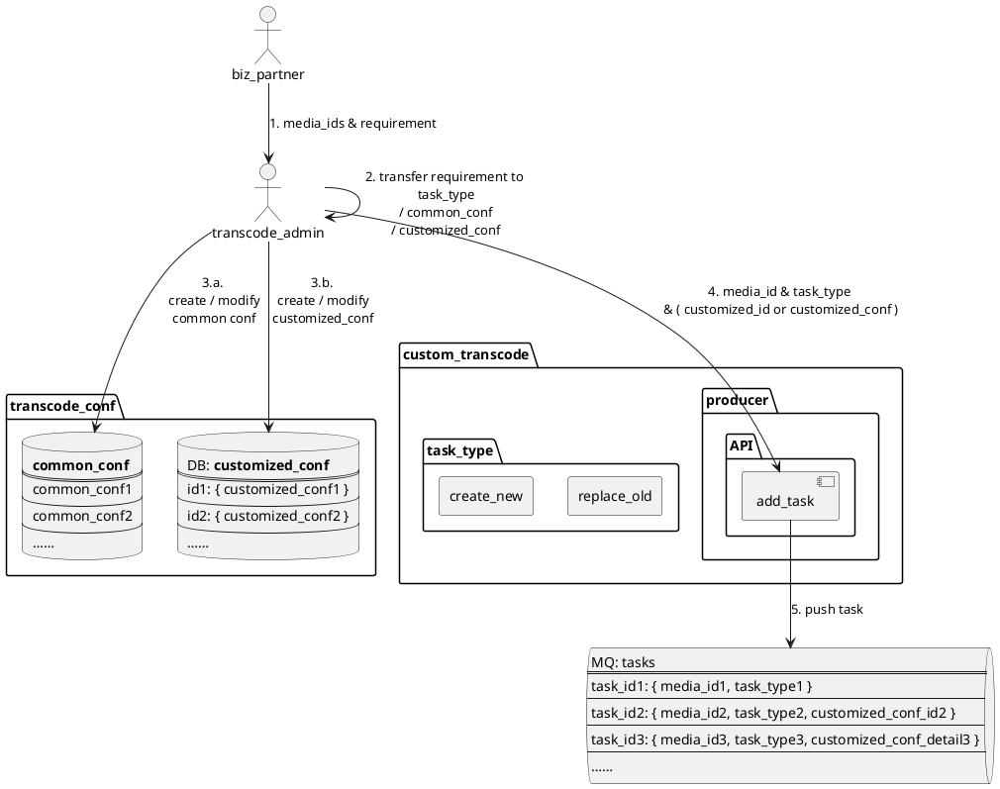
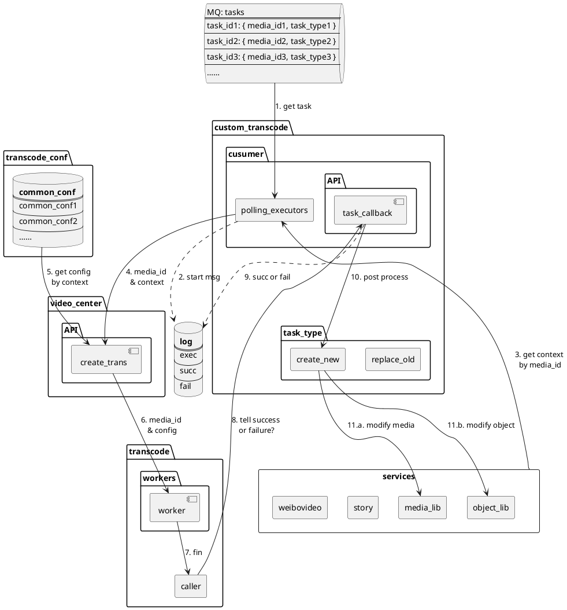
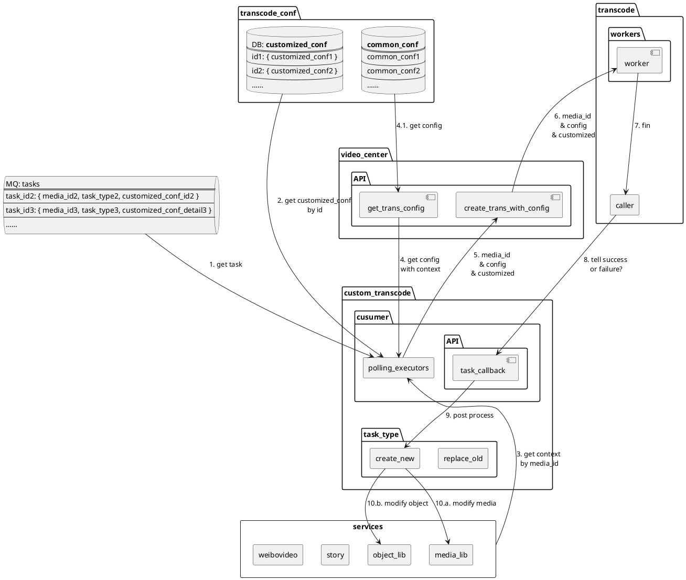

# 自定义转码

## 需求

### 背景

时常会有业务方需要对一批媒体进行自定义的转码，创建为新的媒体，或者替换原有的媒体。做一个新的「自定义转码」服务，将该处理流程标准化，便于复用，提升效率。

### 功能

根据业务方提供的媒体 ID 以及自定义转码需求（例如：去掉水印），可进行转码；完成后，修改媒体库和对象库（例如：创建新的媒体，或替换原有媒体）

## 流程

说明

- video-center 接口
    - transcode/create
        - 接口内部根据 context 自行获取 config，然后根据 config 转码
    - transcode/create_with_config
        - 根据提供的 config 转码
        - 接口初衷：方便自定义调整转码的 config
    - get_trans_config: 根据 context 获取转码 config
        - context：多个不同 key-value 组合
        ```json
        {
            "biz_type": "miaopai",
            "video_type": "vertical",
            ……
        }
        ```

### 准备



### 处理

#### 通用模板



#### 临时自定义

注意：下图省略上图中出现的日志部分



## 接口

格式

- API
    - 接口说明
    - 请求方法：GET / POST
    - Host：待定
    - URL
    - 参数

失败返回

- 除非下文特殊说明，均与此类似

```json
{
    "error": "error_mesage", // 错误消息
    "error_code": 500 // 错误码（待定）
}
```

错误码

- TODO

### customized

#### 添加

```http
POST [host]/customized/add
```

|参数|必选|类型|备注|
|-|:-:|-|-|
|customized|1|json string|定制转码的 customized 配置|

成功返回

```json
{
    "customized_id": "aBcdE"
}
```

#### 查询

```http
POST [host]/customized/get
```

|参数|必选|类型|备注|
|-|:-:|-|-|
|customized_id|1|string|customized 配置的 ID|

成功返回

```json
{
    "hot_video_type":"hot_video_regular"
}
```

### 转码任务

#### 添加

通过 media_ids 批量添加自定义转码任务

<!-- - **任务类型** `task_type`：每种类型对应一种自定义的任务需求
- **任务需求**：来自于业务方，通常可以归纳为以下多个操作的组合，包括但不限于
    - 去除 / 添加 / 替换水印
    - 添加清晰度
    - 添加新的媒体文件 / 替换原有的媒体文件
    - ……
- 需求实现：对应每种新的任务需求，需要先做好代码实现（初版）
    - 初版：只支持一两种任务
    - 后续：抽象出多种标准化的操作
        - 抽象复用原有代码
        - 便于组合成满足不同需求的任务，配置成新的任务类型 -->

- **类型** `task_type`：每种类型对应一种自定义的任务需求
- **任务需求**：来自于业务方，通常可以归纳为以下多个操作的组合，包括但不限于
    - 去除 / 添加 / 替换水印
    - 添加清晰度
    - 添加新的媒体文件 / 替换原有的媒体文件
    - ……
- 需求实现：对应每种新的任务需求，需要先做好代码实现（初版）
    - 初版：只支持一两种任务
    - 后续：抽象出多种标准化的操作
        - 抽象复用原有代码
        - 便于组合成满足不同需求的任务，配置成新的任务类型

```http
POST [host]/task/add
```

参数：customized_id、customized 均对应使用的 customized 字段，只能使用其中一个（不能同时使用）

|参数|必选|类型|备注|
|-|:-:|-|-|
|media_ids|1|string|媒体 ID 列表：用逗号 `,` 分隔，最多 15 个|
|task_type|1|string|定制转码的任务类型：对应代码实践的方法|
|customized_id|0|string|预设的 customized 配置的 ID|
|customized|0|string|自定义 customized 配置的具体内容|

成功返回

```json
{
    "tasks": [
        {
            "task_id": "1",
            "media_id": "apple",
            "task_type": "create_new",
            "customized_id": "223",
            "result": true
        },
        {
            "task_id": "2",
            "media_id": "boy",
            "task_type": "create_new",
            "customized": { … },
            "result": true
        },
        ……
    ]
}
```

失败返回

- 部分失败

```json
{
    "tasks": [
        {
            "task_id": "1",
            "media_id": "apple",
            "task_type": "transcode_remove_watermark_1",
            "customized_id": "223",
            "result": true // 成功
        },
        {
            "task_id": null,
            "media_id": "boy",
            "task_type": "transcode_remove_watermark_1",
            "customized": { … },
            "result": false, // 失败
            "cause": "MQ is full"
        },
        ……
    ]
}
```

- 完全失败

```json
{
    "error": "fail to add task",
    "error_code": 110 // 待定
}
```

- 任务类型不存在

```json
{
    "error": "task_type not exist",
    "error_code": 120 // 待定
}
```

#### 查询

支持批量

```http
GET [host]/task/get
```

参数

- 传 media_ids 或 task_ids ，二选一

|参数|必选|类型|备注|
|-|:-:|-|-|
|media_ids|1|string|媒体 ID 列表：用逗号 `,` 分隔，最多 15 个|
|task_ids|1|string|任务 ID 列表：用逗号 `,` 分隔，最多 15 个|

成功返回

```json
{
    "tasks": [
        {
            "task_id": "1",
            "media_id": "apple",
            "task_type": "transcode_remove_watermark_1"
        },
        {
            "task_id": "2",
            "media_id": "boy",
            "task_type": "transcode_remove_watermark_1"
        },
        ……
    ]
}
```

#### 更新

（暂不实现）

```http
POST [host]/task/update
```

#### 删除

（暂不实现）支持批量

```http
POST [host]/task/delete
```

|参数|必选|类型|备注|
|-|:-:|-|-|
|media_ids|1|string|媒体 ID 列表：用逗号 `,` 分隔，最多 15 个|
|task_ids|1|string|任务 ID 列表：用逗号 `,` 分隔，最多 15 个|

#### 回调

- 无论被通知操作成功或失败，均记录日志
    - 创建：记录创建转码的任务（调用 transcode/create\* 接口前），便于核对那些创建了却没回调的任务（即失败）
    - 成功：记录成功日志 callback_suc.log，并执行后续操作，例如创建新的媒体或替换原有的媒体
    - 失败：记录失败日志 callback_fail.log，不执行后续操作

```http
POST [host]/task/callback
```

#### 文件添加

（暂不支持）通过包含 media_id 的文件的地址，来添加定制转码任务

- 待议：清单文件如何上传？或使用脚本将清单文件中的 media_id 读出再调用「添加」接口批量写入？

```http
POST [host]/task/add_by_file
```

|参数|必选|类型|备注|
|-|:-:|-|-|
|file_url|1|string|文件地址：文件只能包含 media_id，每行一个 media_id（即使用换行符 `\n` 分隔）|
|task_type|1|string|定制转码的任务类型：取值范围（待定）|

## 存储

### DB

#### Configs

注意：仅仅临时示例

```sql
CREATE TABLE `custom_config` (
  `customized_id` varchar(64) NOT NULL DEFAULT '',
  `customized` varchar(2048) NOT NULL DEFAULT '' COMMENT 'JSON String',
  // TODO
  `create_time` timestamp NOT NULL DEFAULT CURRENT_TIMESTAMP COMMENT '创建时间',
  `update_time` timestamp NOT NULL DEFAULT CURRENT_TIMESTAMP COMMENT '更新时间',
  PRIMARY KEY (`media_id`)
) ENGINE=InnoDB DEFAULT CHARSET=utf8mb4 COMMENT='定制转码配置'
```

```json
[
    {
        "customized_id": "1",
        "customized" : { … },
    },
    {
        "customized_id": "2",
        "customized" : { … },
    },
    ……
]
```

### MQ

#### Tasks

```json
[
    {
        "task_id": "110",
        "media_id": "aBcDe",
        "customized_id": "video_7"
    },
    {
        "task_id": "233",
        "media_id": "vWxYz",
        "customized": { … }
    },
    ……
]
```

### Log

注意：仅仅是示例

- info
- exec
- succ
- fail
- …

```properties
[FAIL] 20180725 23:09:26.196 [custom_transcode] callback - task={"task_id":"aBcDe","media_id":"12345","config_id":"video_120"}, response={……} 3406181d-8074-47bf-8e7d-1cfe7578cd75
```
